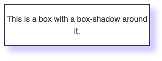

# SuperMarket项目

## 一.项目中遇到的问题
### 1.npm权限问题
### 2.box-shadow属性的应用
```
/* x偏移量 | y偏移量 | 阴影模糊半径 | 阴影扩散半径 | 阴影颜色 */
box-shadow: 10px 10px 10px 2px rgba(0, 0, 255, .2);
```
### 3.rgba颜色问题
rgba(100,100,100,.2);
RGBA颜色表示，rgba(R,G,B,A) 
RGB意味着三原色
A代表透明度，1代表不透明
0代表透明

### 4.路径定义后的使用问题
在配置好文件夹别名后，在图片的src中要用~去提示webpack这个路径是已经定义了的路径。
### 5.style标签中的scoped属性

    <style scoped>属性意味着这个style中的CSS只应用于该组件

###  6.写一个组件的划分思路
1. 应该想一下划分布局
2. 主要是要知道布局划分了过后每一个元素都要尽量用一个div装起来
### 7.text-align和vertical-align
* text-align属性是定义在元素的容器上的，使元素内的行内元素居中，比如图片等,可继承
* vertical-align属性是定义在行内元素上的，规定行内元素对于父元素在垂直方向上的位置，不可继承
### 8.import Vue from 'vue'中的vue存放位置？
### 9.export,import的使用方法
#### 9.1 export导出模块和使用
1.导出

    const a = 123;
    const b = 123;
    function func2(){
        console.log(123);
    }
    //1.直接声明的时候导出
    export function func1(){
        console.log(123);
    }
    //2.最后一次性用对象导出
    export {
        a,
        b,
        func2
    }

 2.引用
		
	//1.直接使用对象的方式拿到即可
	import {fn1} from './test1.js'
	//2.可以进行重新命名
	import{a as a1, b as b2} from './test2.js'
	//3.全部取出，作为对象使用
	import * as all from './test1.js'
	all.fu2();

#### 9.2 export default的使用
1.导出

	//同样也可以先声明再倒入或者同时进行
	export default function fn(){
	    console.log(123);
	}
	//也可以采用导出对象的方式
2.导出
		

    //只能使用一种倒入方式，即倒入命名
    import fn from './test.js'
#### 9.3使用细节
1. export default只能使用一次，因为多了就有指代不清的问题
2. export default不能直接传出非对象类型的数据类型，只能以{}的方式进行多值的传出，并且键值要和变量名相等
3. export default和export混用时，在倒入的时候import * from './test.js'并不包含export default的导出部分

#### 10. 父组件向子组件传值细节
1.静态传值
只有传字符串的时候才可以直接在属性上传值
2.动态传值
除了直接传一个字符串，其他的都要用v-bind的方法绑定该传值属性
3.注意
静态传值不能用动态传值的方法
#### 11.利用计算属性动态绑定样式

```
        <div class="item-text" :style="activeStyle">
        computed:{
      activeStyle(){
          return this.isActive ? {color:this.color} : {};
      }
  }
```
#### 12.插槽属性遗失问题
* 当组件中的插槽被使用后，相当于这个插槽对应的html语句被直接被填充的语句代替，所以插槽本身定义的属性会丢失。即插槽的属性并不能加到被填充的元素上。
* 可以用一个div把插槽包起来并把对应的属性加在这个div上


## 二.项目思路
### 1.项目基本设置
#### 1.1目录结构

- network
- components -> common/content（common是以后能复用的组件）
- pages -> 路由分层
- common （一些常量或者是公共的方法）
- assets
- router
- store

#### 1.2. 设置CSS初始化和全局样式
- initialize.css
- base.css
#### 1.3配置文件夹别名

```
module.exports = {
  configureWebpack: {
    resolve: {
      alias: {
        'assets': '@/assets',
        'common': '@/common',
        'components': '@/components',
        'network': '@/network',
        'views': '@/views',
      }
    }
  }
}
```

####1.4设置代码风格
-新建.editorconfig文件

```
root = true

[*]
charset = utf-8
indent_style = space
indent_size = 2
end_of_line = lf
insert_final_newline = true
trim_trailing_whitespace = true
```
#### 1.4 tabbar的封装
**1.4.1 完成组件的划分**
将tabBar组件划分成两个组成部分：
1. tabBar容器
2. tabBarItem

**1.4.2 tabBar容器的完成**
留出一个插槽给tabBarItem即可并完成样式

**1.4.3 tabBarItem**
* 留出两个插槽给图片和文字完成样式部分
* 完成点击变颜色和图片的功能
* 完成路由插件的管理
* 利用路由的路径来判断哪一个图标处于激活状态从而完善激活功能
* 完成颜色的传值功能

**1.4.4 封装两个插件为一个项目专用的插件**