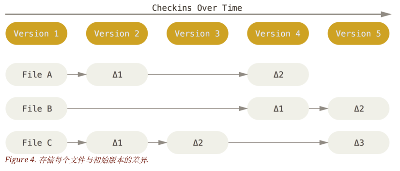
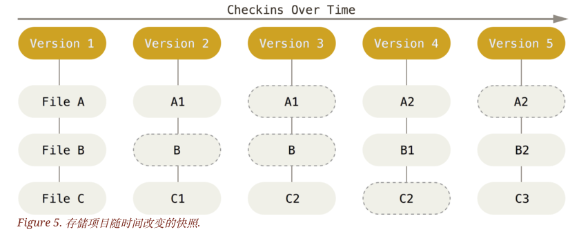
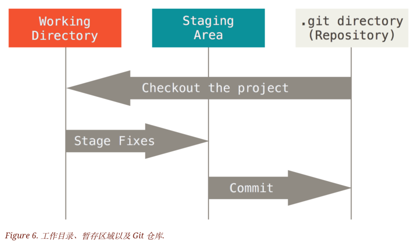
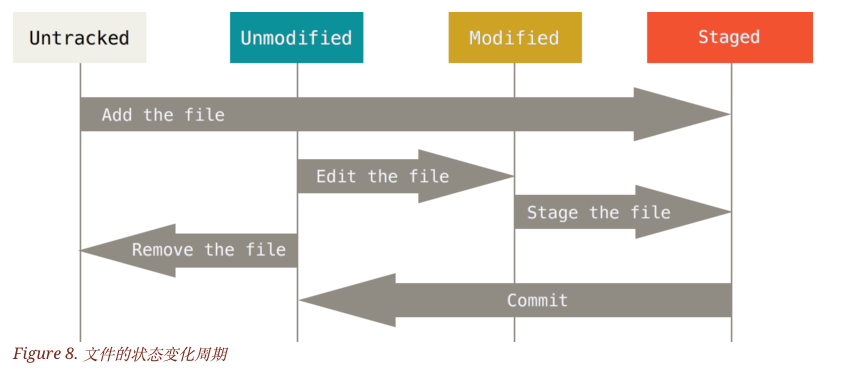
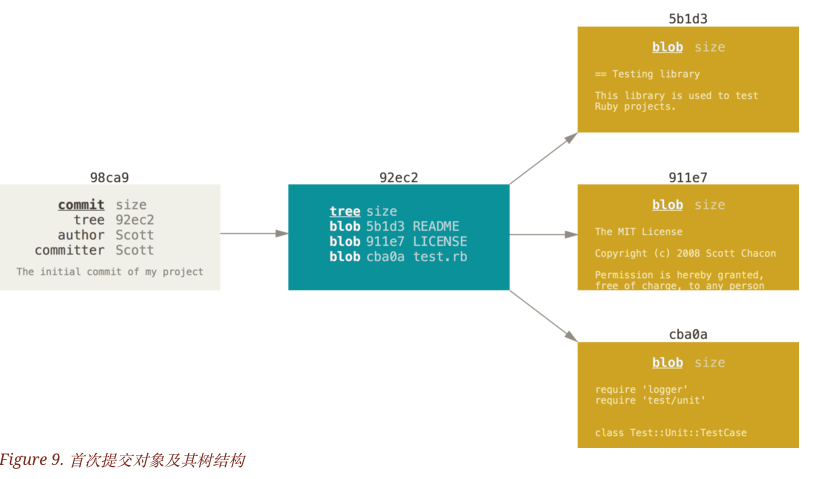
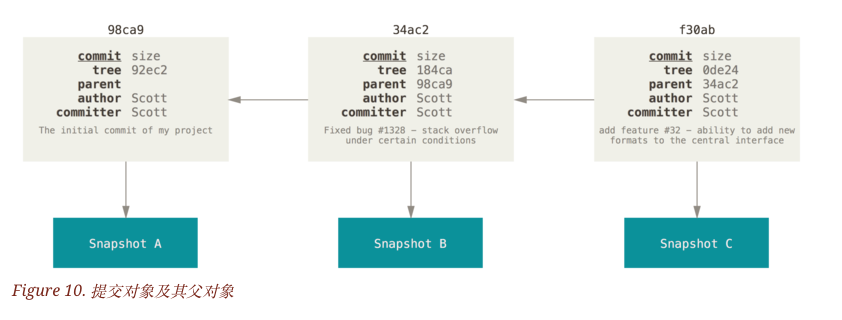
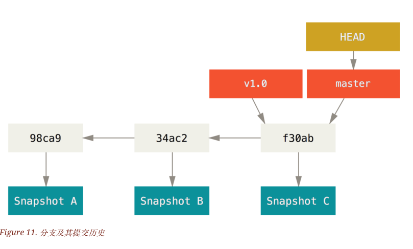

# GitPro

### 1. Git的基本概念

### 1.1 Git记录文件的存储方式

其他版本控制系统采用的是保存差异的方式：



而git采用的是快照保存的方式，每次保存都是对当前的全部文件制作一个快照并保存这个快照的索引。为了高效，如果文件没有修改，Git 不再重新存储该文件，而是只保留一个链接指向之前存储的文件。 Git 对待数据更像是一个 **快照流**。



### 1.2 文件的三种Git状态



已提交（committed）、已修改（modified）和已暂存（staged）

已提交是提交到repository,已修改是working directory已经改动但没有暂存，已暂存是已经暂存到staging area

### 1.3 Git配置

#### 1.3.1 设置用户名和邮箱地址

```console
$ git config --global user.name "John Doe"
$ git config --global user.email johndoe@example.com
```

#### 1.3.2 配置文件

1. `/etc/gitconfig` 文件: 包含系统上每一个用户及他们仓库的通用配置。 如果使用带有 `--system` 选项的 `git config` 时，它会从此文件读写配置变量。
2. `~/.gitconfig` 或 `~/.config/git/config` 文件：只针对当前用户。 可以传递 `--global` 选项让 Git 读写此文件。
3. 当前使用仓库的 Git 目录中的 `config` 文件（就是 `.git/config`）：针对该仓库。

局部优先级更高

#### 1.3.3检查配置

```console
$ git config --list
```

## 2. Git基础命令

* 初始化仓库
* 克隆

```console
git clone https://github.com/libgit2/libgit2 mylibgit//把名字改为mylibgit
```

* 文件加入暂存区或追踪

git add <文件名>  .表示全部



* 状态浏览

git status

git status -s

git status --short

* 忽略文件

.gitignore 用于定义那些文件无需用git来追踪管理

* 提交更新到本地库

git commit

* 移除文件停止追踪

git rm

* 移动文件

```console
git mv file_from file_to
```

* 查看提交历史

git log

*  撤销操作

将暂存区的文件提交，并且是以上一次commit的名义进行提交

```console
$ git commit --amend
```

* 取消暂存的文件

```console
$ git reset HEAD CONTRIBUTING.md
```

* 撤销对文件的修改

```console
$ git checkout -- CONTRIBUTING.md
```

## 3. Git分支

### 3.1 Git分支的原理



* blob 是每一个文件的快照，存放于仓库中，上面的5b1d3等的为校验和

* tree对象包含指针指向文件的快照并且记录了对应的校验和检验备份是否遭到了损坏

* 一次commit产生一个commit对象，一个commit对象拥有指针指向对应的tree对象，并且包含了作者信息等



* 多次commit产生多个commit对象，每一个commit对象会包含一个指针指向上一个commit对象



git分支管理的实现仅仅是用一个指针指向不同的提交对象

如上有master分支和v1.0分之

### 3.2 本地分支管理


