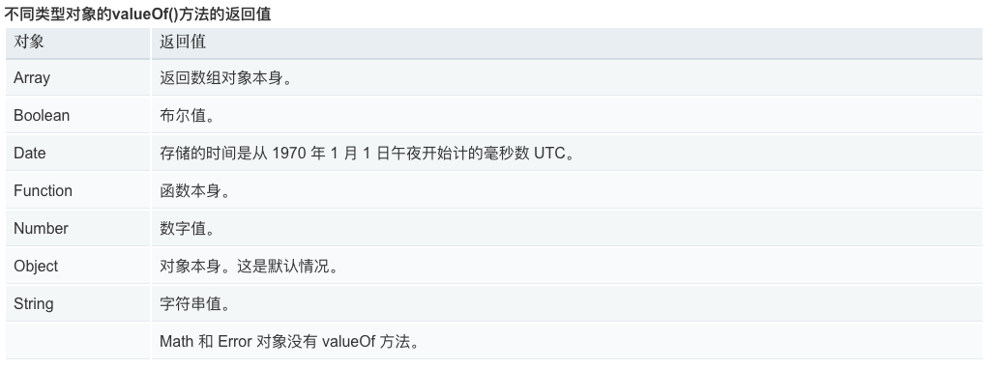
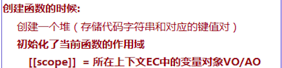
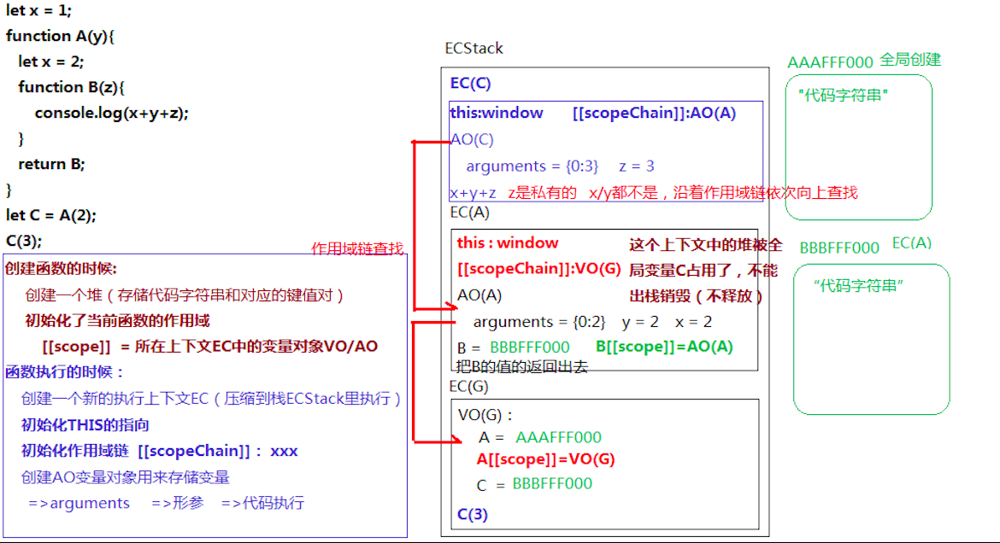
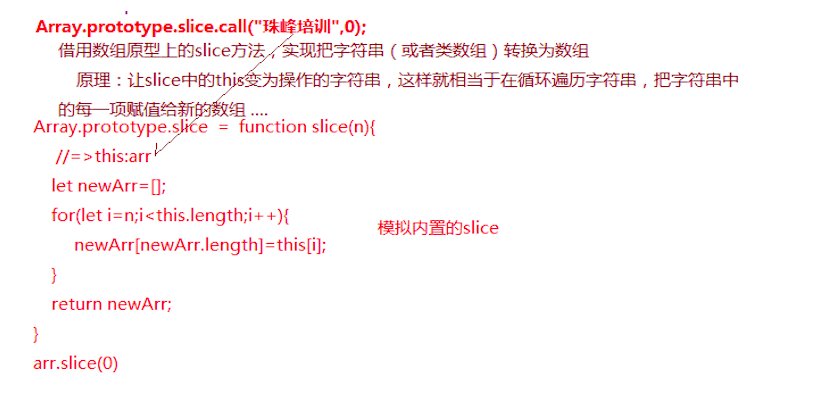
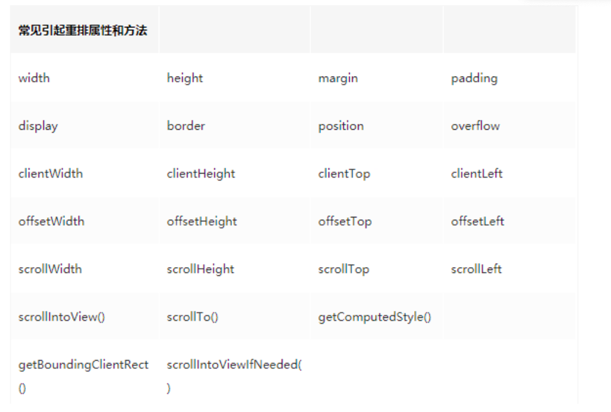
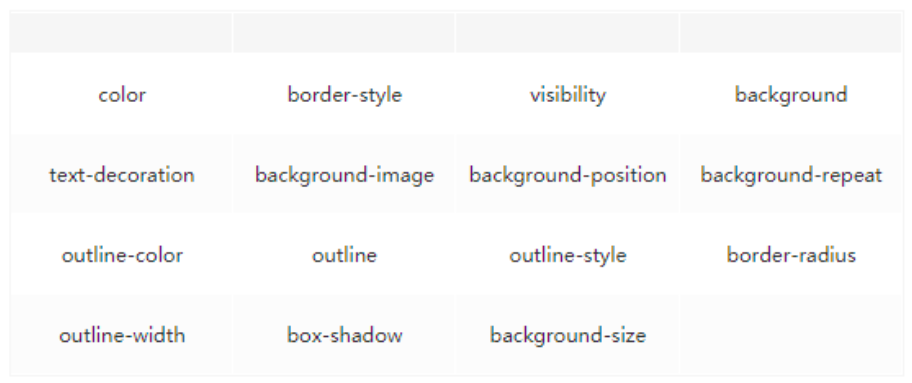
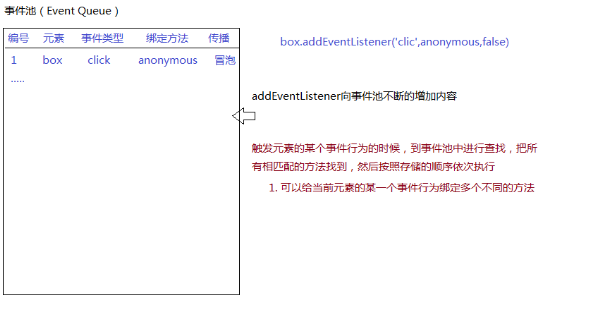

# JS底层原理(上)
@(JS)

## 数据类型及其类型检测
### 数据类型
1. 基本数据类型
	- undefined
	- number
	- string
	- boolean
	- null
	- symbol(ES6新增)
2. 引用数据类型
	- 对象
	- 正则
	- 数组
	- 如期
	- Math
	- 实例
	- function
### 类型检测
**检测数据类型1：typeof**
返回结果都是字符串
字符串中包含了对应的数据类型  "number"/"string"/"boolean"/"undefined"/"symbol"/"object"/"function"
基本对象和函数可用这种方法，简单
【局限性】
**typeof null => "object"**   null不是对象，它是空对象指针
检测数据或者正则等特殊的对象，返回结果都是"object"，所以无法基于typeof判断是数据还是正则

***检测数据类型2/3：instanceof / constructor(是沿着原型链找到原型上的constructor)***
检测某个实例是否属于这个类
他检测的底层机制：所有出现在其原型链上的类，检测结果都是TRUE
【局限性】
由于可以基于__proto__或者prototype改动原型链的动向，所以基于instanceof检测出来的结果并不一定是准确的
基本数据类型的值，连对象都不是，更没有__proto__，虽说也是所属类的实例，在JS中也可以调取所属类原型上的方法，但是instanceof是不认的
例子：

	console.log(12 instanceof Number); //=>false 直接基本类型是不认的
	console.log(new Number(12) instanceof Number); //=>true
	console.log([] instanceof Array); //=>true
	console.log([] instanceof Object); //=>true

	function Fn() {}
	Fn.prototype.__proto__ = Array.prototype;
	let f = new Fn();
	//=>原型链：f -> Fn.prototype -> Array.prototype -> Object.prototype
**检测数据类型4：Object.prototype.toString.call([value]) / ({}).toString.call([value])（一定要是object上的原型才行）**
不是用来转换为字符串的，而是返回当前实例所属类的信息
格式："[object 所属类信息]"
 "[object Object/Array/RegExp/Date/Function/Null/Undefined/Number/String/Boolean/Symbol...]"
这种方式基本上没有什么局限性，是检测数据类型最准确的方式，不会因为改变原型链而发生变化，检测引用数据类型用这种方式
### 其他类自带的toString和valueOf方法汇总

Number/String/Boolean/Symbol他们的原型上都有：
  =>toString：转化为字符串
  =>valueOf：返回原始值
Array/RegExp/Function等内置类的原型上都有
  =>toString：转化为字符串
Object的原型上
  =>toString：返回当前实例所属类的信息
  =>valueOf：返回原始值

### 相等 VS ===绝对相等
 左右数据值类型不同，三个等号不能转换数据类型，直接返回false，但是两个等于号会默认先转换为一致的数据类型再进行比较,比较规则如下：
* NaN==NaN ：NaN和谁都不相等（包括自己）
* null==undefined：null和undefined两个等号比较是相等的（三个则不相等），但是他们和其它任何值都不相等
* 对象==字符串：把对象转换为字符串（对象.toString()）
* 剩余的情况都是转换为数字（对象转换数字：Number(对象.toString())）
### NaN
NaN是number类型，意为不是一个数
应该用isNaN()检测NaN
**NaN和任何值都不相等，所以检测NaN必须用 isNaN()**
得到NaN的情况： parseInt(), float(),Number(),即数学运算不能转换为数据时
**isNaN()中会进行number()的隐式转换，在判断是不是NaN,是NaN返回true,不是返回false**
### Object

    let obj = {
	    0:100,
	    true:'a',
	    {x:100}:100//不允许，会报错
    }
    
        let a = {x:100};
        let obj = {
	    0:100,
	    true:'a',
	    a:100//允许
    }
    a[0] === a['0'];//这两个值是相等的
    
    var x = 10;
    var obj = {x:1};//这个x就是一个字符串，不是x变量
    
**其中a在obj中会自动先运行({x:100}).toString()从而将这个对象转换为"[objet Object]"字符串。所有的属性值在对象中都会先自动运用toString()生成字符串”**
## Object 和 Array的基本方法
### Object.prototype上定义的方法
1. obj.hasOwnProperty(prop)
prop为一个字符串
返回返回一个布尔值，指示对象自身属性中是否具有**除了原型链上继承的属性以外**的指定的属性
若属性中有.hasOwnProperty属性，则该属性会被覆盖
2. Baz.prototype.isPrototypeOf(baz)
Baz.prototype在不在baz这个实例的原型链上
3. obj.propertyIsEnumerable(prop)
每个对象都有一个 propertyIsEnumerable 方法。此方法可以确定对象中指定的属性是否可以被 for...in 循环枚举，但是通过原型链继承的属性除外。如果对象没有指定的属性，则此方法返回 false。
4. obj.toString();
每个对象都有一个 toString() 方法，当该对象被表示为一个文本值时，或者一个对象以预期的字符串方式引用时自动调用。默认情况下，toString() 方法被每个 Object 对象继承。如果此方法在自定义对象中未被覆盖，toString() 返回 "[object type]"，其中 type 是对象的类型。以下代码说明了这一点：

```
var o = new Object();
o.toString(); // returns [object Object]
```
**实际上很多内置对象都重写了toString()方法**


**若要使用定义在Object中的方法，就要适用如下的方式**
```
var toString = Object.prototype.toString;
toString.call(new Date);
```
5. obj.toLocaleString()
就是toString();
6. object.valueOf()
返回值为该对象的原始值。
JavaScript的许多内置对象都重写了该函数，以实现更适合自身的功能需要。因此，不同类型对象的valueOf()方法的返回值和返回值类型均可能不同。

也可以自己重写该方法
### 定义在Object构造函数中的方法
1. Object.assign(target, ...sources)
如果目标对象中的属性具有相同的键，则属性将被源对象中的属性覆盖。后面的源对象的属性将类似地覆盖前面的源对象的属性。
针对深拷贝，需要使用其他办法，因为 Object.assign()拷贝的是属性值。假如源对象的属性值是一个对象的引用，那么它也只指向那个引用。
2. Object.create(proto[, propertiesObject])
Object.create()方法创建一个新对象，**使用现有的对象来提供新创建的对象的\__proto\__**。
所以可以作为寄生继承的一种方法
3.Object.entries(obj)

```
const anObj = { 100: 'a', 2: 'b', 7: 'c' };
console.log(Object.entries(anObj)); // [ ['2', 'b'], ['7', 'c'], ['100', 'a'] ]
```
4. Object.freeze(obj)
obj:要冻结的对象
返回值：已经被冻结的对象
对应的：Object.isFrozen(obj)
检测是否被冻结
该对象指向的内存不能被修改，所有修改都会失效，严格模式下会报错
5.Object.fromEntries(iterable);
返回一个对象

```
const arr = [ ['0', 'a'], ['1', 'b'], ['2', 'c'] ];
const obj = Object.fromEntries(arr);
console.log(obj); // { 0: "a", 1: "b", 2: "c" }
const map = new Map([ ['foo', 'bar'], ['baz', 42] ]);
const obj = Object.fromEntries(map);
console.log(obj); // { foo: "bar", baz: 42 }
```
6. Object.is(value1, value2);
表示两个参数是否相同的布尔值 。

### Array中的常用方法
<https://www.liaoxuefeng.com/wiki/1022910821149312/1023020967732032>


## JS的运行机制
### 编译
用编译器编译，是浏览器能看懂代码
词法解析->AST抽象语法树->构建出浏览器能执行的代码
### 引擎和运行机制
引擎（V8/webkit内核）
变量提升
作用域/闭包
变量对象
堆栈内存
GO/VO/AO/EC/ECStack

- GO：全局对象(Global Object)可以理解为window
- ECStack：Execution [ˌeksɪˈkjuːʃn] Context Stack 执行环境栈
- EC：Execution Context 执行环境（执行上下文）
	- VO：Varibale Object 变量对象（全局的变量对象）是存储全局下的定义的变量
	- AO：Activation Object 活动对象 （函数的叫做AO，理解为VO的一个分支）
- Scope：作用域，创建的函数的时候就赋予的
- Scope Chain ：作用域链
### 函数及运行机制
#### 函数的创建方式

但是～的方式不支持给一个变量返回值
#### 创建函数时的操作步骤

#### 函数的调用
- 自执行函数直接调用运行
- 函数名()  即加括号的方式来运行

**注意要明白函数定义和调用的区别,见下面例子**

```
let x = {x:10};
x.fn = function(){
    console.log(x);
};
setTimeout(x.fn,1000);//1秒后执行
setTimeout(x.fn(),1000);//立即执行
```
因为JS是线性的，在setTimeout被执行的时候就会扫描第一个参数，若是函数定义就不执行，若是加括号或者是立即执行的函数就会立即执行。其实自执行函数也就是看成加括号的函数执行。所以.bind()在函数中会立即执行，.apply()和.call()也会立即执行，且.apply()和.call()的返回值是一个立即执行函数所以也会立即执行。

#### 函数的运行步骤

* 生成一个全新的执行上下文
* **初始化THIS指向**
* **初始化作用域链，指向作用域中的变量对象**
* 生成AO，活动对象，所有私有对象变量都在AO中
* 初始化实参合集即arguments
* 创建形参并赋值（若不在严格模式会建立形参和实参的对应关系）
* 代码执行，执行过程中可以沿着作用域链向上查找变量。
* 执行完若在当前执行环境中创建值被其他执行环境所引用则不出栈，生成闭包，否则出栈。

#### 函数赋初值

#### 判断是否是函数要不要执行


### 逻辑符号


### 内存回收机制
#### 标记清除
使用垃圾回收机制，空闲时把不用的对内存进行释放和销毁
#### 引用计数
跟踪内存被引用的次数，若为0则清除，但会出现循环引用的问题。
#### 内存泄漏
由于闭包或者循环引用导致的内存没有释放的问题，应该养成良好的释放堆内存的习惯，不要滥用闭包。

### this的指向问题
#### this的指向规则
##### 1.给元素事件绑定
给元素的某个事件行为绑定方法，事件触发，方法执行，此时方法中的THIS一般都是当前元素本身
代码：

```
//=>DOM0
		btn.onclick = function anonymous() {
			console.log(this); //=>元素
		};
		这种方式是把匿名函数绑定到了onclick上anonymous执行的时候还是被绑定在了windows
		btn.onclick = function(){
	    anonymous();
		}
		//=>DOM2
		btn.addEventListener('click', function anonymous() {
			console.log(this);  //=>元素
		}, false);
		btn.attachEvent('onclick',function anonymous(){
			// <= IE8浏览器中的DOM2事件绑定(特殊性)
			console.log(this); //=>window
		});

		function fn() {	
			console.log(this);
		}
		btn.onclick = fn.bind(window); //=>fn.bind(window)首先会返回一个匿名函数(AM),把AM绑定给事件；点击触发执行AM，AM中的THIS是元素，但是会在AM中执行FN，FN中的THIS是预先指定的WINDOW
```
##### 2.普通函数执行
普通函数执行，它里面的THIS是谁，取决于方法执行前面是否有“点”，有的话，“点”前面是谁THIS就是谁，没有THIS指向WINDOW（严格模式下是UNDEFINED）
代码：

```
        function fn() {
			console.log(this);
		}
		let obj = {
			name: 'OBJ',
			fn: fn
		}; 
				/*
		 * hasOwnProperty:用来检测某个属性名是否属于当前对象的私有属性
		 * in是用来检测是否为其属性（不论私有还是公有）
		 *
		 * Object.prototype.hasOwnProperty=function hasOwnProperty(){}
		 */
		fn();
		obj.fn();
		console.log(obj.hasOwnProperty('name')); //=>hasOwnProperty方法中的this:obj  TRUE
		console.log(obj.__proto__.hasOwnProperty('name')); //=>hasOwnProperty方法中的this:obj.__proto__(Object.prototype)  FALSE
		console.log(Object.prototype.hasOwnProperty.call(obj, 'name')); //<=> obj.hasOwnProperty('name')
```
**注意：setTimeout中的函数在计时器完成后运行时的this会自动指向window**
```
let x = {x:10};
x.fn = function(){
    console.log(this);
};
setTimeout(x.fn,1000);//1秒后执行
setTimeout(x.fn(),1000);//立即执行
```
第一个setTimeout在一秒后执行的时候this会重新指向window
##### 3.构造函数中的this
构造函数执行（new xxx），函数中的this是当前类的实例
##### 4.箭头函数中的this
* 箭头函数中没有自身的THIS，所用到的THIS都是其上下文中的THIS,即向上级作用域去借用this，也可以说是函数被定义时所处的上下文中的this。
* 箭头函数没有的东西很多：
	* 他没有prototype（也就是没有构造器），所以不能被new执行
	* 他没有arguments实参集合（可以基于...args剩余运算符获取）
* 箭头函数没有this的应用：没有this即可在一个返回函数中不用重新指定this的指向

```
let obj = {
	name: 'OBJ',
	fn: function () {
		// console.log(this); //=>obj
		let _this = this;
		return function () {
			// console.log(this); //=>window
			_this.name = "珠峰";
		};
	}
};
let ff = obj.fn();
ff(); 

let obj = {
	name: 'OBJ',
	fn: function () {
		// console.log(this); //=>obj
		return () => {
			console.log(this); //=>obj
		};
	}
};
let ff = obj.fn();
ff(); 

let obj = {
	name: 'OBJ',
	fn: function () {
		setTimeout(_ => {
			this.name = "珠峰";
		}, 1000);
	}
};
obj.fn(); 
```
##### 5.call/apply/bind改变this指向及其手写实现
* CALL/APPLY
	* 第一个参数就是改变的THIS指向，写谁就是谁（特殊：非严格模式下，传递null/undefined指向的也是window）
	* 唯一区别：执行函数，传递的参数方式有区别，call是一个个的传递，apply是把需要传递的参数放到数组中整体传递
* BIND
	* call/apply都是改变this的同时直接把函数执行了，而bind不是立即执行函数，属于预先改变this和传递一些内容  =>"柯理化"
* 手写
1.手写bind
```
~function anonymous(proto) {//立即执行函数重新写function原型中的bind函数
    //ES5版本
    function bind(context){
        context = context || window;//若context并为传值则为undefined,也可以为null表示空，两种方式都会被做bool类型转换为false
        //获取传递的实参集合
        let args = [].slice.call(arguments,1);//调用了[]原型中的slice方法把{}变成[]且传入1参数从第二个数字开始转换
        //获取需要执行的最终函数
        _this = this;
        //返回封装好的函数
        return function anonymous(){
            //获取anonymous中可能传入的参数
            let inArgs = [].slice.call(arguments,0);//全部都要
            _this.apply(context,args.concat(inArgs));//改变this的指向到context执行，并传入所有的参数
        }
    }
    //ES6版本
    //1.使用apply实现
    function bind(context = window,...args) {
        context = context || window;//由于只能给undefinde赋初值所有还是要加这一句判断null
        return (...inArgs) =>  this.apply(context,args.concat(inArgs));
    }
    proto.bind = bind;
    //2.因为call的效率更高所以用call实现更好
    function bind(context = window,...args) {
        return (...inArgs) =>  this.call(context,...args.concat(inArgs));//...在传参时表示把数组拆分成单个的参数
    }
    proto.bind = bind;
}(Function.prototype)
let obj = {
    a: 1,
    fn: function fn() {
        return function () {
            console.log(this.a);
        }
    }
}
let fn = obj.fn().bind(obj);
```
2.手写call

```
~function anonymous(proto) {//立即执行函数重新写function原型中的bind函数
    function call(context = window, ...args) {
        context = context || window;
        let type = typeof context;
        //若为基本类型值则转换为对应的对象
        if (type === 'number' || type === 'string' || type === 'boolean') {
            switch (type) {
                case 'number':
                    context = new Number(context)
                    break;
                case 'string':
                    context = new String(context);
                    break;
                case 'boolean':
                    context = new Boolean(context);
                    break;
            }
        }
        context.$fn = this;
        let result = context.$fn(...args);
        delete context.$fn;
        return result;
    }
    proto.call = call;
}(Function.prototype)
let obj = {
    a: 1,
    fn: function fn() {
        return function () {
            console.log(this.a);
        }
    }
}
console.log(obj.fn().call(obj), obj);
```
3.手写apply()

		function apply(context = window, args) {//相比call只是传入的参数变成了数组而已
			context.$fn = this;
			let result = context.$fn(...args);//仍然要展开传值
			delete context.$fn;
			return result;
		}

#### 三个例题
1.

2.

3.

```
~ function () {
    function call(context) {
        context = context || window;
        let args = [].slice.call(arguments,1),
            result;
        context.$fn = this;
        result = context.$fn(...args);
        delete context.$fn;
        return result;
    }
    Function.prototype.call = call;
}();

function fn1(){console.log(1);}
function fn2(){console.log(2);}
fn1.call(fn2);
fn1.call.call(fn2);
Function.prototype.call(fn1);
Function.prototype.call.call(fn1);
```
解答：
```
		fn1.call(fn2); //=>执行的是FN1 =>1
		/*
		 * call执行
		 *   this=>fn1
		 *   context=>fn2
		 *   args=>[]
		 * fn2.$fn = fn1;  fn2.$fn(...[])
		 */
		fn1.call.call(fn2); //=>执行的是Fn2 =>2
		/*
		 * 先让最后一个CALL执行
		 *   this=>fn1.call=>AAAFFF000
		 *   context=>fn2
		 *   args=>[]
		 * fn2.$fn=AAAFFF000  fn2.$fn(...[])
		 *
		 * 让CALL方法再执行
		 *    this=>fn2
		 *    context=>undefined
		 *    args=>[]
		 * undefined.$fn=fn2  undefined.$fn()
		 * 
		 * 让fn2执行
		 */
		Function.prototype.call(fn1);
		/*
		 * 先让最后一个CALL执行
		 *     this=>Function.prototype（anonymous函数）只有Function的原型是一个匿名空函数！
		 *     context=>fn1
		 *     args=>[]
		 * fn1.$fn=Function.prototype   fn1.$fn()
		 * 让Function.prototype执行
		 */
		Function.prototype.call.call(fn1); //=>1
		/*
		 * 先让最后一个CALL执行
		 *     this=>Function.prototype.call（AAAFFF000）
		 *     context=>fn1
		 *     args=>[]
		 * fn1.$fn=AAAFFF000   fn1.$fn()
		 *
		 * 让CALL执行
		 *    this=>fn1
		 *    context=>undefined
		 *    args=>[]
		 * undefined.$fn=fn1   undefined.$fn()
		 * 让fn1执行
		 */
```


### let,var,函数,const区别详解
#### 变量提升
##### var和函数
在当前执行上下文代码之前，首先会把所有带var的**提前声明不定义**，带function关键字的**声明且定义**

    	console.log(a); //=>undefined
		fn();
		a = 12;
		console.log(a); //=>12  
	    console.log(a);
		fn();
		var a = 12;
		function fn() {
			console.log('ok');
		} 
##### let
let没有变量提升，通过函数变量赋值的方式防止变量提升。
**注意其实变量提升是在JS的编辑阶段实现的**


    	console.log(a); //=>Uncaught ReferenceError: Cannot access 'a' before initialization
		let a = 12; 
		//=>现在项目中创建函数，一般都是基于函数表达式来实现，这样防止其提前变量提升
		 let fn = function () {

		};
		fn(); 
看一个例题

	/*
	 * EC(G)
	 *   VO(G)
	 *     fn = AAAFFF111
	 *        = AAAFFF222
	 *        = AAAFFF444
	 *        = AAAFFF555 （变量提升阶段（其实就是编译阶段）完成，fn=AAAFFF555）
	 * 代码执行
	 */
	fn(); //=>5
	function fn(){ console.log(1); }
	fn(); //=>5
	function fn(){ console.log(2); }
	fn(); //=>5
	//=> fn = AAAFFF333
	var fn = function(){ console.log(3); }
	fn(); //=>3
	function fn(){ console.log(4); }
	fn(); //=>3
	function fn(){ console.log(5); }
	fn(); //=>3 

#### 给全局增加属性
全局变量对象VO(G)中声明的变量（用var声明的），也会给全局对象GO中增加一个对应的属性；但是用let声明的变量不存在这个特点；
仅限于全局有创建全局变量也相当于给全局对象设置属性有这个特点，私有的执行上下文中就是私有变量

    	function fn() {
			//此时的x不是AO（FN）中的私有变量，则向全局找，此处相当于给全局VO（G）变量对象中设置了一个x的全局变量，也相当于给全局对象GO设置了一个x的属性
			x = 100;
		}
		fn();
		console.log(window.x); 

#### 重复声明

        console.log('OK');//通不过词法解析所以不执行
		let x = 12;
		console.log(x);
		let x = 13;
		console.log(x); 

带var的是可以重复声明的（词法解析可以审核过），执行阶段遇到已经声明过，不会在重新声明；但是let是不可以，词法解析阶段都过不去，也就不存在引擎去执行代码的阶段了
#### 块级作用域
首先看一个例子

    		//=>10MS后连续输出五个5
		for (var i = 0; i < 5; i++) {
			//定时器是异步操作:不用等定时器到时间，继续下一轮循环
			setTimeout(_ => {
				console.log(i);
			}, 10);
		} 
		
			//=>10MS后连续输出0~4
		for (var i = 0; i < 5; i++) {
			//=>每一轮循环都执行自执行函数，形成全新的执行上下文EC
			// 并且把每一轮循环的全局i的值，当做实参赋值给私有下文中的私有变量i（形参变量）
			// 10MS定时器触发执行，用到的i都是私有EC中的保留下来的i
			//=>充分利用闭包的机制（保存/保护）来完成的（这样处理不太好，循环多少次，就形成了多少个不销毁的EC）
			(function (i) {
				/*
				 * EC(自执行)
				 *   AO(自执行) 
				 *    i = 0~4
				 *   创建一个匿名函数_=>{...} BBBFFF000
				 *   BBBFFF000[[scope]]:AO(自执行)
				 * 
				 *   window.setTimeout(BBBFFF000，10);
				 */
				setTimeout(_ => {
					/*
					 * EC(BBBFFF000) 
					 *   AO(BF0)  <AO(BF0),AO(自执行)>
					 */
					console.log(i);
				}, 10);
			})(i);
		}
		
		//注意这一种写法，理解立即执行函数
		for(var i = 0;i < 5;i++){
		setTimeout( ( (i) => {//一个立即执行的函数在setTimeout中会立即执行，因为JS单线程扫描到这里的时候如果是立即执行函数就会立即执行而不是先定义，同样也是构建一个闭包保存了i值
		  return function(){
		  console.log(i);
		  }
		})(i),10);
		}

在这个例子中，由于var没有块级作用域，i都会等于5
如果要保留下5，就要构建一个函数的执行环境把i作为一个参数放进去，然后把函数返回给wimdow.setTimeout从而构成了一个闭包保存下i值

如果用let定义就可以避免这种问题

    	for (let i = 0; i < 5; i++) {
			setTimeout(_ => {
				console.log(i);
			}, 10);
		}
		console.log(i);//=>Uncaught ReferenceError: i is not defined 用来累计的i也是父块作用域中的，也不是全局的，全局还是不能用
		
		//=>let存在块级作用域（var没有）let的块级实现原理
		/* {
			//=>父块作用域
			let i = 0;

			// 第一轮循环
			{
				//=>子块作用域
				let i = 0;
				setTimeout(_ => {console.log(i);}, 10);
			}
			i++; //=>i=1
			// 第二轮循环
			{
				//=>子块作用域
				let i = 1;
				setTimeout(_ => {console.log(i);}, 10);
			}
			// ....
		} */

实际上let也是通过上面的闭包的思想来实现的块级作用域，即在for循环中是构建了新的执行上下文，通过父块作用域和子块作用域来进行的实现

除了对象{},其他带{}的都是块级作用域，看一些例子

    	if (1 === 1) {
			let x = 100;
			console.log(x);
		}
		console.log(x); //=>Uncaught ReferenceError: x is not defined

		let a = 100;
		switch (a) {
			case 100:
				let x = 200;//没有break会一直执行
			case 200:
				// let x = 300; //=>Uncaught SyntaxError: Identifier 'x' has already been declared
				break;
		}
		console.log(x); //=>Uncaught ReferenceError: x is not defined

		try {
			let x = 100;
			console.log(x); //=>100
			console.log(a);
		} catch (e) {
			let y = 200;
			console.log(y); //=>200
		}
		// console.log(x);//=>Uncaught ReferenceError: x is not defined
		// console.log(y); //=>Uncaught ReferenceError: y is not defined 
#### let和const
实际上所有的变量声明都是声明的指向内存地址的指针，let，var的指针指向可以改，但是const不行

	let x = 100;
	x = 200;
	console.log(x); //=>200

	const y = 100;
	y = 200; //=>Uncaught TypeError: Assignment to constant variable.
	console.log(y); 
**所以由const指向的对象，数组等的内容都是可以改变的**

## 惰性函数和单例设计模式
### 单例设计模式
说白了就是暴露闭包中的方法给全局的变量

    		/*
		 *  天气信息管理（查询、设置地区...）
		 *  新闻信息管理（查询、设置地区、分享...）
		 */
		/* 单例设计模式（最原始的模块化思想） */
		 let weatherModule = (function () {
			let _default = 'beijing';
			let queryWeather = function () {
				//...
			};
			let setCity = function () {
				//...
			};

			return {
				//ES6 setCity:setCity
				setCity//注意这个地方是ES6的构建对象写法
			};
		})();

		let newsModule = (function () {
			let _default = 'beijing';
			let queryNews = function () {
				//...
				weatherModule.setCity();
			};
			return {};//即使是空对象也会形成闭包因为已经把这个内存地址赋值给了全局变量
		})(); 
### 惰性函数
只进行一次判断即可的函数再进行第一个判断后重新把这个函数值定义一次之后就不用再重新判断

    		/*
		 * DOM2事件绑定
		 *   元素.addEventListener()
		 *   元素.attachEvent()
		 */
		function emit(element, type, func) {
			if (element.addEventListener) {
				element.addEventListener(type, func, false);
			} else if (element.attachEvent) {
				element.attachEvent('on' + type, func);
			} else {
				element['on' + type] = func;
			}
		} 

		function emit(element, type, func) {
			if (element.addEventListener) {
				emit = function (element, type, func) {
					element.addEventListener(type, func, false);
				};
			} else if (element.attachEvent) {
				emit = function (element, type, func) {
					element.attachEvent('on' + type, func);
				};
			} else {
				emit = function (element, type, func) {
					element['on' + type] = func;
				};
			}
			emit(element, type, func);
		}

		emit(box, 'click', fn1);
		emit(box, 'click', fn2); 

## 柯里化函数思想
利用闭包的机制，把一些内容事先存储和处理了，等到后期需要的时候拿来即用即可
### 手写bind
手写bind就是利用的柯里化函数思想

```
    	let obj = {
			x: 100
		};

		function fn(y, ev) {
			this.x += y;
			console.log(this);
		}
		//1：触发onlick后fn中的this指向的是box
        box.onclick = fn;
        
        //若要让其指向obj就要预先处理fn,用2
        //2：=>call/apply都会把函数立即执行，而bind不会立即执行函数，预先存储一些内容（bind不兼容IE8及以下）
		box.onclick = fn.bind(obj, 200);
		
		//3:或者用一个匿名函数包起来不立即执行
		box.onclick = function proxy(ev) {
			fn.call(obj, ...[200, ev]);
		};
		
		//老版本浏览器不支持bind，需要手写
		function bind(func, context, ...args) {
			//=>func:fn
			//=>context:obj
			//=>args:[200,300]
			return function proxy() {
				func.call(context, ...args);
			};
		}
		
		//更完整的手写并更新到函数的原型上，即可以直接函数.bind()调用
		~ function (proto) {
			function bind(context) {
				context = context || window;
				var _this = this;
				var outerArgs = Array.prototype.slice.call(arguments, 1);
				return function proxy() {
					var innerArgs = [].slice.call(arguments, 0);
					let args = outerArgs.concat(innerArgs);
					_this.apply(context, args);
				};
			}
			proto.bind = bind;
		}(Function.prototype);	
```
**注意：完整版本的写法后面再回过头来看**

## 扁平化
前面的函数返回值作为参数继续给下一个函数

    	let fn1 = function (x) {
			return x + 10;
		};
		let fn2 = function (x) {
			return x * 10;
		};
		let fn3 = function (x) {
			return x / 10;
		};
		
		function compose(...funcs) {
		//=>funcs:传递的函数集合
		return function proxy(...args) {
			//=>args:第一次调用函数传递的参数集合
			let len = funcs.length;
			if (len === 0) {
				//=>一个函数都不需要执行,直接返回ARGS
				return args;
			}
			if (len === 1) {
				//=>只需要执行一个函数，把函数执行，把其结果返回即可
				return funcs[0](...args);
			}
			return funcs.reduce((x, y) => {
				return typeof x === "function" ? y(x(...args)) : y(x);//最精妙的一步，第一次迭代执行，之后作为参数执行
			});
		};
	 }
	 		//=>compose函数调用的扁平化
		console.log(compose()(5)); //=>5
		console.log(compose(fn1)(5)); //=>5+10 = 15
		console.log(compose(fn1, fn2)(5)); //=>fn1(5)=15  fn2(15)=150 ...
		console.log(compose(fn1, fn2, fn1, fn3)(5)); //=>16

实际上就是生成了一个闭包保存函数集合，返回了一个proxy函数用于执行

其中涉及到reduce方法的使用

    	let arr = [12, 23, 34, 45];
		let total = arr.reduce((x, y) => {
			//=>x:上一次处理的结果
			//=>y:数组中某一项
			//reduce不传第二个参数：x初始值是第一项的值，然后每一次返回的结果作为下一次x的值
			//reduce传第二个参数:x初始值就是第二个参数值
			console.log(x, y);
			return x + y;
		}, 0);
		console.log(total); 

## 面向对象
### 概述
		对象：万物皆对象
		类：对象的细分
		实例：类中具体的事物
		JS也是面向对象编程：类、实例
		  1 ->Number
		  'A' ->String
		  true ->Boolean
		  null ->Null                ->Object
		  undefined ->Undefined
		  [] ->Array
		  /^$/ ->RegExp
		  function(){}  ->Function
		  {} ->Object

		每一个元素标签（元素对象）都有一个自己所属的大类
		  div -> HTMLDivElement -> HTMLElement -> Element -> Node -> EventTarget -> Object  
		  每一个实例可以调用所属类（整条链）中的属性和方法
### 构造函数的方式自定义类
#### 构造函数的实现
1:函数可以用()执行，执行方式如之前所述
2:用 **new func()** 的方式 或 **new func**  是一种构建对象实例的方式,只是第二种可以传参。过程如下：

	/*
	 * 创建一个自定义类 
	 *   =>创建一个函数（Function类的实例），直接执行就是普通函数，但是“new 执行”它则被称为一个自定义的类
	 *   NEW 函数执行
	 *     形成一个全新的执行上下文EC
	 *     形成一个AO变量对象
	 *        ARGUMENTS
	 *        形参赋值
	 *     初始化作用域链
	 *     [新]默认创建一个对象，而这个对象就是当前类的实例
	 *     [新]声明其THIS指向，让其指向这个新创建的实例
	 *     代码执行
	 *     [新]不论其是否写RETURN，都会把新创建的实例返回（特殊点）但是若用户自己返回内容，如果返回的是一个引用类型值，则会把默认返回的实例给覆盖掉（此时返回的值就不在是类的实例了）
	 */
#### 手写new

	function Dog(name) {
		this.name = name;
	}
	Dog.prototype.bark = function () {
		console.log('wangwang');
	};
	Dog.prototype.sayName = function () {
		console.log('my name is ' + this.name);
	};

	/* 
	 * 内置NEW的实现原理 
	 * @params
	 *    Func：操作的那个类
	 *    ARGS：NEW类的时候传递的实参集合
	 * @return
	 *    实例或者自己返回的对象
	 */
	function _new(Func, ...args) {
		//默认创建一个实例对象（而且是属于当前这个类的一个实例）
		// let obj = {};
		// obj.__proto__ = Func.prototype; //=>IE大部门浏览器中不允许我们直接操作__proto__
		let obj = Object.create(Func.prototype);

		//也会把类当做普通函数执行
		//执行的时候要保证函数中的this指向创建的实例
		let result = Func.call(obj, ...args);

		//若客户自己返回引用值，则以自己返回的为主，否则返回创建的实例
		if ((result !== null && typeof result === "object") || (typeof result === "function")) {
			return result;
		}
		return obj;
	}
	let sanmao = _new(Dog, '三毛');
	sanmao.bark(); //=>"wangwang"
	sanmao.sayName(); //=>"my name is 三毛"
	console.log(sanmao instanceof Dog); //=>true

**注：Object.create(proto)是返回一个实例，该实例是以该参数为原型**
#### 原型prototype和原型链\__proto__
- 每一个类（函数）都具备prototype，并且属性值是一个对象

- 对象上天生具备一个属性：constructor，指向类本身

- 每一个对象（普通对象、prototype、实例、函数等）都具备：\__proto__，属性值是当前实例所属类的原型

**注意：1.每一个函数对象（即构造函数，即类）的\__proto__都是指向的Function.prototype**
           **2:Function.prototype指向的是Object.prototype**
####   基于内置类原型扩展方法和借用
#### 扩展
主要要加一个前缀防止覆盖原型上的方法

#### 借用
使用其他原型上的方法通过改变指向来达到目的，因为原型上的方法的实现原理类似

### 四大继承方案
#### 重载和重写
JAVA中重载：函数名相同，但是传参类型、数量不同或者返回值不一样，这相当与把一个函数重载了 （JS中没有类似于后台语言中的重载机制：JS中的重载只的是同一个方法，根据传参不同，实现不同的业务逻辑）
重写：子类重写父类上的方法
#### 继承
子类继承父类中的属性和方法（JS中的继承机制和其它后台语言是不一样的，有自己的独特处理方式）
**方案一：原型继承：**
```
 * 方案一：原型继承  （B子类 => A父类）
 *    子类的原型指向父类的一个实例
 *  缺点是父类构造函数的私有变量没有办法私有并且不能传递参数
/* function A() {
	this.x = 100;
}
A.prototype.getX = function getX() {
	console.log(this.x);
};

function B() {
	this.y = 200;
}
B.prototype.sum=function(){}
B.prototype = new A;
B.prototype.getY = function getY() {
	console.log(this.y);
};
let b = new B; */
```
**方案二：CALL继承**
```
/*
 * CALL继承：把父类当做普通函数执行，让其执行的时候，方法中的this变为子类的实例即可
 *  【特点】
 *     1.只能继承父类中的私有属性（继承的私有属性赋值给子类实例的私有属性），而且是类似拷贝过来一份，而不是链式查找，其__proto__指向object
 *     2.因为只是把父类当做普通的方法执行，所以父类原型上的公有属性方法无法被继承过来
 */
/* function A() {
	this.x = 100;
}
A.prototype.getX = function getX() {
	console.log(this.x);
};

function B() {
	//CALL继承
	A.call(this);  //=>this.x = 100;  b.x=100;
	this.y = 200;
}
B.prototype.getY = function getY() {
	console.log(this.y);
};
let b = new B;
console.log(b); */
```
**方案三：寄生组合继承**

```
/*
 * 寄生组合继承：CALL继承+变异版的原型继承共同完成的
 *   CALL继承实现：私有到私有
 *   原型继承实现：公有到公有 
 */
/* function A() {
	this.x = 100;
}
A.prototype.getX = function getX() {
	console.log(this.x);
};

function B() {
	A.call(this);
	this.y = 200;
}
//=>Object.create(OBJ) 创建一个空对象，让其__proto__指向OBJ（把OBJ作为空对象的原型）
B.prototype = Object.create(A.prototype);
B.prototype.constructor = B;
B.prototype.getY = function getY() {
	console.log(this.y);
};
let b = new B;
console.log(b); */
```
**方案四：ES6创建类用class **

```
/*
	 * ES6创建类用class 
	 */
	/* class A {
		constructor() {
			this.x = 100;
		}
		getX() {
			console.log(this.x);
		}
	}
	//=>extends继承和寄生组合继承基本类似
	class B extends A {
		constructor() {
			super(100); //=>一但使用extends实现继承，只要自己写了constructor，就必须写super  <=> A.call(this,100)
			this.y = 200;
		}
		getY() {
			console.log(this.y);
		}
	}

	let b = new B; */

	/* class A {
		constructor() {
			this.x = 1000;
		}
		//=>这样和构造函数中的this.xxx=xxx没啥区别，设置的是私有属性（ES7）
		num = 100;
		//=>设置到A.prototype上的方法
		getX() {
			console.log(this.x);
		}
		//=>把A当做普通对象设置的属性和方法
		static n = 200;
		static getN() {}
	}
	console.log(new A); */
```

### 数据类型值的创建
 * 创建一个数据类型值：
 *   1.字面量方式
 *   2.构造函数方式 
 * 不论哪一种方式，创建出来的结果都是所属类的实例
 * 基本数据类型两种创建方式是不一样的：字面量创建的是基本类型值，构造函数方式创建的是引用类型值

```
let x = 10;
let y = new Number(10);
console.log(y.valueOf() === x); //=>对象结果的原始值是基本类型数字10

// let x = 10; => x = 10
// let x = ['10']; => ['10']
// let x = [10]; [10]
// let x = [10,0];[10,0]
// let x = new Array(10);//长度为10的array
// let x = new Array(10,10);//[10,10]
```
## 浏览器相关
### 进程和线程
* 进程是cpu资源分配的最小单位（是能拥有资源和独立运行的最小单位）
* 线程是cpu调度的最小单位（线程是建立在进程的基础上的一次程序运行单位，一个进程中可以有多个线程）
* 不同进程之间也可以通信，不过代价较大
* 现在，一般通用的叫法：单线程与多线程，都是指在一个进程内的单和多。（所以核心还是得属于一个进程才行）
### 浏览器的线程和进程
#### 基本概念
* 浏览器是多进程的
* 浏览器之所以能够运行，是因为系统给它的进程分配了资源（cpu、内存）
* 简单点理解，每打开一个Tab页，就相当于创建了一个独立的浏览器进程。
#### 浏览器中进程的分类
1. Browser进程：浏览器的主进程（负责协调、主控），只有一个。作用有
* 负责浏览器界面显示，与用户交互。如前进，后退等
* 负责各个页面的管理，创建和销毁其他进程
* 将Renderer进程得到的内存中的Bitmap，绘制到用户界面上
* 网络资源的管理，下载等
2. 第三方插件进程：每种类型的插件对应一个进程，仅当使用该插件时才创建
3. GPU进程：最多一个，用于3D绘制等
4. 浏览器渲染进程（浏览器内核）（Renderer进程，内部是多线程的）：默认每个Tab页面一个进程，互不影响。主要作用为：
* 页面渲染，脚本执行，事件处理等
 
注意：在浏览器中打开一个网页相当于新起了一个进程（进程内有自己的多线程）

浏览器有时会将多个进程合并（譬如打开多个空白标签页后，会发现多个空白标签页被合并成了一个进程），如图

#### 浏览器多进程的优势
相比于单进程浏览器，多进程有如下优点：
* 避免单个page crash影响整个浏览器

* 避免第三方插件crash影响整个浏览器

* 多进程充分利用多核优势

* 方便使用沙盒模型隔离插件等进程，提高浏览器稳定性

即：**如果浏览器是单进程，那么某个Tab页崩溃了，就影响了整个浏览器，体验有多差；同理如果是单进程，插件崩溃了也会影响整个浏览器；而且多进程还有其它的诸多优势。。。但是内存等资源消耗也会更大**
#### 渲染进程的线程分类
1. GUI渲染线程
* 负责渲染浏览器界面，解析HTML，CSS，构建DOM树和RenderObject树，布局和绘制等。


* 当界面需要重绘（Repaint）或由于某种操作引发回流(reflow)时，该线程就会执行


* 注意，GUI渲染线程与JS引擎线程是互斥的，当JS引擎执行时GUI线程会被挂起（相当于被冻结了），GUI更新会被保存在一个队列中等到JS引擎空闲时立即被执行。
2. JS引擎线程
* 也称为JS内核，负责处理Javascript脚本程序。（例如V8引擎）


* JS引擎线程负责解析Javascript脚本，运行代码。


* JS引擎一直等待着任务队列中任务的到来，然后加以处理，一个Tab页（renderer进程）中无论什么时候都只有一个JS线程在运行JS程序


* 同样注意，GUI渲染线程与JS引擎线程是互斥的，所以如果JS执行的时间过长，这样就会造成页面的渲染不连贯，导致页面渲染加载阻塞。
3. 事件触发线程
* 归属于浏览器而不是JS引擎，用来控制事件循环（可以理解，JS引擎自己都忙不过来，需要浏览器另开线程协助）


* 当JS引擎执行代码块如setTimeOut时（也可来自浏览器内核的其他线程,如鼠标点击、AJAX异步请求等），会将对应任务添加到事件线程中


* 当对应的事件符合触发条件被触发时，该线程会把事件添加到待处理队列的队尾，等待JS引擎的处理


* 注意，由于JS的单线程关系，所以这些待处理队列中的事件都得排队等待JS引擎处理（当JS引擎空闲时才会去执行）
4. 定时触发器线程
* setInterval与setTimeout所在线程


* 浏览器定时计数器并不是由JavaScript引擎计数的,（因为JavaScript引擎是单线程的, 如果处于阻塞线程状态就会影响记计时的准确）


* 因此通过单独线程来计时并触发定时（计时完毕后，添加到事件队列中，等待JS引擎空闲后执行）


* 注意，W3C在HTML标准中规定，规定要求setTimeout中低于4ms的时间间隔算为4ms。

5. 异步http请求线程
* 在XMLHttpRequest在连接后是通过浏览器新开一个线程请求

* 将检测到状态变更时，如果设置有回调函数，异步线程就产生状态变更事件，将这个回调再放入事件队列中。再由JavaScript引擎执行。


### 浏览器的渲染过程

* 浏览器多线程，但是页面渲染是单线程
* 浏览器分配一个线程自上而下，从左到右依次解析和渲染代码
* 由渲染进程中的渲染线程负责
* 最后浏览器将painting计算出来的各层信息发送给 GPU，GPU 将各层信息合成（composite），显示在屏幕上
### DOM(Document Object Model)的构建

* 遇到DOM部分的代码就构建DOM
* 渲染线程中的DOM解析器解析DOM tree
* DOMContentLoaded事件是在DOM建立好过后触发
* load事件是当所有的资源包括图片都加载完成后再触发
### CSSOM(CSS Object Model)的构建

* 遇到CSS的内嵌样式部分就直接构建CSSOM
* 由渲染线程中的CSS解析器负责
* 和DOM解析器平行运行，即CSS解析器解析CSS并不会阻碍DOM的建立
### 构建渲染树过程
* 同样由渲染线程来进行，将DOM和CSSOM进行结合生成render tree, 注意DOM中的结点不一定都是会出现在渲染树中，因为有一些比如说display:none的结点不用占地方所以就不用出现在渲染树中
* **CSS匹配HTML元素是一个相当复杂和有性能问题的事情。所以，DOM树要小，CSS尽量用id和class，千万不要过渡层叠下去。否则会返回去找父结点查看是否匹配**
* 必须要有CSSOM和DOM结合称为了渲染树后再由渲染线程进行Layout(回流)和Painting(重绘)
* 浏览器可以先利用部分构建好的DOM去结合CSSOM生成渲染树进行部分的页面显示从而提高用户体验
* 但是CSSOM必须完全被解析为CSSOM之后才能够结合DOM进行页面的渲染
* 所以CSS应该被加载和解析得越快越好，所以应该放在头部
* 所以CSS如果不是很多应该使用内嵌的方式，这样会提高页面渲染的速度
* 实际上这里指的完全的CSSOM是指的一个CSS任务或者文件，只要一个CSS文件被完全解析过后就可以立马结合已经解析了的DOM进行页面的渲染，或者是最开始没有CSS文件，浏览器也会把没有样式的DOM渲染到页面上，最后拿到了CSSOM再进行回流和重绘
### 回流和重绘
我们知道，当网页生成的时候，至少会渲染一次。在用户访问的过程中，还会不断重新渲染。重新渲染会重复上图中的第四步(回流)+第五步(重绘)或者只有第五个步(重绘)。

* 回流:当render tree中的一部分(或全部)因为元素的规模尺寸、布局、隐藏等改变而需要重新构建
* 重绘:当render tree中的一些元素需要更新属性，而这些属性只是影响元素的外观、风格，而不会影响布局的，比如background-color。

**回流必定会发生重绘，重绘不一定会引发回流。**重绘和回流会在我们设置节点样式时频繁出现，同时也会很大程度上影响性能。回流所需的成本比重绘高的多，改变父节点里的子节点很可能会导致父节点的一系列回流。
#### 引起回流的方法
任何会改变元素几何信息(元素的位置和尺寸大小)的操作，都会触发回流，

* 添加或者删除可见的DOM元素；
* 元素尺寸改变——边距、填充、边框、宽度和高度
* 内容变化，比如用户在input框中输入文字
* 浏览器窗口尺寸改变——resize事件发生时
* 计算 offsetWidth 和 offsetHeight 属性
* 设置 style 属性的值

#### 引起重绘的方法

实例：


### JS
* 遇到script标签会执行去执行js句或者去请求js脚本文件待加载完后再执行
* 在js的资源加载和解析执行的过程中会阻塞渲染线程，而渲染线程负责整个渲染过程，所以DOM和CSSOM的解析，渲染树的生成以及回流重绘都会被阻塞
* **注意，由于JS中有可能操作元素的样式，而操作样式就要等CSSOM和DOM结合成渲染树，而单个的CSS文件或者执行段又必须完全被解析为CSSOM后才能生成渲染树，所以JS会等待已有的CSS任务解析完毕并和已有的DOM结合生成渲染树后再执行。并且在异步过程中也是如此，哪怕JS的资源先加载回来，也会等之前发送请求的CSS加载并解析渲染完成后才能执行**
* 从以上这个角度来讲，CSS的解析会阻塞JS的执行
* 可以使用async和defer属性去缓解js的阻塞带来的不良影响
	* async是并行请求请求到了就马上执行，不管请求的顺序
	* defer会延迟到最后执行且按照请求的先后顺序执行


### Preseeker和常见的两个页面渲染的不良问题
* 另外的线程中还会有一个preseeker去扫描整个代码，如果发现有要异步请求的资源就会提前去请求,不必等HTML parser或者说DOM parser到那里
* FOUC：由于浏览器渲染机制（比如firefox），再CSS加载之前，先呈现了HTML，就会导致展示出无样式内容，然后样式突然呈现的现象；
* 白屏：有些浏览器渲染机制（比如chrome）要先构建DOM树和CSSOM树，构建完成后再进行渲染，如果CSS部分放在HTML尾部，由于CSS未加载完成，浏览器迟迟未渲染，从而导致白屏；也可能是把js文件放在头部，脚本会阻塞后面内容的呈现，脚本会阻塞其后组件的下载，出现白屏问题。
### 浏览器的优化方式总结（一直总结补充）
* 减少http请求：大部分浏览器只能最大支持6个并发的请求，多的就要等待，所以要减少请求数量
	* CSS内嵌
* 减少阻塞
	* js放尾部或者采用async或者defer
	* CSS放首部
	* js使用defer或async
* 减少回流和重绘
	* 使用 transform 替代 top
	* 使用 visibility 替换 display: none ，因为前者只会引起重绘，后者会引发回流（改变了布局）
	* 不要把节点的属性值放在一个循环里当成循环里的变量。
	* 可以把CSS语句打包最后一次更新
	* 不要使用 table 布局，可能很小的一个小改动会造成整个 table 的重新布局
	* 动画实现的速度的选择，动画速度越快，回流次数越多，也可以选择使用 requestAnimationFrame
	* CSS 选择符从右往左匹配查找，避免节点层级过多
	* 将频繁重绘或者回流的节点设置为图层，图层能够阻止该节点的渲染行为影响别的节点。比如对于 video 标签来说，浏览器会自动将该节点变为图层。
	* 使用VUE
	* 分离读写操作
	* 􏱞样式集中改变
	* 缓存布局信息
	* 元素批量修改
	* 牺牲平滑度换取速度
## 事件
事件是浏览器赋予元素天生默认的一些行为，不论是否绑定相关的方法，只要行为操作进行了，那么一定会触发相关的事件行为（若没有绑定方法其实也会触发事件只是没有反应而已）
### 元素天生自带的事件
**[鼠标事件]**
click:点击(按下抬起)（PC端是点击，移动端是单击移动端使用click会有300ms延迟）只要点了就是点击，单击是一段时间只按一下
dblclick:双击
mouseover:鼠标经过
mouseout:鼠标移出
mouseenter:鼠标进入
mouseleave:鼠标移开
mousemove:鼠标移动
mousedown:鼠标按下(左右键都起作用，它是按下即触发，click是按下抬起才触发)
mouseup:鼠标抬起（相比click先触发mouseup）
mousewheel:鼠标滚轮滚动
...
**[键盘事件]**
 keydown:键盘按下
 keyup:键盘抬起
 keypress:和keydwon类似，keydown返回的是键盘码，keypress返回的是ASCII码值
 input:由于PC端有实体物理键盘，可以间听到键盘的按下和抬起，但是移动端是虚拟的键盘，所以keydown和keyup在大部分手机上都没有，我们用input统一代替（代表内容改变事件）
 [表单元素常用的事件]
  focus:获取焦点
  剩下的自己去总结一下

### 事件绑定
给元素的某一个事件行为绑定方法，目的是行为触发会可以做点自己想做的事情
#### DOM0事件绑定

```
元素.onxxx=function(){}//要加绑定时要加on
元素.onxxx=null;  
```

原理：给DOM元素对象的某一个私有事件属性赋值函数值，当用户触发这个事件行为，JS引擎会帮助我们把之前绑定的方法执行的

	=>1.不是所有的事件类型都支持这种方式，元素有哪些onxxx事件属性，才能给其绑定方法（例如：DOMContentLoaded事件就不支持这种绑定方案）
	=>2.只能给当前元素的某一个事件行为绑定一个方法（绑定多个也只能识别最后一个）
	
#### DOM2事件绑定

```
IE6-8: 元素.attachEvent(onxxx,function(){});
元素.addEventListener([事件类型],[方法],[传播模式])
元素.removeEventListener([事件类型],[方法],[传播模式])
        function anonymous(){
        console.log('ok');
        }
box.addEventListener('click',anonymous,false);//flase为冒泡阶段
box.removeEventListener('click',anonymous,false);
```

原理：基于原型链查找机制，找到EventTarget.prototype上的addEventListener方法执行，它是基于浏览器事件池机制完成事件绑定的

### 事件对象

 当前元素的某个事件行为被触发，不仅会把绑定的方法执行，还会给绑定的方法传递一个实参，这个实参就是事件对象；事件对象就是用来存储当前行为操作相关信息的对象；（MosueEvent/KeyboardEvent/Event/TouchEvent...）
 **注意：**
  * 事件对象和在哪个方法中拿到的没关系，它记录的是当前操作的信息，只和操作的类型，位置等有关，操作一次只有一份信息，第二次操作再重新生成一个新的对象
  * 每一次事件触发浏览器处理顺序：
  1:捕获到当前操作的行为，通过创建MouseEvent实例，得到事件对象EV
  2：通知所有绑定的方法（符合执行条件的）开始执行，并把EV当作实参传给每一个方法，所以每个方法中的事件对象实际上是同一个
  3:后面再继续触发这个事件行为，会重新获取本次操作的信息

  鼠标事件对象中的属性：
  clientX,clientY触发点距离窗口（能看到的部分）左上角X/Y轴的坐标
  pageX/pageY触发点距离当前页面（整个页包括看不到的）左上角X/Y轴坐标
  type:触发事件的类型
  target:事件源（操作的是哪个元素）
  srcElement:也是事件源
  preventDefault：阻止默认行为的方法
  ev.returnValue = false:阻止默认行为
  stopPropagation:阻止冒泡传播
  ev.cancleBubble = true 也可以阻止冒泡
### 阻止事件的默认行为

```
  如<a>的默认行为
	 1:页面跳转
	 2:锚点定位
  阻止该默认行为的三种方式：
	 1:href = 'javascript:;'
	 2:link.onclick = function(ev){
		 return false;
	 }
	 点击<a>先触发click行为，再执行href的跳转，
	 通过return false结束后面的步骤
	 3:link.onclick = function(ev){
		 ev.preventDefault();
	 }
```

### 事件传播机制
捕获阶段：从外到内（目的是为了冒泡排序计算好传播的层级路径）**不能阻止捕获，所以尽量都在冒泡阶段执行**
目标阶段：当前元素的相关事件行为触发
冒泡传播：一个元素的事件行为触发，所有的祖先元素一直到window相关的事件行为都触发（从内到外）
ev.stopPropagation();阻止事件的冒泡传播

### mouseeneter VS mouseover

