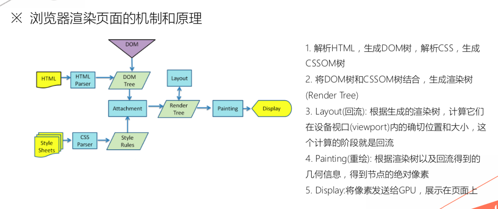

# JS底层原理（下）

@(JS)

## 浏览器相关
### 进程和线程
* 进程是cpu资源分配的最小单位（是能拥有资源和独立运行的最小单位）
* 线程是cpu调度的最小单位（线程是建立在进程的基础上的一次程序运行单位，一个进程中可以有多个线程）
* 不同进程之间也可以通信，不过代价较大
* 现在，一般通用的叫法：单线程与多线程，都是指在一个进程内的单和多。（所以核心还是得属于一个进程才行）
* 进程拥有独立的PCB，进程控制块
* 线程拥有的是线程控制块TCB
### 进程间的通信
https://www.jianshu.com/p/c1015f5ffa74
* 共享存储器
	* 共享数据结构
	* 共享存储区
* 管道通信系统
	* 连接一个读进程和一个写进程以实现它们之间通信的一个共享文件
* 消息传递系统
	* 以格式化的消息为单位，将通信的数据封装在消息中，再用通信原语进行交流
* 客户机-服务器系统
	* 套接字

### 浏览器的线程和进程
#### 基本概念
* 浏览器是多进程的
* 浏览器之所以能够运行，是因为系统给它的进程分配了资源（cpu、内存）
* 简单点理解，每打开一个Tab页，就相当于创建了一个独立的浏览器进程。
#### 浏览器中进程的分类
1. Browser进程：浏览器的主进程（负责协调、主控），只有一个。作用有
* 负责浏览器界面显示，与用户交互。如前进，后退等
* 负责各个页面的管理，创建和销毁其他进程
* 将Renderer进程得到的内存中的Bitmap，绘制到用户界面上
* 网络资源的管理，下载等
2. 第三方插件进程：每种类型的插件对应一个进程，仅当使用该插件时才创建
3. GPU进程：最多一个，用于3D绘制等
4. 浏览器渲染进程（浏览器内核）（Renderer进程，内部是多线程的）：默认每个Tab页面一个渲染进程，互不影响。主要作用为：
* 页面渲染，脚本执行，事件处理等
 
注意：在浏览器中打开一个网页相当于新起了一个进程（进程内有自己的多线程）

浏览器有时会将多个进程合并（譬如打开多个空白标签页后，会发现多个空白标签页被合并成了一个进程），如图

#### 浏览器多进程的优势
相比于单进程浏览器，多进程有如下优点：
* 避免单个page crash影响整个浏览器

* 避免第三方插件crash影响整个浏览器

* 多进程充分利用多核优势

* 方便使用沙盒模型隔离插件等进程，提高浏览器稳定性

即：**如果浏览器是单进程，那么某个Tab页崩溃了，就影响了整个浏览器，体验有多差；同理如果是单进程，插件崩溃了也会影响整个浏览器；而且多进程还有其它的诸多优势。。。但是内存等资源消耗也会更大**
#### 渲染进程的线程分类
1. GUI渲染线程
* 负责渲染浏览器界面，解析HTML，CSS，构建DOM树和RenderObject树，布局和绘制等。


* 当界面需要重绘（Repaint）或由于某种操作引发回流(reflow)时，该线程就会执行


* 注意，GUI渲染线程与JS引擎线程是互斥的，当JS引擎执行时GUI线程会被挂起（相当于被冻结了），GUI更新会被保存在一个队列中等到JS引擎空闲时立即被执行。
2. JS引擎线程
* 也称为JS内核，负责处理Javascript脚本程序。（例如V8引擎）


* JS引擎线程负责解析Javascript脚本，运行代码。


* JS引擎一直等待着任务队列中任务的到来，然后加以处理，一个Tab页（renderer进程）中无论什么时候都只有一个JS线程在运行JS程序


* 同样注意，GUI渲染线程与JS引擎线程是互斥的，所以如果JS执行的时间过长，这样就会造成页面的渲染不连贯，导致页面渲染加载阻塞。
3. 事件触发线程
* 归属于浏览器而不是JS引擎，用来控制事件循环（可以理解，JS引擎自己都忙不过来，需要浏览器另开线程协助）


* 当事件满足触发条件时，将事件放入到JS引擎所在的执行队列中


* 注意，由于JS的单线程关系，所以这些待处理队列中的事件都得排队等待JS引擎处理（当JS引擎空闲时才会去执行）
4. 定时触发器线程
* setInterval与setTimeout所在线程


* 浏览器定时计数器并不是由JavaScript引擎计数的,（因为JavaScript引擎是单线程的, 如果处于阻塞线程状态就会影响记计时的准确）


* 因此通过单独线程来计时并触发定时（计时完毕后，添加到事件队列中，等待JS引擎空闲后执行）


* 注意，W3C在HTML标准中规定，规定要求setTimeout中低于4ms的时间间隔算为4ms。

5. 异步http请求线程
* 在XMLHttpRequest在连接后是通过浏览器新开一个线程请求

* 将检测到状态变更时，如果设置有回调函数，异步线程就产生状态变更事件，将这个回调再放入事件队列中。再由JavaScript引擎执行。


### 浏览器的渲染过程

* 浏览器多线程，但是页面渲染是单线程
* 浏览器分配一个线程自上而下，从左到右依次解析和渲染代码
* 由渲染进程中的渲染线程负责
* 最后浏览器将painting计算出来的各层信息发送给 GPU，GPU 将各层信息合成（composite），显示在屏幕上
### DOM(Document Object Model)的构建

* 遇到DOM部分的代码就构建DOM
* 渲染线程中的DOM解析器解析DOM tree
* DOMContentLoaded事件是在DOM建立好过后触发
* load事件是当所有的资源包括图片都加载完成后再触发
### CSSOM(CSS Object Model)的构建

* 遇到CSS的内嵌样式部分就直接构建CSSOM
* 由渲染线程中的CSS解析器负责
* 和DOM解析器平行运行，即CSS解析器解析CSS并不会阻碍DOM的建立
### 构建渲染树过程
* 同样由渲染线程来进行，将DOM和CSSOM进行结合生成render tree, 注意DOM中的结点不一定都是会出现在渲染树中，因为有一些比如说display:none的结点不用占地方所以就不用出现在渲染树中
* **CSS匹配HTML元素是一个相当复杂和有性能问题的事情。所以，DOM树要小，CSS尽量用id和class，千万不要过渡层叠下去。否则会返回去找父结点查看是否匹配**
* 必须要有CSSOM和DOM结合称为了渲染树后再由渲染线程进行Layout(回流)和Painting(重绘)
* 浏览器可以先利用部分构建好的DOM去结合CSSOM生成渲染树进行部分的页面显示从而提高用户体验
* 但是CSSOM必须完全被解析为CSSOM之后才能够结合DOM进行页面的渲染
* 所以CSS应该被加载和解析得越快越好，所以应该放在头部
* 所以CSS如果不是很多应该使用内嵌的方式，这样会提高页面渲染的速度
* 实际上这里指的完全的CSSOM是指的一个CSS任务或者文件，只要一个CSS文件被完全解析过后就可以立马结合已经解析了的DOM进行页面的渲染，或者是最开始没有CSS文件，浏览器也会把没有样式的DOM渲染到页面上，最后拿到了CSSOM再进行回流和重绘
### 回流和重绘
我们知道，当网页生成的时候，至少会渲染一次。在用户访问的过程中，还会不断重新渲染。重新渲染会重复上图中的第四步(回流)+第五步(重绘)或者只有第五个步(重绘)。

* 回流:当render tree中的一部分(或全部)因为元素的规模尺寸、布局、隐藏等改变而需要重新构建
* 重绘:当render tree中的一些元素需要更新属性，而这些属性只是影响元素的外观、风格，而不会影响布局的，比如background-color。

**回流必定会发生重绘，重绘不一定会引发回流。**重绘和回流会在我们设置节点样式时频繁出现，同时也会很大程度上影响性能。回流所需的成本比重绘高的多，改变父节点里的子节点很可能会导致父节点的一系列回流。
#### 引起回流的方法
任何会改变元素几何信息(元素的位置和尺寸大小)的操作，都会触发回流，

* 添加或者删除可见的DOM元素；
* 元素尺寸改变——边距、填充、边框、宽度和高度
* 内容变化，比如用户在input框中输入文字
* 浏览器窗口尺寸改变——resize事件发生时
* 计算 offsetWidth 和 offsetHeight 属性
* 设置 style 属性的值

#### 引起重绘的方法

实例：


### JS
* 遇到script标签会执行去执行js句或者去请求js脚本文件待加载完后再执行
* 在js的资源加载和解析执行的过程中会阻塞渲染线程，而渲染线程负责整个渲染过程，所以DOM和CSSOM的解析，渲染树的生成以及回流重绘都会被阻塞
* **注意，由于JS中有可能操作元素的样式，而操作样式就要等CSSOM和DOM结合成渲染树，而单个的CSS文件或者执行段又必须完全被解析为CSSOM后才能生成渲染树，所以JS会等待已有的CSS任务解析完毕并和已有的DOM结合生成渲染树后再执行。并且在异步过程中也是如此，哪怕JS的资源先加载回来，也会等之前发送请求的CSS加载并解析渲染完成后才能执行**
* 从以上这个角度来讲，CSS的解析会阻塞JS的执行
* 可以使用async和defer属性去缓解js的阻塞带来的不良影响
	* async是并行请求请求到了就马上执行，不管请求的顺序
	* defer会延迟到最后执行且按照请求的先后顺序执行


### Preseeker和常见的两个页面渲染的不良问题
* 另外的线程中还会有一个preseeker去扫描整个代码，如果发现有要异步请求的资源就会提前去请求,不必等HTML parser或者说DOM parser到那里
* FOUC：由于浏览器渲染机制（比如firefox），再CSS加载之前，先呈现了HTML，就会导致展示出无样式内容，然后样式突然呈现的现象；
* 白屏：有些浏览器渲染机制（比如chrome）要先构建DOM树和CSSOM树，构建完成后再进行渲染，如果CSS部分放在HTML尾部，由于CSS未加载完成，浏览器迟迟未渲染，从而导致白屏；也可能是把js文件放在头部，脚本会阻塞后面内容的呈现，脚本会阻塞其后组件的下载，出现白屏问题。
### 浏览器的优化方式总结（一直总结补充）
* 减少http请求：大部分浏览器只能最大支持6个并发的请求，多的就要等待，所以要减少请求数量
	* CSS内嵌
	*  使用雪碧图base64
	* 合并资源
	* 合理利用缓存
	* 懒加载
	* connection -> keepalive
* 减少阻塞
	* js放尾部或者采用async或者defer
	* CSS放首部
	* js使用defer或async
* 减少回流和重绘
	* 使用 transform 替代 top
	* 使用 visibility 替换 display: none ，因为前者只会引起重绘，后者会引发回流（改变了布局）
	* 不要把节点的属性值放在一个循环里当成循环里的变量。
	* 可以把CSS语句打包最后一次更新
	* 不要使用 table 布局，可能很小的一个小改动会造成整个 table 的重新布局
	* 动画实现的速度的选择，动画速度越快，回流次数越多，也可以选择使用 requestAnimationFrame
	* 将频繁重绘或者回流的节点设置为图层，图层能够阻止该节点的渲染行为影响别的节点。比如对于 video 标签来说，浏览器会自动将该节点变为图层。
	* 使用VUE
	* 分离读写操作
	* 􏱞样式集中改变
	* 缓存布局信息
	* 元素批量修改
	* 牺牲平滑度换取速度
* 代码本身来说
	* 合理利用闭包内存
	* CSS 选择符从右往左匹配查找，避免节点层级过多
	
## 事件
事件是浏览器赋予元素天生默认的一些行为，不论是否绑定相关的方法，只要行为操作进行了，那么一定会触发相关的事件行为（若没有绑定方法其实也会触发事件只是没有反应而已）
### 元素天生自带的事件
**[鼠标事件]**
click:点击(按下抬起)（PC端是点击，移动端是单击移动端使用click会有300ms延迟）只要点了就是点击，单击是一段时间只按一下
dblclick:双击
mouseover:鼠标经过
mouseout:鼠标移出
mouseenter:鼠标进入
mouseleave:鼠标移开
mousemove:鼠标移动
mousedown:鼠标按下(左右键都起作用，它是按下即触发，click是按下抬起才触发)
mouseup:鼠标抬起（相比click先触发mouseup）
mousewheel:鼠标滚轮滚动
...
**[键盘事件]**
 keydown:键盘按下
 keyup:键盘抬起
 keypress:和keydwon类似，keydown返回的是键盘码，keypress返回的是ASCII码值
 input:由于PC端有实体物理键盘，可以间听到键盘的按下和抬起，但是移动端是虚拟的键盘，所以keydown和keyup在大部分手机上都没有，我们用input统一代替（代表内容改变事件）
 [表单元素常用的事件]
  focus:获取焦点
  剩下的自己去总结一下

### 事件绑定
给元素的某一个事件行为绑定方法，目的是行为触发会可以做点自己想做的事情
#### DOM0事件绑定

```
元素.onxxx=function(){}//要加绑定时要加on
元素.onxxx=null;  
```

原理：给DOM元素对象的某一个私有事件属性赋值函数值，当用户触发这个事件行为，JS引擎会帮助我们把之前绑定的方法执行的

	=>1.不是所有的事件类型都支持这种方式，元素有哪些onxxx事件属性，才能给其绑定方法（例如：DOMContentLoaded事件就不支持这种绑定方案）
	=>2.只能给当前元素的某一个事件行为绑定一个方法（绑定多个也只能识别最后一个）
	
#### DOM2事件绑定

```
IE6-8: 元素.attachEvent(onxxx,function(){});
元素.addEventListener([事件类型],[方法],[传播模式])
元素.removeEventListener([事件类型],[方法],[传播模式])
        function anonymous(){
        console.log('ok');
        }
box.addEventListener('click',anonymous,false);//flase为冒泡阶段
box.removeEventListener('click',anonymous,false);
```

原理：基于原型链查找机制，找到EventTarget.prototype上的addEventListener方法执行，它是基于浏览器事件池机制完成事件绑定的

### 事件对象

 当前元素的某个事件行为被触发，不仅会把绑定的方法执行，还会给绑定的方法传递一个实参，这个实参就是事件对象；事件对象就是用来存储当前行为操作相关信息的对象；（MosueEvent/KeyboardEvent/Event/TouchEvent...）
 **注意：**
  * 事件对象和在哪个方法中拿到的没关系，它记录的是当前操作的信息，只和操作的类型，位置等有关，操作一次只有一份信息，第二次操作再重新生成一个新的对象
  * 每一次事件触发浏览器处理顺序：
  1:捕获到当前操作的行为，通过创建MouseEvent实例，得到事件对象EV
  2：通知所有绑定的方法（符合执行条件的）开始执行，并把EV当作实参传给每一个方法，所以每个方法中的事件对象实际上是同一个
  3:后面再继续触发这个事件行为，会重新获取本次操作的信息

  鼠标事件对象中的属性：
  clientX,clientY触发点距离窗口（能看到的部分）左上角X/Y轴的坐标
  pageX/pageY触发点距离当前页面（整个页包括看不到的）左上角X/Y轴坐标
  type:触发事件的类型
  target:事件源（操作的是哪个元素）
  srcElement:也是事件源
  preventDefault：阻止默认行为的方法
  ev.returnValue = false:阻止默认行为
  stopPropagation:阻止冒泡传播
  ev.cancleBubble = true 也可以阻止冒泡
### 阻止事件的默认行为

```
  如<a>的默认行为
	 1:页面跳转
	 2:锚点定位
  阻止该默认行为的三种方式：
	 1:href = 'javascript:;'
	 2:link.onclick = function(ev){
		 return false;
	 }
	 点击<a>先触发click行为，再执行href的跳转，
	 通过return false结束后面的步骤
	 3:link.onclick = function(ev){
		 ev.preventDefault();
	 }
```

### 事件传播机制
捕获阶段：从外到内（目的是为了冒泡排序计算好传播的层级路径）**不能阻止捕获，所以尽量都在冒泡阶段执行**
目标阶段：当前元素的相关事件行为触发
冒泡传播：一个元素的事件行为触发，所有的祖先元素一直到window相关的事件行为都触发（从内到外）
ev.stopPropagation();阻止事件的冒泡传播

### mouseeneter VS mouseover

