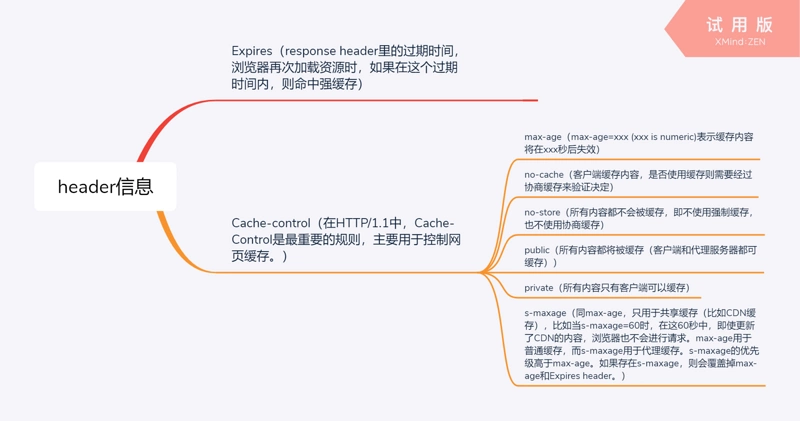
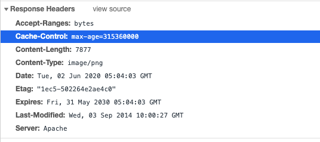
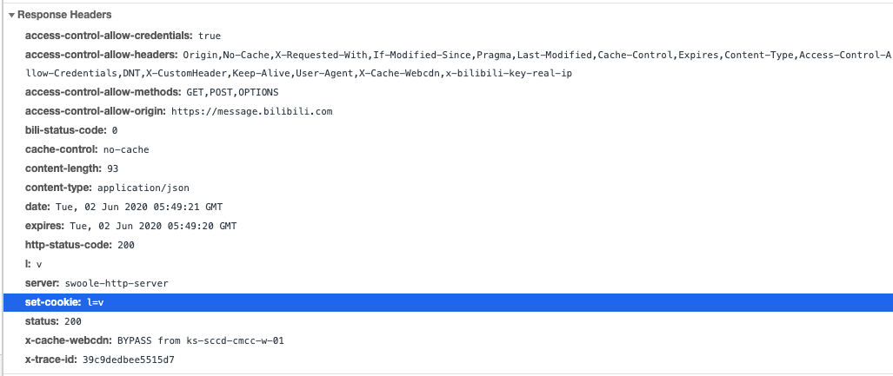

## 全面拥抱ES6和AJAX HTTP

@(JS)

### ES6基础语法
#### 解构赋值
解构赋值主要是针对于数组和对象的：真实项目中，一般常用于把从服务器获取的JSON数据进行快速解构，赋值给对应的变量，帮助我们快速拿到对应的结果 

```javascript
// let arr = [10, 20, 30, 40];

/* let [a, b, c, d] = arr;
console.log(a, b, c, d); */

/* let [a, , , b] = arr;
console.log(a, b); */

/* let [a] = arr;
console.log(a); */

/* let [a, ...b] = arr;//...为扩展运算符，把剩下的项赋值给b
console.log(a, b); //=>b=[20,30,40] */

/* let [a] = arr.reverse();//拿最后一个词
console.log(a); */

// 赋值默认值
/* let arr = [10];
let [a, b = 0] = arr;
console.log(a, b); */

// a/b互换值
/* let a = 10,
	b = 20; */

/* let c = a;
a = b;
b = c;
console.log(a, b); */

/* a = a + b;
b = a - b;
a = a - b;
console.log(a, b); */

/* [b, a] = [a, b];//快速实现交换变量
console.log(a, b); */
```
#### 对象解构赋值
		/* let obj = {
			id: 1,
			name: '珠峰培训',
			age: 10
		}; */
	
		/* 
		//=>对象解构赋值，创建的变量名需要和属性名保持一致
		let {
			id,
			name,
			sex
		} = obj;
		console.log(id, name, sex); */
	
		/*
		//=>赋值默认值 
		let {
			sex = 0
		} = obj;
		console.log(id, name, sex); */
	
		// 设置别名
		/* let age = 0;
		let {
			age: age1
		} = obj;
		console.log(age1); */
##### 真实项目中的应用

```javascript
let data = [{
	id: 1,
	name: '珠峰培训'
}, {
	id: 2,
	name: '周啸天'
}];

/* let str = ``;
data.forEach((item) => {
	let {
		id,
		name
	} = item || {};//对item进行解构赋值拿到里面的数据,且null不能解构赋值会报错，给一个{}的初值
	str += `<div>
		<span>${id}</span>
		<span>${name}</span>
	</div>`;
});*/

/* let str = ``;
data.forEach(({//直接在赋值的时候进行解构赋值拿到id和name
	id,
	name
}) => {
	str += `<div>
		<span>${id}</span>
		<span>${name}</span>
	</div>`;
}); */
```
#### ...运算符
1.扩展运算符  let [...arr]=[10,20,30,40]; // arr = [10,20,30,40],把前面的一起赋值给arr
2.剩余运算符  函数的形参赋值上 
3.展开运算符  展开数组或者对象中的每一项

	/* let fn = (n, ...m) => {//剩余运算符
		// 箭头函数中没有arguments
		console.log(n, m);
	};
	fn(10, 20, 30, 40); */
	
	// 数组克隆 （展开运算符）
	/* let arr1 = [10, 20, 30];
	let arr2 = [...arr1];//把arr1中的每一项展开再传给arr2实现数组的克隆
	fn.call(obj,...arr1);  // fn(10,20,30)展开传递 */

#### Array.from()和Array.of()

Array.from() 把一个类数组集合（Set集合）转换为数组,如或set集合:

```
{
1:'a',
2:'c'
}
```

Array.of() 把一组值转换为数组
ES5中Array常用的一个方法：Array.isArray()验证是否为数组

Array.prototype新增的方法
**new Array(3).fill(null)  创建集合长度为3，每一项都填充为null**
includes
flat() 数组扁平化
entries()，keys()，values()
find / findIndex  =>数组的遍历迭代方法 forEach/map/filter/find/some/every/reduce...
#### Object上的方法

```
// Object.assign([obj1],[obj2]) 合并对象，把[obj2]的信息替换[obj1]
// Object.create([obj]) 创建一个空对象，让其__proto__指向[obj]
// Object.defineProperty([obj],[key],[options]) 监听一个对象某个属性的处理操作
// Object.entries([obj]) 获取一个对象所有的键值对
// Object.keys([obj])
// Object.values([obj])
// Object.freeze([obj]) 冻结对象，让其所有操作都不能进行
// Object.is([value1],[value2]) 比较两个值是否相等，比==/===更准确 
```
#### 数组去重
方法1:
```
		Set数据结构中的每一项都是唯一的（类数组）
		arr = [...new Set(arr)];
		console.log(arr);
		arr = Array.from(new Set(arr));
		console.log(arr);
```
#### Map
		// 传统对象结构中 键不能是对象
		// let n = {
		// 	x: 10
		// };
		// let obj = {
		// 	id: 1
		// };
		// obj[n] = 10;//此时n会.toString()转化成[object.object]
	
		// map支持属性名是对象
		// let n = {
		// 	x: 10
		// };
		// let obj = new Map();
		// obj.set(n, 10);

### 数组克隆
#### 数组浅克隆
1.展开运算符（浅克隆：只把第一级克隆一份过来，第二级及以后和原始对象公用相同的堆地址,所以第二级或以后的对象地址都是一样的）

```
let arr2 = [...arr1];
```
2.slice实现的也是浅克隆

```
let arr2 = arr1.slice(0);
```
#### 数组深度克隆
1.基于JSON方法，先把原始对象转换为字符串，在把字符串重新定义为对象，此时实现了内容的深度克隆
问题：如果对象中的某一项值是正则或者函数，基于JSON.stringify和JSON.parse处理后就不在是正则（变为空对象）或者函数（变为null）了

```
let arr2 = JSON.parse(JSON.stringify(arr1));
```
2.深度克隆的一般方法

```
function _type(value) {
	return Object.prototype.toString.call(value);
}

function _deepClone(obj) {
	// 必须保证OBJ是数组或者对象等
	let newObj = new obj.constructor;
	for (let key in obj) {
		if (!obj.hasOwnProperty(key)) break;
		let item = obj[key],
			itemType = _type(item);
		if (item !== null && typeof item === "object") {
			if (/(RegExp|Date)/.test(itemType)) {
				newObj[key] = new item.constructor(item);//注意这个地方也要用生成对象的方式
				continue;
			}
			// 只有对象才需要深层次克隆处理
			newObj[key] = _deepClone(item);
			continue;
		}
		newObj[key] = item;
	}
	return newObj;
}
```
注意虽然正则和日期是对象但是并不需要递归生成所以需要额外判断
### JS事件循环
#### JS同步异步的操作
##### 同步
JS本身是单线程的（浏览器只分配一个线程供JS代码自上而下运行） 
=>在JS中大部分操作都是同步编程：当前任务不完成，下一个任务是无法继续执行的，换句话说，任务是逐一执行的
=>但是对于某些特殊的需求，也是需要按照异步编程的思维去处理的
##### 异步操作
[浏览器端]
+ 定时器是异步编程
+ JS中的事件绑定是异步编程
+ Ajax/Fetch请求的发送（HTTP事务）
+ Promise设计模式管控异步编程的（包括：async/await...）
[Node端]
+ progress.nextTick
+ setImmediate
+ FS进行I/O操作可以是异步操作
#### 异步运行机制：事件循环和事件队列
1. 运行机制
	


注意主栈清空后先运行微任务，再进行DOM渲染，再运行宏任务
2. 例题1
 
**注意主栈为空是指所有代码都执行完毕**
3. 例题2
```
/* console.log(1);
setTimeout(_ => {
	console.log(2);
}, 50);
console.log(3);
setTimeout(_ => {
	console.log(4);
	// 遇到死循环  =>所有代码执行最后都是在主栈中执行，遇到死循环，主栈永远结束不了，后面啥都干不了了
	while (1 === 1) {}
}, 0);
console.log(5); */
```
4. 实现一个sleep函数

```
function sleep(d){
  for(var t = Date.now();Date.now() - t <= d;);
}
sleep(5000); //当前方法暂停5秒
```
Date.prototype.getTime()
返回从1970-1-1 00:00:00 UTC（协调世界时）到该日期经过的毫秒数，对于1970-1-1 00:00:00 UTC之前的时间返回负值。
Date.now()
返回自 1970-1-1 00:00:00  UTC（世界标准时间）至今所经过的毫秒数。
**注：还有其他版本之后再补充**

### Promise的基础
#### AJAX中的回调地狱
回调地狱：上一个回调函数中继续做事情，而且继续回调（在真实项目的AJAX请求中经常出现回调地狱）=>异步请求、不方便代码的维护 
例子：
```
$.ajax({
	url: '/student',
	method: 'get',
	data: {//传入的表单数据
		class: 1
	},
	success: function (result) {//把收到的结果result作为回调函数的参数继续进行
		// result=>学生信息
		$.ajax({//继续ajax请求
			url: '/score',
			method: 'get',
			data: {
				stuId: result.map(item => item.id)//map对数组中每一个值进行操作返回一个新数组
			},
			success: function (result) {
				// result=>学员的分数信息
				$.ajax({
					//...
				});
			}
		});
	}
}); 
```
#### Promise的产生
Promise的诞生就是为了解决异步请求中的回调地狱问题：它是一种**设计模式**，ES6中提供了一个JS内置类Promise，来实现这种设计模式，即Promise本身并不是异步，只是一种让异步实现得更优雅已读的代码编写方式
例子：


```
//封装
function ajax1() {
	return new Promise(resolve => {//用Promise去实行一个ajax的异步请求
		$.ajax({
			url: '/student',
			method: 'get',
			data: {
				class: 1
			},
			success: resolve
		});
	});
}

function ajax2(arr) {
	return new Promise(resolve => {
		$.ajax({
			url: '/score',
			method: 'get',
			data: {
				stuId: arr
			},
			success: resolve
		});
	});
}

function ajax3() {
	return new Promise(resolve => {
		$.ajax({
			url: '/jige',
			// ...
			success: resolve
		});
	});
}
//调用三种promise的方法
ajax1().then(result => {
	return ajax2(result.map(item => item.id));
}).then(result => {
	return ajax3();
}).then(result => {

});
//或者async await语法糖
async function handle() {
	let result = await ajax1();
	result = await ajax2(result.map(item => item.id));
	result = await ajax3();
	// 此处的result就是三次异步请求后获取的信息
}
handle();
```
#### 创建一个Promise实例
new Promise([executor]) 
[executor]执行函数是必须传递的

PROMISE是用来管理异步编程的一种设计结构，它本身不是异步的：
```
let p1 = new Promise(() => {
	console.log(1); //=>1
});
console.log(2); //=>2 
//先输出1再输出2
```
new Promise的时候会立即把executor函数执行（只不过我们一般会在executor函数中处理一个异步操作）
如：
```
let p1 = new Promise(() => {
	setTimeout(_ => {
		console.log(1);
	}, 1000);
	console.log(2);
});
console.log(3);
//2->3->1
```
#### Promise实例的[[PromiseStatus]]和[[PromiseValue]]属性
* PROMISE本身有三个状态  =>[[PromiseStatus]](是实例中的一个属性)
	* pending 初始状态
	* fulfilled 代表操作成功（resolved）
	* rejected 代表当前操作失败

* PROMISE本身有一个[[PromiseValue]]值，用来记录成功的结果**或者是失败的原因**
* 这个状态决定于异步操作中执行resolve还是reject函数，resolve成功，reject失败
* 并且一旦状态被改变，在执行resolve、reject就没有用了

例子：
```
let p1 = new Promise((resolve, reject) => {
	setTimeout(_ => {
		// 一般会在异步操作结束后，执行resolve/reject函数，执行这两个函数中的一个，都可以修改Promise的[[PromiseStatus]]/[[PromiseValue]]
		// 一旦状态被改变，在执行resolve、reject就没有用了，所以此时是fulfilled,reject无效
		resolve('ok');
		reject('no');
	}, 1000);
});
```
#### Then方法
例子1：
```
let p1 = new Promise((resolve, reject) => {
	setTimeout(_ => {
		let ran = Math.random();
		console.log(ran);
		if (ran < 0.5) {
			reject('NO!');
				return;
			}
			resolve('OK!');
		}, 1000);
// THEN：设置成功或者失败后处理的方法
// Promise.prototype.then([resolvedFn],[rejectedFn])
p1.then(result => {
	console.log(`成功：` + result);
}, reason => {
	console.log(`失败：` + reason);
}); 
```
new Promise的时候先执行executor函数，在这里开启了一个异步操作的任务（此时不等：把其放入到EventQuque任务队列中），继续执行

p1.then基于THEN方法，在promise原型上，存储起来两个函数（此时这两个函数还没有执行）；当executor函数中的异步操作结束了，基于resolve/reject控制Promise状态，从而决定执行then存储的函数中的某一个

例子2：

```
// 先输出1,2,3 再输出 100
		let p1 = new Promise((resolve, reject) => {
		console.log(1);
			// resolve/reject 的执行，不论是否放到一个异步操作中，都需要等待then先执行完，把方法存储好，才会在更改状态后执行then中对应的方法 =>此处是一个异步操作（所以很多人说PROMISE是异步的），而且是微任务操作
	    resolve(100);
	    console.log(2);
		});
		p1.then(result => {
			console.log(`成功：` + result);
		}, reason => {
			console.log(`失败：` + reason);
		});
		console.log(3); 
```
resolve和reject是异步，会等then先存储两个方法，并且等主栈执行完，再执行resolve并修改promise实例的状态再执行对应的方法，即resolve是异步的微任务


#### 带状态的PROMISE实例的创建
创建一个状态为成功/失败的PROMISE实例 的三种写法：
```
//1.
Promise.resolve(100)
//2.
Promise.reject(0)
//3.
new Promise(function (resolve, reject){
resolve(100);
//reject(100);
});
```
#### Promise的具体执行逻辑
```
let p1 = new Promise((resolve, reject) => {
		resolve(100);
	});
let p2 = p1.then(result => {//执行它
	console.log('成功：' + result);
	return result + 100;//没有报错成功执行，返回这个200作为p2的成功状态的value值
}, reason => {
	console.log('失败：' + reason);
	return reason - 100;
});
let p3 = p2.then(result => {
	console.log('成功：' + result);
}, reason => {
	console.log('失败：' + reason);
}); 
```
 p1这个new Promise出来的实例，成功或者失败，取决于executor函数执行的时候，执行的是resolve还是reject决定的，再或者executor函数执行发生异常错误，也是会把实例状态改为失败的

 p2/p3这种每一次执行then返回的新实例的状态，由then中存储的方法执行的结果来决定最后的状态（上一个THEN中某个方法执行的结果，决定下一个then中哪一个方法会被执行）

=>不论是成功的方法执行，还是失败的方法执行（THEN中的两个方法），凡是执行抛出了异常，则都会把实例的状态改为失败

=>方法中如果返回一个新的PROMISE实例，返回这个实例的结果是成功还是失败，也决定了当前实例是成功还是失败

=>剩下的情况基本上都是让实例变为成功的状态 

=>方法返回的结果是当前实例的value值：上一个then中方法返回的结果会传递到下一个then的方法中,若没有返回时undefined,若报错了返回报错的信息


例题1：

```
Promise.resolve(10).then(result => {
	console.log(`成功：${result}`);
	return Promise.reject(result * 10);
}, reason => {
	console.log(`失败：${reason}`);
}).then(result => {
	console.log(`成功：${result}`);
}, reason => {
	console.log(`失败：${reason}`);
}); 
```
返回
成功 10
失败100

例题2:

返回


#### Then和Catch区别于联系

* TEHN中也可以只写一个或者不写函数
* .then(fn)或者.then(null,fn)
* 遇到一个THEN，要执行成功或者失败的方法，如果此方法并没有在当前THEN中被定义，则顺延到下一个对应的函数

例子1：
```
Promise.reject(10).then(result => {
			console.log(`成功：${result}`);
			return result * 10;
		}).then(null, reason => {
			console.log(`失败：${reason}`);
		});
```
* 使用catch去捕捉失败
* Promise.prototype.catch(fn)其实与.then(null,fn)的作用相等

例子：
```
Promise.resolve(10).then(result => {
			console(a);//=>报错了
		}).catch(reason => {
			console.log(`失败：${reason}`);
		});
```
#### All和Race的用法
Promise.all(arr)：
* 返回的结果是一个PROMISE实例（ALL实例）
* 要求ARR数组中的每一项都是一个新的PROMIE实例
* PROMISE.ALL是等待所有数组中的实例状态都为成功才会让“ALL实例”状态为成功
* VALUE是一个集合，存储着ARR中每一个实例返回的结果，**且VALUE的顺序对应的是ALL中的顺序**
* ARR中有一个实例状态为失败，“ALL实例”的状态也是失败

Promise.race(arr)：
* 和ALL不同的地方，RACE是赛跑，也就是ARR中不管哪一个先处理完，处理完的结果作为“RACE实例”的结果

例子：

```
let p1 = Promise.resolve(1);
let p2 = new Promise(resolve => {
	setTimeout(_ => {
		resolve(2);
	}, 1000);
});
let p3 = Promise.reject(3);

Promise.all([p2, p1]).then(result => {
	// 返回的结果是按照ARR中编写实例的顺序组合在一起的
	// [2,1]
	console.log(`成功：${result}`);
}).catch(reason => {
	console.log(`失败：${reason}`);
}); 
```
#### async/await
* ES7中提供了PROMISE操作的语法糖：async / await
* ASYNC 是让一个普通函数返回的结果变为STATUS=RESOLVED并且VALUE=RETRN结构的PROMISE实例 

```
 async function fn() {
			return 10;
		}
		console.log(fn());//返回一个promise实例，状态成功，值为10
```

* ASYNC 最主要的作用是配合AWAIT使用的，因为一旦在函数中使用AWAIT，那么当前的函数必须用ASYNC修饰
* AWAIT会等待当前PROMISE的返回结果，只有返回的状态是RESOLVED情况，才会把返回结果赋值给RESULT
* AWAIT不是同步编程，是异步编程（微任务）:当代码执行到此行就立即执行await对应的函数，然后马上把await下面的代码构建为一个异步的微任务入微任务队列，若返回时成功状态才会执行对应的微任务中的代码，相当于then中的第一个成功的方法
* 如果PROMISE是失败状态，则AWAIT不会接收其返回结果，AWAIT下面的代码也不会在继续执行（AWAIT只能处理PROMISE为成功状态的时候），所以若要处理失败不能用await
* 注意await后面跟的必须是一个promise的实例或者是一个要返回一个promise实例的执行函数才能实现异步操作即把后面的代码作为微任务放到任务队列中，await只是把这个实例的value值返回给了一个变量，让这个变量参与后续的计算

例子1：

```javascript
let p1 = Promise.resolve(100);
let p2 = new Promise(resolve => {//这个时候Promise中的executor已经开始执行了
	setTimeout(_ => {
		resolve(200);
	}, 1000);
});
let p3 = Promise.reject(3);

async function fn() {
	console.log(1);
	// AWAIT会等待当前PROMISE的返回结果，只有返回的状态是RESOLVED情况，才会把返回结果赋值给RESULT
	// AWAIT不是同步编程，是异步编程（微任务）:当代码执行到此行（先把此行），构建一个异步的微任务（等待PROMISE返回结果，并且AWAIT下面的代码也都被列到任务队列中），
	let result = await p2;//注意这个地方p2是一个promise实例，result是这个实例的值，会等待Promise中的executor执行完毕生成value值
	console.log(result);//所以result是200

	let AA = await p1;//AA为100
	console.log(AA);
}
fn();
console.log(2); 
```

例子2:

```
async function fn() {
	// 如果PROMISE是失败状态，则AWAIT不会接收其返回结果，AWAIT下面的代码也不会在继续执行（AWAIT只能处理PROMISE为成功状态的时候）
	let reason = await p3;
	console.log(reason);//不会输出
}
fn(); 
```
例题3:

```
async function async1() {
	console.log('async1 start');
	await async2();
	console.log('async1 end');
}
async function async2() {
	console.log('async2');
}
console.log('script start');
setTimeout(function () {
	console.log('setTimeout');
}, 0)
async1();
new Promise(function (resolve) {
	console.log('promise1');
	resolve();
}).then(function () {
	console.log('promise2');
});
console.log('script end');
```


例题4:
```
console.log(1);
setTimeout(_ => { console.log(2); }, 1000);
async function fn() {
	console.log(3);
	setTimeout(_ => {  console.log(4); }, 20);
	return Promise.resolve();
}
async function run() {
	console.log(5);
	await fn();
	console.log(6);
}
run();
// 需要执行150MS左右
for (let i = 0; i < 90000000; i++) {}
setTimeout(_ => {
	console.log(7);
	new Promise(resolve => {
		console.log(8);
		resolve();
	}).then(_ => { console.log(9); });
}, 0);
console.log(10);
```


### Promise的手写

```javascript
class MyPromise {
	constructor(executor) {//executor是必须传入的参数，是实际运用中需要异步执行的函数
		this.status = 'pending';
		this.value = undefined;
		this.resolveArr = [];//用来装.then中成功的回调函数，不止一个所以用数组
		this.rejectArr = [];//用来装.then中失败的回调函数，不止一个所以用数组

		let change = (status, value) => {//作为改变实例状态的一个函数
			if (this.status !== 'pending') return;//只能改变一次所以若不为pending就不能继续
			this.value = value;
			this.status = status;
			let fnArr = status === 'resolved' ? this.resolveArr : this.rejectArr;//是成功还是失败的回调？
			fnArr.forEach(item => {
				if (typeof item !== 'function') return;
				item(this.value);//以executor中对resolve或者reject传入的参数作为回调函数的参数进行执行
			});
		};
		let resolve = result => {
			if (this.resolveArr.length > 0) {//若已经执行了.then放了回调函数才执行
				change('resolved', result);
				return;
			}
			let delayTimer = setTimeout(_ => {//若没有执行回调函数就利用一个定时器去模拟微任务的实现让.then先执行
				change('resolved', result);
				clearTimeout(delayTimer);//清除计时器
			}, 0);
		};
		let reject = reason => {
			if (this.rejectArr.length > 0) {
				change('rejected', reason);
				return;
			}
			let delayTimer = setTimeout(_ => {
				change('rejected', reason);
				clearTimeout(delayTimer);
			}, 0);
		};

		try {//若executor本身执行不出错才会看executor中是执行的resolve还是reject
			executor(resolve, reject);
		} catch (err) {//若本身执行出错了就会直接执行reject并传入出错的信息
			reject(err.message);
		}
	}

	then(resolveFn, rejectFn) {
		// 如果传递的参数不是函数（NULL/不传递），我们让成功或者失败顺延
		if (typeof resolveFn !== 'function') {
			resolveFn = result => {
				return result;//如果是成功的回调函数没传直接把result参数传递即可
			};
		}
		if (typeof rejectFn !== 'function') {
			rejectFn = reason => {
				return MyPromise.reject(reason);//如果是失败的回调函数没传就静态生成一个reject状态的promise实例
			};
		}
//为了满足回调函数的执行结果会对.then状态造成影响的效果，采用了闭包的处理机制，把新生成的实例的resolve，reject方法和resolverFn放在一个匿名函数中再放进resolverArr，从而通过识别resolverFn的执行结果选择执行resolve或者reject
		return new MyPromise((resolve, reject) => {
			this.resolveArr.push(result => {//
				try {//若resolverFn执行成功
					let x = resolveFn(result);
					if (x instanceof MyPromise) {//若返回一个Promise实例会根据这个实例的状态来执行resolve或者是reject
						x.then(resolve, reject);
						return;
					}
					resolve(x);
				} catch (err) {//若resolverFn执行失败
					reject(err.message);
				}
			});
			this.rejectArr.push(reason => {//原理同上
				try {
					let x = rejectFn(reason);
					if (x instanceof MyPromise) {
						x.then(resolve, reject);
						return;
					}
					resolve(x);
				} catch (err) {
					reject(err.message);
				}
			});
		});
	}

	// MyPromise.prototype.catch(fn) === MyPromise.prototype.then(null,fn)
	catch (rejectFn) {
		return this.then(null, rejectFn);
	}

	/* 静态方法 */
	static resolve(result) {//用来实现MyPromise.resolve(100)返回一个状态为成功的MyPromise实例
		return new MyPromise(resolve => {
			resolve(result);
		});
	}
	static reject(reason) {
		return new MyPromise((_, reject) => {
			reject(reason);i
		});
	}
	
	static all(arr) {
		return new MyPromise((resolve, reject) => {
			let index = 0,
				results = [];
			for (let i = 0; i < arr.length; i++) {
				let item = arr[i];
				if (!(item instanceof MyPromise)) continue;
				item.then(result => {
					index++;
					results[i] = result;
					if (index === arr.length) {
						resolve(results);
					}
				}).catch(reason => {
					// 只要有一个失败，整体就是失败
					reject(reason);
				});
			}
		});
	}
}
```
### 搭建一个网站(个人博客)的大致框架


### 输入一个url过后到返回页面经历的过程
#### 1.解析输入的URL地址
> http://www.zhufengpeixun.cn:80/index.html?lx=teacher#video

- 传输协议
	+ http 超文本传输协议（传输的内容除了文本，还有可能是其它类型：二进制编码、BASE64码、文件流等等）
	+ https 比HTTP更加安全的传输协议（传输通道设置加密算法SSL），一般支付类网站都是HTTPS协议
	+ ftp 资源上传协议，一般应用于把本地文件直接上传到服务器端

- 域名  zhufengpeixun.cn
	+ 一级域名 www.zhufengpeixun.cn
	+ 二级域名 video.zhufengpeixun.cn
	+ 三级域名 webG.video.zhufengpeixun.cn
	+ 常用域名性质：.com国际 / .cn中国 / .gov政府 / .org官方 / .net系统 / .io博客 / .vip ...

- 端口号 （根据端口号，找到当前服务器上指定的服务）
	+ 0~65535之间
	+ 不同协议有自己默认的端口号（也就是自己不用写，浏览器会帮我们加上）
		+ http => 80
		+ https => 443
		+ ftp => 21
		+ 除这几个在书写的时候可以省略，其余的不能省

- 请求资源的路径和名称
	+ /stu/index.html
		+ 一般情况下，如果我们访问的是index.html等，可以省略不写（因为服务端一般会设置index.html为默认文档，当然可以自定义）
	+ 伪URL
		+ SEO优化    https://item.jd.com/100006038463.html 
		+ 数据请求的接口地址  /user/list

- 问号传参部分 ?xxx=xxx
	+ 客户端基于GET系列请求，把信息传递会服务器，一般都会基于问号传参的模式
	+ 页面之间跳转，信息的一些通信也可以基于问号传参的方式（单页面中组件和组件跳转之间的信息通信，也可能基于问号传参）
	+ 关于传递的内容需要进行编码处理（处理特殊字符和中文）
		+ encodeURI / decodeURI：只能把空格和中文内容进行编码和解码，所以一般应用这种模式处理整个URL的编码 
		+ encodeURIComponent / decodeURIComponent：会把所有的特殊字符和汉字都进行编码，一般不会整个URL编码，只会给传递的每一个参数值单独编码
		+ escape / unescape：这种方式不一定所有的后台都有，所以一般只应用于客户端自己内部编码，例如：存储cookie信息，把存储的中文进行编码和解码；特殊符号也会被编码；
		

客户端和服务器端都支持这两种编码和解码方式（客户端和服务器端信息编码一般都是基于这种方式）

例子：
```
let str =`http://www.zhufengpeixun.cn?lx=0&url=${encodeURIComponent('http://www.baidu.com/?aa=12')}&name=${encodeURIComponent('珠峰培训')}`;
console.log(str);

// http://www.zhufengpeixun.cn?lx=0&url=http%3A%2F%2Fwww.baidu.com%2F%3Faa%3D12&name=%E7%8F%A0%E5%B3%B0%E5%9F%B9%E8%AE%AD

		console.log(decodeURIComponent('http%3A%2F%2Fwww.baidu.com%2F%3Faa%3D12'));
```


#### 2.DNS解析
网站中，每发送一个TCP请求，都要进行DNS解析（一但当前域名解析过一次，浏览器一般会缓存解析记录，缓存时间一般在1分钟左右，后期发送的请求如果还是这个域名，则跳过解析步骤 =>这是一个性能优化点）

真实项目中，一个大型网站，他要请求的资源是分散到不同的服务器上的（每一个服务器都有自己的一个域名解析）
- WEB服务器（处理静态资源文件，例如：html/css/js等 的请求）
- 数据服务器（处理数据请求）
- 图片服务器 （处理图片请求）
- 音视频服务器
- ......
这样导致，我们需要解析的DNS会有很多次

**优化技巧：DNS Prefetch 即 DNS 预获取**
> 让页面加载（尤其是后期资源的加载）更顺畅更快一些
```
<meta http-equiv="x-dns-prefetch-control" content="on">
<link rel="dns-prefetch" href="//static.360buyimg.com">
<link rel="dns-prefetch" href="//misc.360buyimg.com">
<link rel="dns-prefetch" href="//img10.360buyimg.com">
<link rel="dns-prefetch" href="//img11.360buyimg.com">
<link rel="dns-prefetch" href="//img12.360buyimg.com">
.......
```

#### 3.基于TCP的三次握手，够建客户端和服务器端的连接通道
只有建立好连接通道，才能基于HTTP等传输协议，实现客户端和服务器端的信息交互

#### 4.发送HTTP请求
基于HTTP等传输协议，客户端把一些信息传递给服务器

- HTTP请求报文（所有客户端传递给服务器的内容，统称为请求报文）
	+ 谷歌控制台NetWork中可以看到
	+ 请求起始行
	+ 请求首部（请求头）
	+ 请求主体

- 强缓存 和 协商缓存（性能优化：减少HTTP请求的次数）
	+ 强缓存 ( Cache-Control 和 Expires )
	+ 协商缓存 ( Last-Modified 和 Etag )

#### 5.服务器接受到请求，并进行处理，最后把信息返回给客户端
- HTTP响应报文（所有服务器返回给客户端的内容）
	+ 响应起始行
	+ 响应首部（响应头）
		+ date存储的是服务器的时间
		+ ...
	+ 响应主体 
	+ 服务器返回的时候是：先把响应头信息返回，然后继续返回响应主体中的内容（需要的信息大部分都是基于响应主体返回的）

#### 6.断开TCP链接通道 （四次挥手）
- 当客户端把请求信息发送给服务器的时候，就挥第一次手：客户端告诉服务器端，我已经把请求报文都给你了，你准备关闭吧
- 第二次挥手：由服务器发起，告诉浏览器，我接收完请求报文，我准备关闭，你也准备吧；
- 第三次挥手：由服务器发起，告诉浏览器，我响应报文发送完毕，你准备关闭吧；
- 第四次挥手：由浏览器发起，告诉服务器，我响应报文接收完毕，我准备关闭，你也准备吧；

Connection: Keep-Alive 保持TCP不中断（性能优化点，减少每一次请求还需要重新建立链接通道的时间）

#### 7.客户端渲染服务器返回的结果
参照浏览器的渲染原理

### 前端性能优化点
#### 1. 减少HTTP请求的次数和大小
- 合并压缩 webpack（代码比较少的情况下，尽可能使用内嵌式）
- 雪碧图或者图片BASE64
- 对于动态获取的图片，采用图片懒加载（数据也做异步分批加载：开始只请求加载第一屏的数据，滑动到第几屏在加载这一屏的数据和图片）
	+ 骨架屏技术（首屏内容由服务器渲染；再或者开始展示占位结构，客户端在单独获取数据渲染；）
- 音视频取消预加载（播放的时候再去加载音视频文件，对于自动播放采取延迟播放的处理，先打开页面再加载音视频）
- 服务器采用GZIP压缩
- CSS内嵌
- 图片懒加载，先不加载，看到再加载
- 在客户端和服务器端进行信息交互的时候，对于多项数据我们尽可能基于JSON格式来进行传送（JSON格式的数据处理方便，资源偏小）
- ....

##### 2.建立缓存机制
- 把一些请求回来的信息进行本地存储（缓存存储），在缓存有效期内，再次请求资源，直接从缓存中获取数据，而不是服务器上从新拉取
- DNS预获取
- 资源文件的强缓存和协商缓存（304）
- 数据也可以做缓存（把从服务器获取的数据存储到本地：cookie/localStorage/redux/vuex等，设定期限，在期限内，直接从本地获取数据即可）
- 离线存储（一般很少用）manifest
- CDN区域分布式服务器开发部署（费钱  效果会非常的好）

##### 3.代码上的优化
- 减少DOM的重绘和回流
- 在JS中尽量减少闭包的使用（内存优化）
- 在JS中避免“嵌套循环”和“死循环”
- 尽可能使用事件委托
- 尽量减少CSS表达式的使用(expression)
- CSS选择器解析规则是从右向左解析（基于less/sass开发的时候尽可能减少层级嵌套，目的是让选择器的前缀短一点）  【 a{}  和  .box a{}】
- 尽可能实现JS的封装（低耦合高内聚），减少页面中的冗余代码
- 在CSS导入的时候尽量减少使用@import导入式，因为会阻碍DOM的解析
- 使用window.requestAnimationFrame（JS中的帧动画）代替传统的定时器动画（能用CSS3动画的绝对不用JS动画）
- 减少递归的使用，避免死递归，避免由于递归导致的栈内存嵌套
- 基于SCRIPT调取JS的时候，可已使用 defer或者async 来异步加载
- CSS放首部，JS放尾部
……
##### 4.减少回流和重绘

* 使用 transform 替代 top
* 使用 visibility 替换 display: none ，因为前者只会引起重绘，后者会引发回流（改变了布局）
* 不要把节点的属性值放在一个循环里当成循环里的变量。
* 可以把CSS语句打包最后一次更新
* 不要使用 table 布局，可能很小的一个小改动会造成整个 table 的重新布局
* 动画实现的速度的选择，动画速度越快，回流次数越多，也可以选择使用 requestAnimationFrame
* CSS 选择符从右往左匹配查找，避免节点层级过多
* 将频繁重绘或者回流的节点设置为图层，图层能够阻止该节点的渲染行为影响别的节点。比如对于 video 标签来说，浏览器会自动将该节点变为图层。
* 使用VUE
* 分离读写操作
* 􏱞样式集中改变
* 缓存布局信息
* 元素批量修改
* 牺牲平滑度换取速度

### AJAX基础
> AJAX：async javascript and xml  异步的JS和XML

- XML（最早的时候，基于AJAX从服务器获取的数据一般都是XML格式数据，只不过现在基本上都是应用更小巧、更方便操作的JSON格式处理）
	+ HTML 超文本标记语言
	+ XHTML 严谨的HTML
	+ XML 可扩展的标记语言（基于标签结构存储数据）

- 异步的JS（基于AJAX实现局部刷新）
	+ 服务器渲染（一般都是同步：全局刷新）
	+ 客户端渲染（一般都是异步：局部刷新）
#### 1.AJAX的客户端渲染优化原理

* 最开始都是服务器负责将数据和html进行整合，最后生成一个完整的html文件给客户端，客户端只负责对页面进行一个呈现，不负责数据的交互。
* 这导致了服务器的工作量特别大，并且客户端每次要进行一点微小改变都要再全部请求所有的页面是一种浪费
* 现在可以通过AJAX异步请求请求数据进行局部的修改
* 但是这种通过AJAX异步请求的方式由于数据并不呈现在网页的html文件上，所以搜索引擎并不能识别到就不便于推广
#### 2.AJAX的基础语法
发送AJAX请求有四步操作：
1. 创建一个XHR对象
+ 不兼容XMLHttpRequest的浏览器使用ActiveXObject创建
2. 打开请求连接（配置请求信息）
+ xhr.open([METHOD],[URL],[ASYNC],[USER-NAME],[USE-PASS])
+ [METHOD]请求方式
	 + GET系列：从服务器获取
	 + POST系列：向服务器发送信息
+ [ASYNC]是否为异步请求，默认是true，也就是异步，设置为false代表当前请求任务为同步（项目中基本上都采用异步请求）
   + [USER-NAME],[USE-PASS] 向服务器发送请求所携带的用户名密码，只有在服务器设置了安全来宾账号的情况下需要（一般不用）
3. 监听请求状态，在不同状态中做不同的事情
4. 发送AJAX请求（AJAX任务开始，直到响应主体信息返回[AJAX状态为4]代表当前任务结束）
* XMLHttpRequest.send() 方法用于发送 HTTP 请求。如果是异步请求（默认为异步请求），则此方法会在请求发送后立即返回；如果是同步请求，则此方法直到响应到达后才会返回。XMLHttpRequest.send() 方法接受一个可选的参数，其作为请求主体；如果请求方法是 GET 或者 HEAD，则应将请求主体设置为 null。
* 如果没有使用 setRequestHeader() 方法设置 Accept 头部信息，则会发送带有 "* / *" 的Accept 头部。
#### 3.AJAX的异步操作
核心都是ajax操作：JQ中的$.ajax是帮我们封装好的ajax库；axios也是基于Promise封装的ajax库
fetch是浏览器内置的发送请求的类（天生就是Promise管控的） 

 * AJAX的状态：xhr.readyState
 *   UNSENT 0  创建完XHR默认就是0
 *   OPENED 1  已经完成OPEN操作
 *   HEADERS_RECEIVED 2 服务器已经把响应头信息返回了
 *   LOADING 3  响应主体正在返回中
 *   DONE 4 响应主体已经返回

 XHR.OPEN第三个参数控制的同步异步指的是：从当前SEND发送请求，算任务开始，一直到AJAX状态为4才算任务结束（同步是：在此期间所有的任务都不去处理，而异步是：在此期间该干啥干啥） **true为异步，false为同步**
 =>异步在SEND后，会把这个请求的任务放在EventQueue中（宏任务）

例题1
```
let xhr = new XMLHttpRequest;
xhr.open('get', './js/fastclick.js', true);//true代表异步操作
		// console.log(xhr.readyState); //=>1
xhr.onreadystatechange = function () {
			//=>监听到状态改变后才会触发的事件
			console.log(xhr.readyState); //=>2,3,4
		};
xhr.send(); 
```
输出三次，分别为2，3，4
例题2

```
let xhr = new XMLHttpRequest;
		xhr.open('get', './js/fastclick.js', true);
		xhr.send();
		xhr.onreadystatechange = function () {
			console.log(xhr.readyState); //=>2.3.4
		}; 
```
也会返回2，3，4，因为open是1，收到相应头才会变成2，send并不会改变readyState收到相应头才会
例题3

```
let xhr = new XMLHttpRequest;
		xhr.open('get', './js/fastclick.js', false);
		xhr.send();
		xhr.onreadystatechange = function () {
			console.log(xhr.readyState);
		}; 
```
不输出，因为等状态变为4才绑定事件
例题4

```
let xhr = new XMLHttpRequest;
		xhr.open('get', './js/fastclick.js', false);//状态为1
		xhr.onreadystatechange = function () {
			console.log(xhr.readyState); //=>4
		};
		xhr.send();
```
只会输出4，因为同步执行，直到readyState变成了4才会继续其他任务，绑定的onreadystatechange是在状态为1时绑定，而最后识别到变成了4再继续执行
#### 4.Get和Post方法
##### 传递数据的方式
不管是哪一种请求方式，客户端都可以把信息传递给服务器，服务器也可以把信息返回给客户端，只不过GET偏向于拿（给的少拿的多），而POST偏向于给（给的多拿的少）

**[GET系列]**：GET / HEAD（只获取响应头的信息，不获取响应主体内容）/ DELETE（删除，一般代指删除服务器上指定的文件） / OPTIONS（试探性请求，在CROSS跨域请求中，所以正常请求发送前，先发送一个试探请求，验证是否可以和服务器正常的建立连接）

**[POST系列]**：POST / PUT（新增，一般代指向服务器中新增文件）

***基于GET向服务器发送请求，传递给服务器的方式：***
 + 基于请求头传递给服务器（比如想把本地的Cookie信息传递给服务器）
 + 请求URL地址后面的问号传参（主要方式）  **xhr.open('get', './data.json?id=2&lx=0')** 

***基于POST向服务器发送请求，传递给服务器的方式：***
 + 基于请求头传递给服务器
 + 基于请求主体，把信息传递给服务器（主要方式） **xhr.open('post', './data.json');**  **xhr.send(data);**  

注意：Post把要传的东西写在send里面，get则是直接写在url中

##### 传递给服务器的数据格式
 + application/x-www-form-urlencoded：xxx=xxx&xxx=xxx （最常用的方式） 【字符串】
 + multipart/form-data （也很常用，例如：表单提交或者文件上传）  【对象】
 + raw （可以上传text、json、xml、html等格式的文本，富文本编辑器中的内容可以基于这种格式传递）
 + binary （上传二进制数据或者编码格式的数据）

例子：
```
//get方法
let xhr = new XMLHttpRequest;
xhr.open('get', './data.json?lx=1&name=zhufeng');//把要传的信息放在？后面
xhr.send();

//Post方法1
xhr = new XMLHttpRequest;
xhr.open('post', './data.json');
xhr.setRequestHeader('Content-Type', 'application/x-www-form-urlencoded');//设置响应头
xhr.send('lx=1&name=zhufeng&obj=' + encodeURIComponent(JSON.stringify({
	name: '哈哈'
})));

//Post方法2
xhr = new XMLHttpRequest;
xhr.open('post', './data.json');
xhr.setRequestHeader('Content-Type', 'multipart/form-data');//设置响应头
let formData = new FormData();
formData.append('lx', 2);
formData.append('name', 'zhufeng');
formData.append('obj', {
	name: '哈哈'
});
xhr.send(formData);//把要发送的表单数据打包放到对象中
```
##### 两种方法的区别
 1. GET请求传递给服务器的信息有大小的限制（因为它是基于地址问号传参方式传递信息，而URL有长度的限制：IE浏览器只有2KB大小...）；而POST请求理论上是没有大小限制的（实际操作中也都会给予限制）；
 2. GET请求相对POST请求来说不太安全，也是因为传参是基于地址栏问号传参，会被别人基于URL劫持的方式把信息获取到...所以真实项目中，涉及到安全的信息（例如：密码等）都是基于POST方式传递的（互联网面前人人都在裸奔，没有绝对的安全，我们需要更多的处理安全性）
 3. GET请求容易产生缓存，原因还是因为GET是基于问号传参传递信息的，浏览器在每一次获取数据后，一般会缓存一下数据，下一次如果请求的地址和参数和上一次一样，浏览器直接获取缓存中的数据，所以我们基于GET发送请求，需要清除缓存的时候，一般都会在地址栏中添加一个随机数
 *    xhr.open('get', './data.json?lx=1&name=zhufeng&_='+Math.random())

####  5.AJAX状态码 \ 服务器返回的HTTP网络状态码
AJAX状态码：xhr.readyState
HTTP网络状态码：xhr.status
##### 网路状态码总结
* 2开头
	* 200 OK 正常返回数据
* 3开头的一般也是成功了，只不过中间做了一些额外处理
	* 301 Moved Permanently 永久性转移/重定向   一般应用于网站域名更换，访问老域名，永久都跳转到新的域名上
	* 302 Move Temporarily 临时转移
	* 307 Temporary Redirect 临时重定向   一般应用于服务器的负载均衡
	* 304 Not Modified 读取的是缓存中的数据   这个是客户端和服务器端共建的协商缓存（把不经常更新，请求过的资源文件做缓存，后期在访问这些资源直接走缓存数据，除非服务器端更新了此资源，或者客户端强制清缓存刷新等）
* 4开头的都是失败：失败的原因一般都是客户端的问题
	* 400 Bad Request  请求参数错误
	* 401 Unauthorized 无权限访问
	* 404 Not Found  地址错误
	* 405 Method Not Allowed 当前
* 5开头的都是失败：失败的原因一般都是服务器问题
	* 500 Internal Server Error  未知服务器错误
	* 503 Service Unavailable  服务器超负荷

注：真实项目中，后台开发者可能不是按照这个规则来进行处理的，不管传参或者权限是否正确等，只要服务器接收到请求最后都给返回200，再返回的JSON数据中，基于某一个字段（例如：code）来表示错误信息

```
{
	code:0, 0成功  1无权限  2参数错误  3服务器错误 ....
	message:'' 当前状态的具体描述
 }
```
##### 一个请求的例子和一些其他的方法
```
let xhr = new XMLHttpRequest;
xhr.open('get', './data.json');
// xhr.timeout = 100; 设置超时时间
// xhr.withCredentials=true; 跨域资源共享中，允许携带资源凭证
// xhr.abort() 强制中断AJAX请求
// xhr.setRequestHeader() 设置请求头信息（记住：属性值不能是中文和特殊字符）
xhr.setRequestHeader('name', encodeURIComponent("珠峰培训"));
xhr.onreadystatechange = function () {
	let status = xhr.status,//网络状态码
		state = xhr.readyState,//ajax实体的状态
		result = null;
	if (!/^(2|3)\d{2}$/.test(status)) {//如果状态码不是2,3开头
		// 错误处理
		return;
	}
	// AJAX状态码为2的时候，响应头信息回来了
	if (state === 2) {
		// 获取响应头信息
		console.log(xhr.getAllResponseHeaders());
		// console.log(xhr.getResponseHeader('date')); //=>获取的服务器日期是格林尼治时间 GMT（比北京时间晚了八个小时 北京时间：GMT+0800）
		console.log(new Date(xhr.getResponseHeader('date'))); //=>转换为北京时间
		return;
	}
	if (state === 4) {
		// 获取响应主体信息  responseText/responseType/responseXML
		result = xhr.response;
		console.log(result);
	}
};
xhr.send();
/* SEND后：首先响应头信息回来  最后响应主体信息再回来 */
```
#### 6.电商倒计时的实例
##### 问题定义：
有一个目标核定时间：2020/02/25 20:30:00
获取当前的时间：2020/02/25 20:10:00
动态的衡量当前时间到目标时间的距离
##### 问题分析
1. 获取当前客户端本地的时间作为当前时间（但是这个时间客户可以自己修改本地的时间）：真实项目中只能做一些参考的工作，不能做严谨的校验；严格校验的情况下，我们需要的时间是从服务器获取的；
2. 如何从服务器获取时间，以及存在的问题
* 可以基于ajax向服务器发送请求，服务器返回的信息中，响应头中包含了服务器时间（GMT 格林尼治时间  => 转换为北京时间  new Date([转换的时间])）
* 由于网络传送存在时差，导致客户端接收到的服务器时间和真实时间存在偏差
	  * 当响应头信息返回（AJAX状态为2的时候），我们即获取到时间即可
	  * HTTP传输中的HEAD请求方式，就是只获取响应头的信息

##### 实现代码

```
		function queryServerTime() {
			return new Promise(resolve => {
				let xhr = new XMLHttpRequest;
				xhr.open('head', './data.json');
				xhr.onreadystatechange = function () {
					if (!/^(2|3)\d{2}$/.test(xhr.status)) return;
					if (xhr.readyState === 2) {
						// 响应头信息已经返回
						let time = xhr.getResponseHeader('date');//GMT时间的字符串
						time = new Date(time);//将时间转换为北京时间，new Date可以自动转换
						resolve(time);
					}
				};
				xhr.send();
			});
		}

		async function init() {
			let serverTime = await queryServerTime(),//注意await后面一定是一个promise实例
				targetTime = new Date('2020/06/20 20:49:30'),
				autoTimer = null;

			// 计算时间差
			function computed() {
				let spanTime = targetTime - serverTime;//时间相减可以得到时间相差的秒数
				if (spanTime <= 0) {
					// 已经到达我们的抢购时间了
					spanBox.innerHTML = `00:00:00`;
					clearInterval(autoTimer);
					return;
				}
				let hours = Math.floor(spanTime / (60 * 60 * 1000));
				spanTime = spanTime - hours * 60 * 60 * 1000;
				let minutes = Math.floor(spanTime / (60 * 1000));
				spanTime = spanTime - minutes * 60 * 1000;
				let seconds = Math.floor(spanTime / 1000);
				hours = hours < 10 ? '0' + hours : hours;
				minutes = minutes < 10 ? '0' + minutes : minutes;
				seconds = seconds < 10 ? '0' + seconds : seconds;
				spanBox.innerHTML = `${hours}:${minutes}:${seconds}`;//直接利用id为spanBox获取spanBox的DOM元素
			}
			computed();

			// 间隔1S中后重新计算一次
			autoTimer = setInterval(async _ => {
				// 我们应该重新从服务器获取时间（但是这样有很大延迟和服务器的压力太大了）
				// serverTime = await queryServerTime();
				// 我们可以基于第一次获取的时间，在原来的基础上，让其自动累加1000MS即可
				serverTime = new Date(serverTime.getTime() + 1000);//getTime以毫秒的形式返回时间戳
				computed();
			}, 1000);
		}

		init();
```
##### 问题总结
1. Date的用法总结
看廖雪峰

### AXIOS
#### 几种异步处理机制的对比
1. 常用的AJAX库（调用起来更方便、操作起来更简单）：
* 以JQ/ZEPTO为主的AJAX库（把AJAX四步操作进行封装、提供了JSONP跨域处理、对于一些常用操作[例如：GET/POST/表单序列化/参数处理等]进行封装处理）
* 以AXIOS为主的AJAX库（不仅对AJAX进行封装，而且是基于PROMISE进行管理） [最常用的]


2. ES6中新增的内置类Fetch来完成HTTP数据请求（记住：FETCH不是AJAX，他是新的通讯方案；而且默认基于PROMISE进行管理） [很多公司已经开始尝试使用]

#### AXIOS基础
AXIOS：基于PROMISE进行管理的AJAX库
http://www.axios-js.com/zh-cn/docs/ 

1. 发送请求

```
axios.request({
	// 请求的地址  baseURL：统一基本地址，一般是设置地址的前缀
	url: './data.json',
	// 请求的方式
	method: 'GET',
	// 设置请求头信息
	headers: {
		'Content-Type': 'application/x-www-form-urlencoded'
	},
	// GET请求下，问号传参的信息
	params: {},
	// POST请求下，请求主体传参的信息
	data: {},
}).then(result => {
	// 从服务器获取的结果
	/* 
	 * config:你自己的配置信息
	 * headers:响应头信息
	 * request:原生的XHR AJAX对象
	 * status:网络状态码  
	 * statusText
	 * data:存储的是响应主体信息
	 */
	console.log(result);
});
```
2. 快捷请求
```
/* 快捷请求的方法 axios.get/delete/head/post/put... 或者 axios.all*/
// .get([URL],[OPTIONS])
axios.get('./data.json', {
	params: {
		lx: 0
	},
	/* transformResponse: [function (data) {
		// 把从服务器获取的请求主体信息进行处理，处理完在执行THEN操作
	}] */
});
// .get([URL],[DATA],[OPTIONS])  [DATA]是基于请求主体传递的内容
// axios基于请求主体传递给服务器的默认是JSON格式，如果想变为x-www-form-urlencoded格式还需要自己处理
axios.post('./data.json', {
	lx: 0,
	name: 'zhufeng'
}, {
	// 针对于POST系列请求，把传递给服务器请求主体内容进行处理（函数中返回的结果就是最后基于请求主体传递给服务器的内容）
	transformRequest: [function (data) {
		// xxx=xxx&xxx=xxx
		let str = ``;
		for (let key in data) {
			if (!data.hasOwnProperty(key)) break;
			str += `&${key}=${data[key]}`;
		}
		str = str.substring(1);
		return str;
	}],
	headers: {
		'Content-Type': 'application/x-www-form-urlencoded'
	}
}); 
```
3. .all方法

```
let request1 = axios.get('./data.json');
let request2 = axios.get('./data.json');
let request3 = axios.get('./data.json');

/* axios.all([request1, request2, request3]).then(resuls => {
	// 所有请求都成功后才会执行  => Promise.all
	// resuls数组中存储了三个请求的结果
	console.log(resuls);
	let [val1,val2,val3] = results;//直接使用解构赋值可以实现和.spread相同的效果
}); */

axios.all([request1, request2, request3]).then(
	axios.spread((val1, val2, val3) => {
		// 把ALL返回的多个结果进行处理
		console.log(val1, val2, val3);
	})
);
```
##### 基于Promise封装自己的AXIOS库
等后面需要再看

### 浏览器的缓存管理
#### 浏览器缓存的分类

本地存储解决方案：
 * 服务器存储
	* 数据库
	* Redis
	* session
 * 客户端本地存储
	* 访问客户端本地存储的信息，**受‘浏览器’（IE存储的谷歌访问不了），‘源’（百度下存储的信息京东获取不了）的限制**（存储在本地，物理磁盘中跟的某一个位置，但是是加密的）
	* 本地存储的信息都是明文的，所以需要严格保密的信息都要慎重存在本地（要加密）
	* cookie
	* H5中的webStorage
		* localStorage
		* SessionStorage
	* 本地数据库存储
		* webSql
		* IndexedDB
#### HTTP缓存
简单来说，浏览器缓存就是把一个已经请求过的Web资源（如html，图片，js）拷贝一份副本储存在浏览器中。缓存会根据进来的请求保存输出内容的副本。当下一个请求来到的时候，如果是相同的URL，缓存会根据缓存机制决定是直接使用副本响应访问请求，还是向源服务器再次发送请求（当然还有304的情况）。

**缓存是根据url来处理的，只要url不一样就是新的资源。**
##### 强缓存
1. 理解
* 不会向服务器发送请求，直接从缓存中读取资源
* 请求返回200的状态码
* 在chrome控制台的network选项中可以看到size显示from disk cache或from memory cache
		* from memory cache代表使用内存中的缓存
		* from disk cache则代表使用的是硬盘中的缓存
		* 浏览器读取缓存的顺序为memory –> disk
		* 在浏览器中，浏览器会在js和图片等文件解析执行后直接存入内存缓存中，那么当刷新页面时只需直接从内存缓存中读取(from memory cache)；而css文件则会存入硬盘文件中，所以每次渲染页面都需要从硬盘读取缓存(from disk cache)

 

2. http中的具体实现


客户端可以在HTTP请求中使用的标准 Cache-Control 指令:
* max-age=<\seconds>
	* The maximum amount of time a resource is considered fresh. Unlike Expires, this directive is relative to the time of the request.多少秒后过期
* max-stale[=<\seconds>]
	* Indicates the client will accept a stale response. An optional value in seconds indicates the upper limit of staleness the client will accept.
* min-fresh=<\seconds>
	* Indicates the client wants a response that will still be fresh for at least the specified number of seconds.
* no-cache 
	* 每次用之前都要请求校验一下
* no-store 
	* 不缓存
* no-transform 
	* No transformations or conversions should be made to the resource. The Content-Encoding, Content-Range, Content-Type headers must not be modified by a proxy.
* only-if-cached 
	* 如果缓存服务器有缓存该资源，则返回，不需要确认有效性。否则返回504网关超时

服务器可以在响应中使用的标准 Cache-Control 指令:
* must-revalidate 
	* 缓存资源未过期，则返回，否则代理要向源服务器再次验证即将返回的响应缓存是否有效，如果连接不到源服务器，则返回504网关超时
* no-cache 
	* 同上
* no-store 
	* 同上
* no-transform 
	* 同上
* public 
	* 代理服务器等都可以缓存
* private 
	* 只有客户端缓存
* proxy-revalidate 
	* 所有缓存服务器在客户端请求返回响应之前，再次向源服务器验证缓存有效性
* max-age=<\seconds> 
	* 同上
* s-maxage=<\seconds> 
	* Overrides max-age or the Expires header, but only for shared caches (e.g., proxies). Ignored by private caches.

**实例：**



**Expires和Cache-Control两者对比**：Expires 是http1.0的产物，Cache-Control是http1.1的产物，两者同时存在的话，**Cache-Control优先级高于Expires**


##### 协商缓存

**理解**
协商缓存就是强制缓存失效后，浏览器携带缓存标识向服务器发起请求，由服务器根据缓存标识决定是否使用缓存的过程
协商缓存生效，返回304和Not Modified

 **http的实现**
1. Last-Modified和If-Modified-Since
浏览器在第一次访问资源时，服务器返回资源的同时，在response header中添加 Last-Modified的header，值是这个资源在服务器上的最后修改时间，浏览器接收后缓存文件和header；
浏览器下一次请求这个资源，浏览器检测到有 Last-Modified这个header，于是添加If-Modified-Since这个header，值就是Last-Modified中的值；服务器再次收到这个资源请求，会根据 If-Modified-Since 中的值与服务器中这个资源的最后修改时间对比，如果没有变化，返回304和空的响应体，直接从缓存读取，如果If-Modified-Since的时间小于服务器中这个资源的最后修改时间，说明文件有更新，于是返回新的资源文件和200

2. ETag和If-None-Match
Etag是上一次加载资源时，服务器返回的response header，是对该资源的一种唯一标识，只要资源有变化，Etag就会重新生成。浏览器在下一次加载资源向服务器发送请求时，会将上一次返回的Etag值放到request header里的If-None-Match里，服务器只需要比较客户端传来的If-None-Match跟自己服务器上该资源的ETag是否一致，就能很好地判断资源相对客户端而言是否被修改过了。如果服务器发现ETag匹配不上，那么直接以常规GET 200回包形式将新的资源（当然也包括了新的ETag）发给客户端；如果ETag是一致的，则直接返回304知会客户端直接使用本地缓存即可。

3. 协商缓存两种方式的对比
* 精确度上，Etag要优于Last-Modified，Last-Modified的时间单位是秒，如果某个文件在1秒内改变了多次，那么他们的Last-Modified其实并没有体现出来修改，但是Etag每次都会改变确保了精度；如果是负载均衡的服务器，各个服务器生成的Last-Modified也有可能不一致。
* 性能上，Etag要逊于Last-Modified，毕竟Last-Modified只需要记录时间，而Etag需要服务器通过算法来计算出一个hash值。
* 优先级上，服务器校验优先考虑Etag

##### Http缓存的缓存机制


#### 本地存储
##### cookie
Cookie主要是由服务器生成，且前端也可以通过document.cookie设置，保存在客户端本地的一个文件，通过response响应头的set-Cookie字段进行设置，且Cookie的内容自动在同源请求的时候被传递给服务器。如下：

Reponse:


Request:


**Cookie包含的信息：**

它可以记录你的用户ID、密码、浏览过的网页、停留的时间等信息。当你再次来到该网站时，网站通过读取Cookies，得知你的相关信息，就可以做出相应的动作，如在页面显示欢迎你的标语，或者让你不用输入ID、密码就直接登录等等。一个网站只能读取它自己放置的信息，不能读取其他网站的Cookie文件。因此，Cookie文件还保存了host属性，即网站的域名或ip。
这些属性以名值对的方式进行保存，为了安全，它的内容大多进行了加密处理。

**Cookie的优点：**

* 给用户更人性化的使用体验，如记住“密码功能”、老用户登录欢迎语
* 弥补了HTTP无连接特性
* 站点统计访问人数的一个依据

**Cookie的缺点：**

* 它无法解决多人共用一台电脑的问题，带来了不安全因素
* Cookie文件容易被误删除
* 一人使用多台电脑
* Cookies欺骗。修改host文件，可以非法访问目标站点的Cookie
* 容量有限制，不能超过4kb
* 在请求头上带着数据安全性差

##### Local Storage
localStorage主要是前端开发人员，在前端设置，一旦数据保存在本地后，就可以避免再向服务器请求数据，因此减少不必要的数据请求，减少数据在浏览器和服务器间不必要地来回传递。

**可以长期存储数据，没有时间限制**，一天，一年，两年甚至更长，数据都可以使用。
localStorage中一般浏览器支持的是5M大小，这个在不同的浏览器中localStorage会有所不同

优点：

* localStorage拓展了cookie的4k限制
* localStorage可以将第一次请求的5M大小数据直接存储到本地，相比于cookie可以节约带宽
* localStorage的使用也是遵循同源策略的，所以不同的网站直接是不能共用相同localStorage

缺点：

* 需要手动删除，否则长期存在
* 浏览器大小不一，版本的支持也不一样
* localStorage只支持string类型的存储，JSON对象需要转换
* localStorage本质上是对字符串的读取，如果存储内容多的话会消耗内存空间，会导致页面变卡


##### SessionStorage
sessionStorage主要是前端开发人员，在前端设置，sessionStorage（会话存储），只有在浏览器被关闭之前使用，创建另一个页面时同意可以使用，关闭浏览器之后数据就会消失

存储上限限制：不同的浏览器存储的上限也不一样，但大多数浏览器把上限限制在5MB以下
##### websql
Web SQL 是在浏览器上模拟数据库，可以使用JS来操作SQL完成对数据的读写。它使用 SQL 来操纵客户端数据库的 API，这些 API 是异步的，规范中使用的方言是SQLlite。数据库还是在服务端，不建议使用，已废弃
##### indexDB
随着浏览器的功能不断增强，越来越多的网站开始考虑，将大量数据储存在客户端，这样可以减少从服务器获取数据，直接从本地获取数据。

现有的浏览器数据储存方案，都不适合储存大量数据：Cookie 的大小不超过4KB，且每次请求都会发送回服务器；LocalStorage 在 2.5MB 到 10MB 之间（各家浏览器不同），而且不提供搜索功能，不能建立自定义的索引。所以，需要一种新的解决方案，这就是 IndexedDB 诞生的背景。

通俗地说，IndexedDB 就是浏览器提供的本地数据库，它可以被网页脚本创建和操作。IndexedDB 允许储存大量数据，提供查找接口，还能建立索引。这些都是 LocalStorage 所不具备的。就数据库类型而言，IndexedDB 不属于关系型数据库（不支持 SQL 查询语句），更接近 NoSQL 数据库。

#### 注意点
##### Cookie,LocalSession,SessionStorage的区别对比
1. Cookie对比localSession
* cookie兼容大部分浏览器（包括IE6），localStorage是H5中新增的API，不兼容低版本浏览器，例如（IE678），在考虑兼容的情况下只用COOKIE
* 本地存储的cookie信息在发送AJAX请求的时候会在请求头中自动携带并传递给服务器（Cookie）虽然是本地存储，但是会在服务器和客户端传来传去），
 但是localStorage是不会这样传递的
* cookie有大小存储的限制，比localStorage小很多，一般同一个源下，
 cookie只能存储4kb,localStorage可以存储5MB(所以存储一些代码信息或者一些s数据信息，我们应该使用localStorage)
* cookie不稳定，会被一些特殊情况给干掉，cookie本身是有生命周期的，比如：使用360安全卫士或者浏览器本身自带的清理历史记录的功能清理电脑时，就会把cookie干掉，但是到目前为止，这些工具都清除不掉localStorage,localStorage是持久化的存储在客户端，除非手动清除，没有生命周期的限制
* cookie可能会被禁用（例如浏览器的无痕浏览模式）
2. LocalSession对比SessionStorage
* localstorage是持久存储到本地，然而sessionStorage是会话存储，也就是：页面关掉（刷新不算），当前存储的SessionStorage就会被清除
#####  Cookie和Session的区别和联系
* Session的概念：
	* 为了解决http无状态的问题，要用某种机制记录用户的状态，即判断是谁和服务器发送请求报文而产生的一种会话的抽象概念

* Cookie的概念：
	* 确实存在的一个存储在浏览器端的一个字段，会在http的头部发送给服务器，服务器也可以用set-Cookie字段对Cookie进行修改，当然前端也可以自己改

* Session和Cookie的联系：
 * 为了实现Session,后端服务器会对每一个发送请求的用户建立开辟一个存储记录的空间，并且每一条记录有一个唯一标示Session id,服务器会把这个Session id放在set-cookie里面发回给客户端，从而记录下来这个Session id到cookie中。客户端以后再发送请求就要带着这个存在cookie中的字段发给服务器，从而识别用户的身份
 * session 的运行依赖 session id，而 session id 是存在 cookie 中的，也就是说，如果浏览器禁用了 cookie ，同时 session 也会失效（但是可以通过其它方式实现，比如在 url 中传递 session_id）

* 注意：
	* 不只是登陆要用到session和session id，就算没有登陆也会用一个对应用户的Session来存放用户信息，如:不登录 x 宝或者 x 东，加入物品进购物车。然后关闭页面。再开页面进去，登录，你会发现东西都在你登录后的购物车里。这就是未登录的 session ID


#### CDN 缓存
当服务接入了 CDN 之后，浏览器本地缓存的资源过期之后，浏览器不是直接向源服务器请求资源，而是转而向 CDN 边缘节点请求资源。CDN 边缘节点中将用户的数据缓存起来，如果 CDN 中的缓存也过期了，CDN 边缘节点会向源服务器发出回源请求，从而来获取最新资源。
https://juejin.im/post/5cdb7e29e51d453a572aa2f1

### 跨域及其解决方案
#### 跨域问题的产生及其同源策略


```
//当前页面请求地址：http://127.0.0.1:5500/1.html (live server插件)
	axios.get('http://127.0.0.1:1001/test').then(result => {
		console.log(result);
	}); 
//=>跨域请求错误：Access to XMLHttpRequest at 'http://127.0.0.1:1001/test' from origin 'http://127.0.0.1:5500' has been blocked by CORS policy: No 'Access-Control-Allow-Origin' header is present on the requested resource.  为了保证请求的安全，ajax请求默认是不允许跨域的
```

#### 跨域的解决
1. 很早有这样一种方案（开发环境下）：
=>项目部署的时候肯定会在一起（项目一旦部署不存在跨域访问），但是在开发的时候，开发者需要让本地的项目也能访问到正常的数据接口
* 最开始需要前端开发把后台代码也在本地部署起来，和本地的WEB部署在一起，在本地也产生同源的环境 =>BUG：需要前端随时同步后台的代码到本地，而且本地也要安装一些后太的环境
* 本地无需拿后台代码等，本地启动一个WEB服务，通过修改本地的HOST文件，模拟出和数据服务器相同的环境  xampp / wampp   
2. JSONP  
		 JSONP：利用了SCRIPT（IMG/IFRAME）等标签不存在跨域请求限制的特点，实现跨域请求的 
* 只能是GET请求（不能处理POST请求）
* 传递给服务器的信息都是基于问号传参的方式传递过去的
* 为了能够拿到服务器返回的结果，需要利用回调函数的机制，把客户端的某个函数(全局)名传递给服务器，由服务器接收到函数后进行特出的处理  ?callback=func  （callback这个名字是和服务器商定好的，一般都叫callback这个名字）

```
function func(result) {
			console.log(result);
		}

		let script = document.createElement('script');
		script.src = `http://127.0.0.1:1001/test?lx=1&name=zhufeng&callback=func&_=${new Date().getTime()}`;//加一个时间去除缓存
		document.body.appendChild(script);
		// 请求结束，客户点拿到一个这样的结果：func({....})，浏览器会把函数执行（之所以这个函数在传递的时候需要是全局函数，因为后期获取到结果的时候，需要把它执行，只有全局函数才能在任何地方获取到）

/* 
 * JSONP的服务器端处理：所有的JSONP请求都需要服务器端接收到请求后做特殊处理
 */
 app.get('/test', (req, res) => {
	let {
		lx,
		name,
		callback //callback存储的就是客户端传递过来的函数名
	} = req.query;
	let data = {
		code: 0,
		codeText: 'SUCCESS',
		text: `LX：${lx} === NAME：${name}`
	};
	//=>特殊处理：把客户端传递的函数名和需要给客户端的数据，拼成这样的格式 “函数(数据)”
	res.send(`${callback}(${JSON.stringify(data)})`);
}); 
```

3. 其它一些方案（IFRAME）
* window.name  
* window.location.hash
* document.domain 处理主域相同，子域不同的相互请求
* postMessage
4. CORS 跨域资源共享
* 原理：让服务器端允许客户端跨域AJAX请求（基本上靠服务端设置允许跨域，客户端无需做太多的修改，直接正常发送AJAX请求即可）

```
app.use((req, res, next) => {
	// 允许CORS跨域资源请求
	// 1.允许的源ORIGIN有两种写法
	//   "*" ：允许所有客户端发送请求，但是不能携带资源凭证（Credentials===false）
	//   "xxx"：想要携带资源凭证，只能指定一个源，不能指定多个
	res.header("Access-Control-Allow-Origin", "http://127.0.0.1:5500");
	res.header("Access-Control-Allow-Credentials", true);
	res.header("Access-Control-Allow-Headers", "Content-Type,Content-Length,Authorization");
	res.header("Access-Control-Allow-Methods", "PUT,POST,GET,DELETE,OPTIONS,HEAD");
	// 2.POST请求中，在请求发送前，一般都会先发送一个OPTIONS试探请求，目的是验证，当前请求能否和服务器端建立链接，能链接上在发正式请求
	req.method === 'OPTIONS' ? res.send('CURRENT SERVICES SUPPORT CROSS DOMAIN REQUESTS!') : next();
});
```

5. webpack的崛起，带动了http proxy这种方案的兴起
* 原理：利用webpack-dev-server插件，构建本地服务AA（预览本地开发的项目），我们发送AJAX请求，都先把请求发送给AA，有AA帮我们在发送给真正的服务器，AA起了一个中间代理的作用，从而解决跨域的问题！
* 但是上述操作是基于AA这个服务的（webpack-dev-server），项目最后部署的时候，没有webpack-dev-server插件，此时我们需要基于其它方案（例如：nginx反向代理）实现出当初AA服务代理的作用才可以！
* nginx反向代理
6. web scoket

### 计算机网络相关
#### 计算机网络有几层和对应的协议

#### HTTP和HTTPs的区别
##### 区别


##### HTTPS的加密算法

#### HTTP1.0 1.1 2.0的区别
#### HTTP的报文格式和常用头部字段
#### TCP/UDP区别
#### TCP报文格式
#### UDP报文格式
#### 三次握手建立连接
#### 四次挥手断开链接
#### TCP的滑动窗口
#### TCP拥塞控制
#### TCP重传