## Scrum

## 1. Scrum概念

Scrum 是一种**敏捷开发**的框架，即一种敏捷开发的方法

敏捷开发自己去学习一下

### 1.1敏捷开发的理念

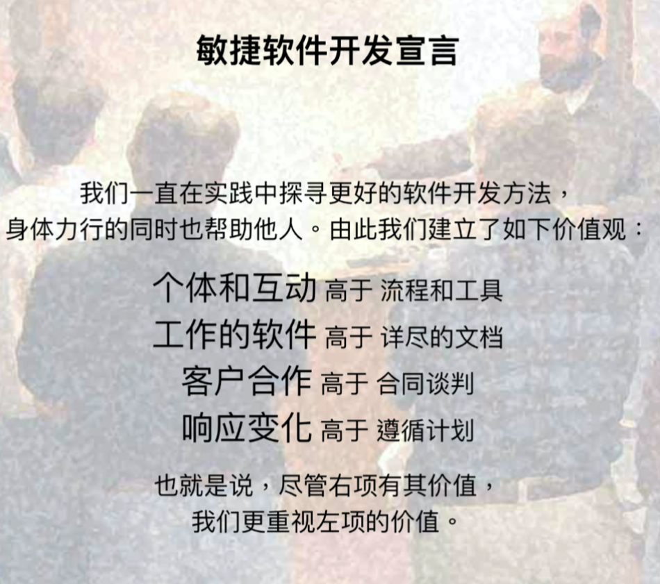

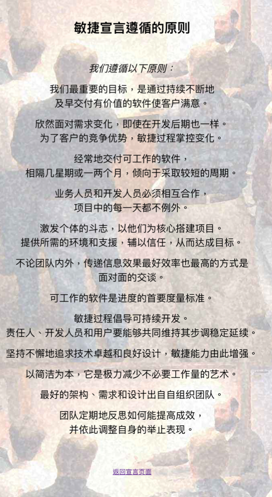

### 1.2 敏捷开发方法比较

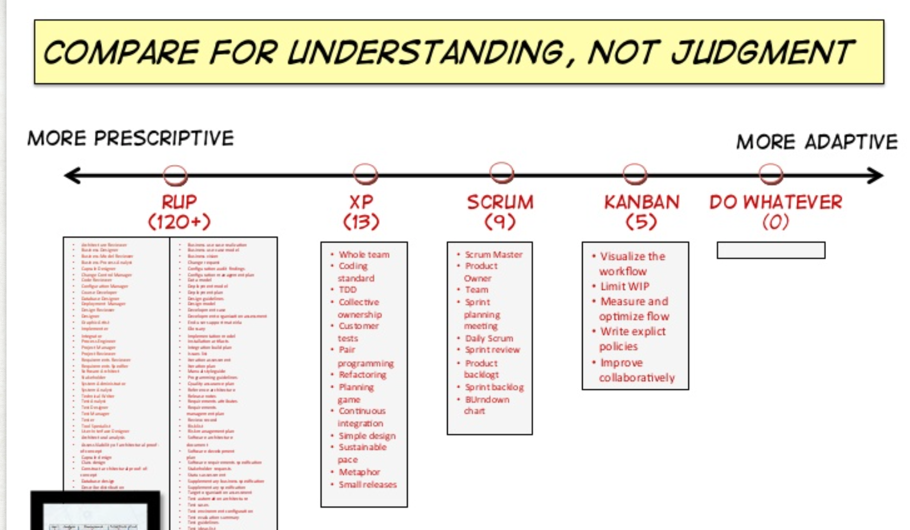

轴越往右越灵活，约束越少，越往左约束越多

### 1.3 敏捷开发的开发流程一览

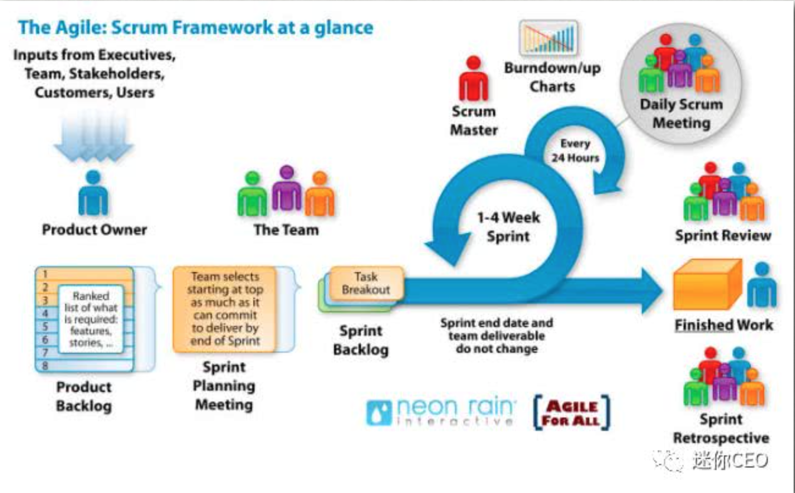

一个sprint是一个小周期的意思，为1-4周的一个时间长度

## 2. Scrum的具体内容

### 2.1 Scrum的角色

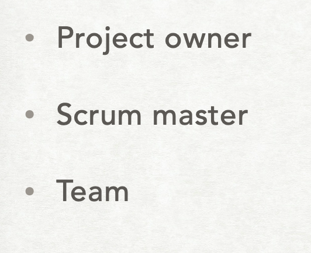

### 2.2 Sprint

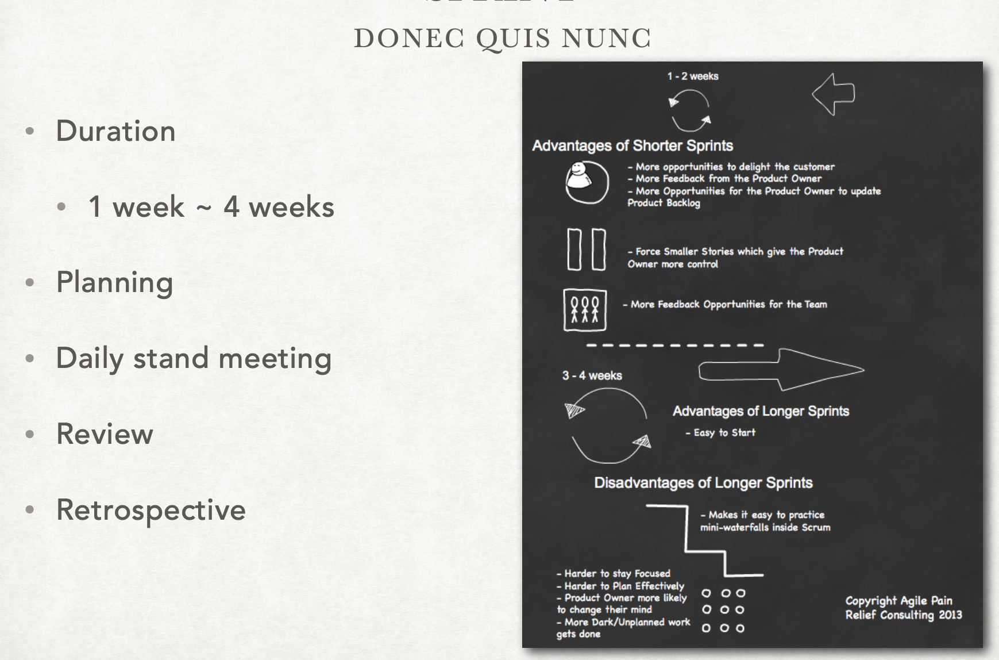

注意一个周期（sprint）内的任务是不会轻易变化的

### 2.3 Backlog

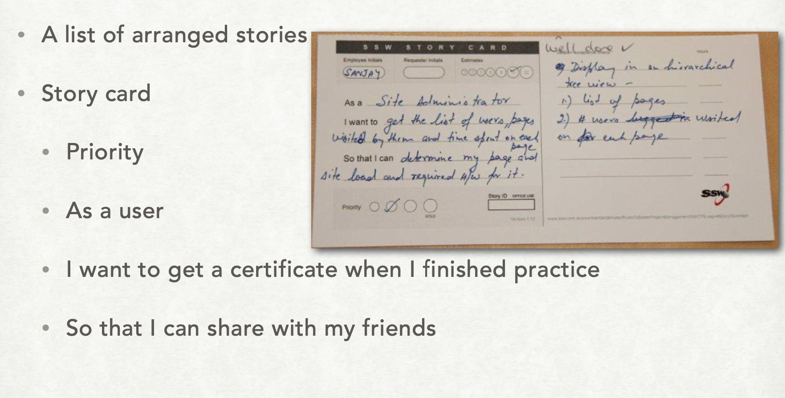

把需要解决的需求收集到backlog中

### 2.4 plan meeting

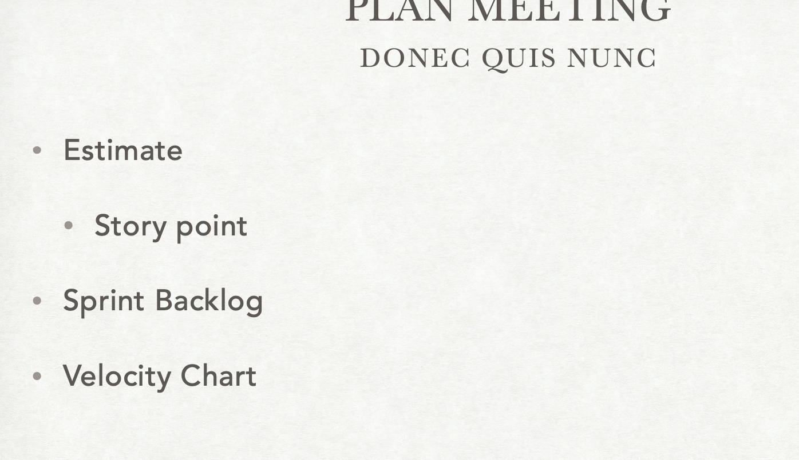

Story point单是指这个任务客观本身的工作量，基于一个标准工作量

story point是基于斐波那契数列或者2的n次方，这样可以把任务进行拆分为可控的单位

### 2.5 Daily

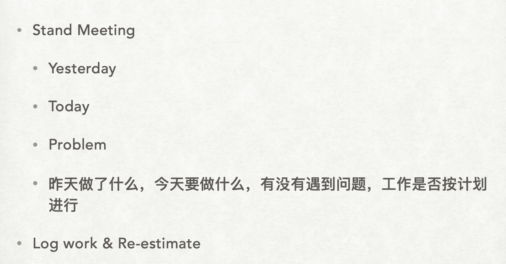

每天的站会

昨天做了什么，今天要做什么，有无问题？工作是否按计划进行？

### 2.6 review meeting

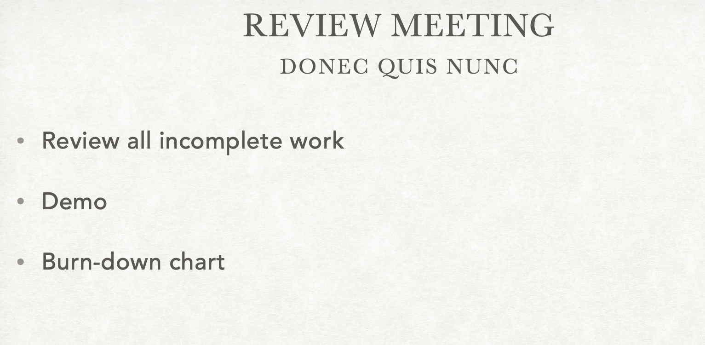

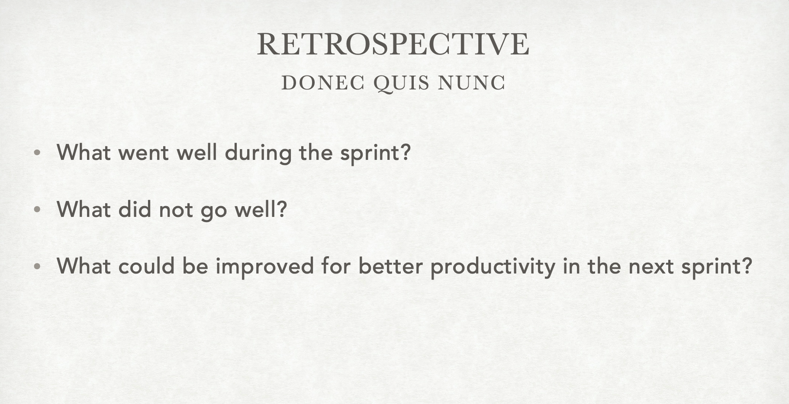

## 3. Scrum工具

生成图或者是什么别的

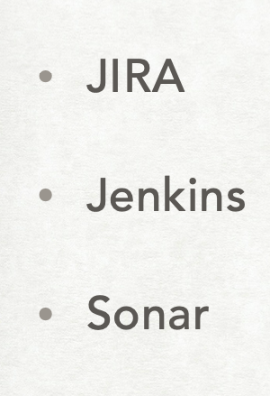

