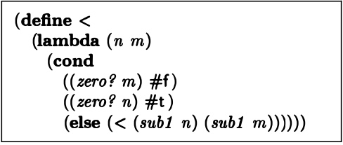
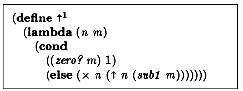
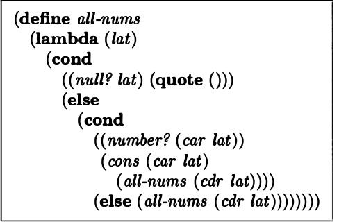
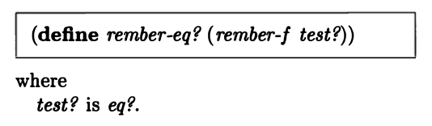
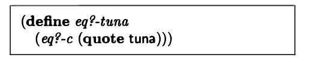

# The Little Schemer阅读笔记

## 1. Toys

第一章就是理解一些定义的语法：

1. atom

* atom是不以(或者)开头的字符串
* 用空格间隔两个atom

2. list

* 理解为数组，成员可以是别的数组或是atom
* ()为空数组

3. S-expression

* a一个tom或者是一个list也是一个S-expression,可以理解为符合表达规则的表达式

4. car

* car of  l 或者 (car l) 返回一个list，即l，的第一个元素
* 返回值是一个S-expression
* 不能返回空list的car
* 不能返回atom的car

5. cdr

* cdr of l 或者(cur l)返回一个**非空**list，即l，的除了第一个元素的剩余元素
* 返回值是一个list

* 不能返回atom的cdr

6. Cons

* (cons a l) 表示把a加到list l 的首部，a可以是atom或者list
* 即a可以是任何S-expression

7. null

* (null? l) 返回一个l即list是否是空list

8. (atom? s)

* 返回s是否是一个atom

9. Eq

* （eq ? a b）意思为a和b是否相等
* 返回值为bool
* a和b都必须是不为数字的atom

## 2. Do it again and again(递归的概念)

1. lat

* 由atom组成的list,可以为空
* (lat? l) 意思为l是否为lat

2. （or (表达式1)(表达式2)）

or 表示或关系，两个表达式的或关系是or的返回值

3. (member? a l)

a这个S expression是不是l的其中一个孩子

4. 如何定义member

此处 define为定义

lambda为参数

(cond

​	(条件1)(返回值1) 

​	(条件2)(返回值2) )

(else(返回值3)))

(Null ? lat) #f 意为若lat为null则返回false

然后就是一个else + 递归

## 3. cons the magnificent（递归的应用）

1. rember a l

把a这个东西从l中删除，若l中没有a,则什么也不做

2. 定义rember

3. 定义(firsts l)

返回l这个list中每一个list中的第一个s-expression

若为null.即空list,则返回(quote()),即空list

4. (insertR new old l)

把new这个新的值插入到l这个list的第一个old的后面

5. multirember(a lat)

把lat中所有的a都删掉

6 . multiinsertR(new old lat)

lat中所有的old的右边都插入new

## 4. Numbers Games

1. number

本书中只考虑非负整数

2. (add1 y)

返回 1 + y 

3. (sub1 y)

返回y - 1

注意sub1 0无答案因为我们只考虑非负整数

4. (+ n m)

5. (- n m)

6. tup

tup是a list of numbers,注意只能是number不能是list或者atoms

空list也是tup

7. (addup tup)

返回tup中的number和

8. (x n m)

9. (tup+ tup1 tup2)

10. (> n m)

return n > m

11. (< n m )

12. (= n m)

13. (⬆️ n m) n的m次方

14. (➗ n m )

15. (length l) 

16. (pick n l)

拿到l的第n个atoms，下标从1开始

17. （rempick n l）

返回去掉第n个atoms的l

18. (number? n)

返回 n 是否是 number

19. (no-nums l)

返回去除了number的l

20. (all-nums l)

返回所有的number

21. eqan(a1 a2)

22. occur(a lat)

a 在 lat中出现的次数

## 5.It's full of stars

1. rember* a l 

深度去除l中的所有a

2. (insertR* new old l)

深度在所有的old atom的右边加上atom new

3. (occur* a l)

深度数一下a在l中的出现次数

4. (subst* new old l)

深度用new代替所有old

5. (insertL* new old l)

深度在old的左边加new

6. (member* a l)

深度找a是否在l中出现过

7. (leftmost l)

返回l中第一个出现的atom,但是如果第一个s-expression是空list则没有答案

对空list也没有答案

8. eqlist

深度对比两个list

9. equal

考虑了atom,lis,number三种类型的相等

10. **使用eqlist简写eqlist**

这是一种我没有见过的递归类型，即两个函数相互递归调用

11. 如果rember(s l)是指s是任意s-expression, l中也是任何s-expresssion的list

## 6. Shadows

1. Arithmetic expression

atom或者是arithmetic运算符比如+ ✖️ ⬆️

2. (quote a)

Quote a 把a变成字符atom

3. (numbered ? z)

判断z这个arithmetic是否只包含除了+ ✖️ ⬆️的数字,即是否是一个能算出一个返回值的合法的表达式

注意z是由一个list表示的

比如 1 + （2 * 3） =》 [1,+,[2,*,3]]

4. (Value nexp)

计算nexp这个表达式的值

如果运算符号在前的话：即 + 1 2 = 3

注意这个地方的运算只是两个数的运算即  + 1 1 不会是 + 1 1 1

通过抽取公共函数的方式可以使得我们的代码更加简洁。比如抽取operator或者1st-sub-exp

 

5. 用()表示数字

1 (())   2 (()())

6. 检验0 aero?

7. edd1 

8. zub1

9. 重新定义➕

10. shadows

把（1 2 3）用()表示可以表示为 ((())  (()()) (()()()))

每一个list用() 每一个list中的每一项也用()以示区分 再用()的个数表示数字的大小

这个时候用lat? 方法去判断 （1 2 3）的括号表现形式就会失效，这就是shadows

## 7. Friends and Relations

1. Set 

没有重复值的list

2. set?

3. makeset l

把l去重

4. Subset set1 set2

Set1 是否是 set2 的子集

5. eqset?

两个set是否相等

6. intersect? set1 set2

两个set是否有交集

7. intersect set1 set2

取两个set的交集

8. Union set1 set2

取set1 和 set2的并集

9. intersectall l-set ！！

l中的每一个item都是set,返回每一个item中都有的item

10. a-pair?

判断一个list是否只由两个S-sepressions组成

11. first second third build函数

用于简化其他函数

12. rel

a set of pairs, 即不重复的pairs构成的list

13. fun? rel

注意firsts的定义

14. revrel

颠倒rel中每一个pair的顺序

如果有一个revpair函数

可以改写revrel为

15. fullfun? fun

seconds为获取fun中每一个item的第二个值

16. One-to-one

## 8. lambda the ultimate

1. rember-f（test? a l）

test为判断相等的函数，a为一个atom，l是一个list,删掉l中的第一个a

把function作为参数传入

2. 一个函数返回另外一个函数（柯里化）

3. 用柯里化去处理rember-f并命名为remember-eq?

4. insertL-f和insertR-f

5. seqL 和 seqR 和seqS 和 seqS

   seqL返回插入左边的函数，seqR返回插入右边的函数

   

6. 写一个insert-g()函数以seqL或者是seqR为参数决定插入的位置

7. 用insert-g重新定义insertL

8. 用insert-g重新定义insertR

9. 用insert-g重新定义sebst

10. 用seqrem和insert-g定义rember

yyy即是rember, 参数 #f只是为了占位

11. 改写计算一个表达式的值的value函数

抽象出atom-to-function对于符号的判断功能

12. Multirember-f

13. multiremberT

这个方法中的test?是像以下的比较函数中的一样进行的与一个值的比较

14. ！！！ multirember&co ！！！

这个函数有些复杂，每一次运行都会传出当前域的值形成闭包进行递归，并且每一次递归都会传传一个函数参数。

这个函数的作用是，遍历lat这个数组，与a相等的值放在参数seen中，与b相等的值放在参数newlat中，最后返回以seen和newlat为参数的col函数的值

15. multiinsertLR

等于oldL插在左边，等于oldR插在右边

16. 