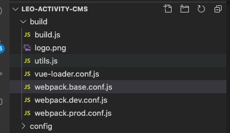
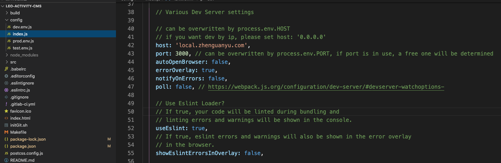
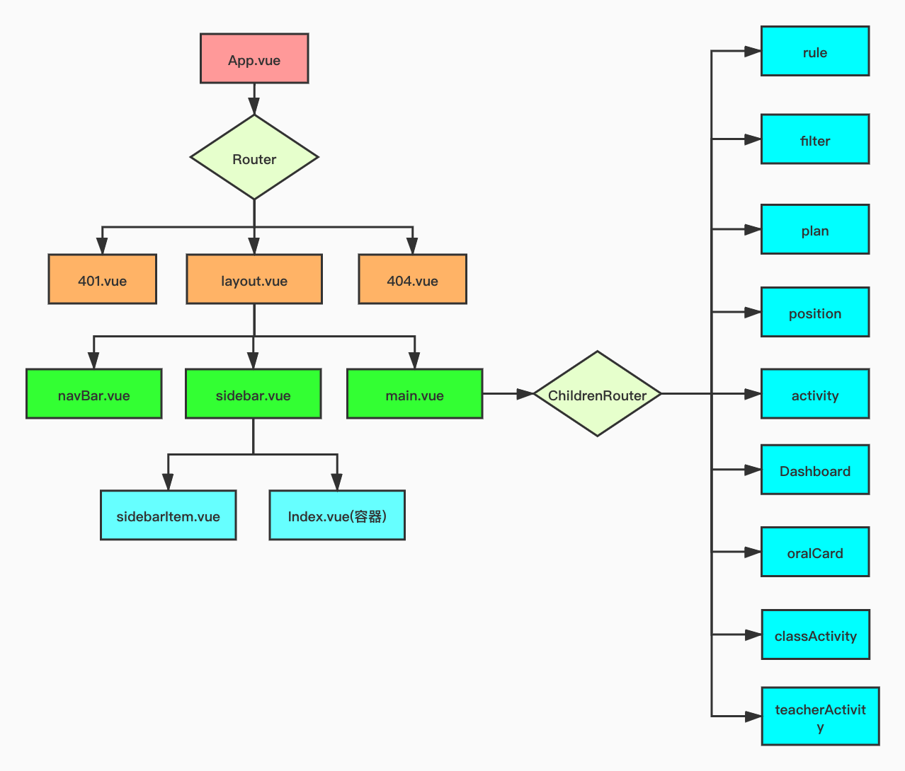
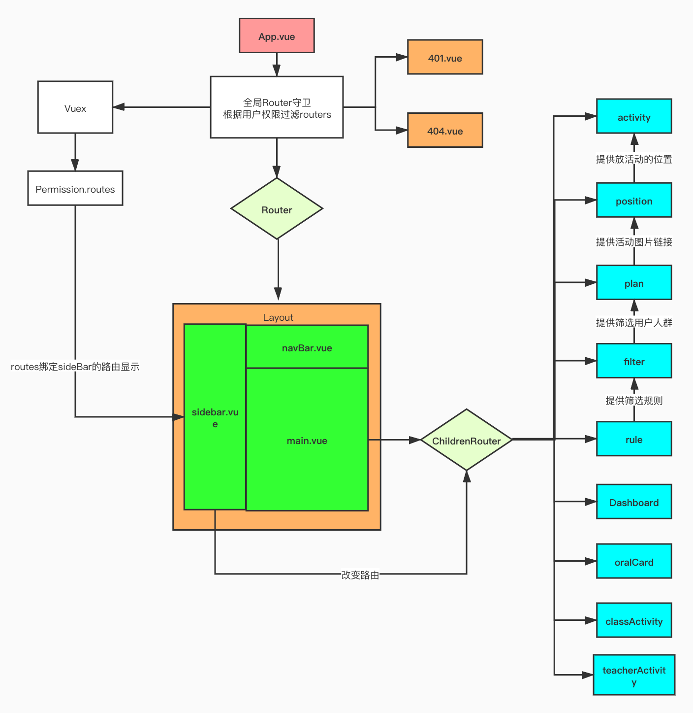

# 活动平台知识总结

## 遇到的问题

### 1.TS

#### 1.1@Component的修饰器写法

##### 1.1.1 @Component属于什么包

* vue-class-component是一个修饰器的包，其中定义了很多的修饰器,@Component就是其中之一
  * https://github.com/vuejs/vue-class-component
* vue-property-decorator是基于vue-class-component的扩展，封装了更多的修饰器
  * https://github.com/kaorun343/vue-property-decorator

##### 1.1.2 @component的作用

@Component就是把一个类声明为一个Vue的组件

##### 1.1.3@Component在项目中的使用方式

```ts
import Vue from 'vue'
import Component from 'vue-class-component'

// HelloWorld class will be a Vue component
@Component({
  components: {//注册子组件
    Pagination,
    BackTop,
    PlanComponent,
  },
  directives: {//注册局部指令
    waves,
  },
})
export default class HelloWorld extends Vue {
  // Declared as component data
  message = 'Hello World!'
  firstName = 'John'
  lastName = 'Doe'
    
  // Declared as component method
  hello() {
    console.log('Hello World!')
  }

  // Declared as computed property getter
  get name() {
    return this.firstName + ' ' + this.lastName
  }

  // Declared as computed property setter
  set name(value) {
    const splitted = value.split(' ')
    this.firstName = splitted[0]
    this.lastName = splitted[1] || ''
  }
    // Declare mounted lifecycle hook
  mounted() {
    console.log('mounted')
  }

  // Declare render function
  render() {
    return <div>Hello World!</div>
  }
}
```
#### 1.2 vuex-class的使用

* Vuex-class is binding helpers for Vuex and vue-class-component
* 依赖：vue,vuex,vue-class-component
* 使用方式：

```ts
import Vue from 'vue'
import Component from 'vue-class-component'
import {
  namespace
} from 'vuex-class'

// 相当于引入 store/modules 下的 activity 文件
const activityStore = namespace('activity');//到模块的路径
export default class Activity extends Vue {
  
  //定义一个变量test通过修饰器把这个变量变成vuex中activity模块下的test state
  @activityStore.State("test") test: string;
  //以下同理，可以加("模块中的名字")，或者不加但是名字和类型一致
  @activityStore.Action getActivityListAction: (p: IActivityQueryType) => void;
  @activityStore.Action updateActivityAction: (p: UpdateActivityType) => void;
  @activityStore.Action addActivityAction: (p: UpdateActivityType) => void;
  @activityStore.Action deleteActivityAction: (id: number) => void;
  @activityStore.Getter activityListGetter: ActivityList;
 
  hello(){
      console.log(this.test);
      await deleteActivityAction(123);
  }
}
```
参考：https://blog.csdn.net/qq_43036532/article/details/103598797
### 2.Vue

#### 2.1自定义指令及其注册

指令：就是像v-model或者是v-show一样的提供交互效果的属性

[详见文档](https://cn.vuejs.org/v2/guide/custom-directive.html)

#### 2.2 Vue-router中hidden的用法？

#### 2.3 Vue-router中meta标签的用法


### 3.webpack

#### 3.1 项目别名的设置



Webpack.base.conf.js中进行配置

```typescript
module.exports = {

  resolve: {

​    extensions: ['.js', '.ts', '.vue', '.json'],

​    alias: {

​      '@': resolve('src')//配置@为src

​    }

  },
}
```

### 4.node

##### 4.1 node的版本问题

最开始使用node15.0版本进行npm install和运行会带来报错，用nvm(node version manager)进行版本调整，注意如果要长期使用某个版本的node,要用
> nvm alias default node

进行默认版本的切换

[nvm教程](https://github.com/nvm-sh/nvm#usage)

### 5. 其他

#### 5.1Host的配置

1.什么是host(主机名)？

URL = <协议>://<主机号>：<端口>/<路径>

host = hostname = 主机号 = 主机名 = 服务器名（计算机名） + 域名

域名 = （四级域名） + 三级域名 + 二级域名 + 顶级域名 

如http://www.sina.com.cn/， www是服务器名，sina.com.cn才是域名

注意域名和主机号host的概念是从属关系

2. IP地址和主机名的关系

IP地址和主机名是一一对应的关系

在超网的划分中，

> IP地址 = <网络前缀>， <主机号>

其中网络前缀对应着域名，主机号对应着不同的服务器名

3. hosts文件配置

可以通过本地的hosts文件强行将某一个主机名映射到一个IP地址上,即不经过 DNS服务器解析而是直接通过配置的IP地址发起请求

```
127.0.0.1	localhost
127.0.0.1   local.zhenguanyu.com
255.255.255.255	broadcasthost
::1             localhost
```

正因为默认配置了localhost到127.0.0.1,所以在浏览器中输入localhost才会访问到127.0.0.1

4. 在项目中的体现



由于前端向服务器请求数据涉及到跨域请求的问题，而公司服务器对于跨域的请求只会同意host字段为

local.zhenguanyu.com:300 的请求，

所以在配置开发环境的本地服务器时需要配置该本地服务器的host为local.zhenguanyu.com，port为300。

5. 127.0.0.1IP地址的理解

所有的127开头的地址都是A类地址的保留地址，用作本地软件环回测试。但是在mac系统中只有127.0.0.1可以ping得到。

localhost只是配置到127.0.0.1的host，所以也可以把这个host配置到别的ip地址上

#### 5.2 git提交代码

项目中采用的是单分支开发，所以上传顺序为

git add .

git commit -m 'FIX:修改内容' //FIX要大写

git pull -- rebase  //用rebase pull的方式抓去更新

git push review //再上传让人给你review代码

#### 5.3 git stash的用法


## 项目的结构

### 1. 组件架构



### 2.组件逻辑

#### 2.1 改写前



## 项目进行的计划顺序

### 1.活动平台路由优化

1：首先把项目启起来 ☑️

​	1.1 总结一下项目启动中遇到的问题☑️ 

2：改写路由

​	2.1 需要读懂项目组件的逻辑，完成

​	   * 组件架构图 ☑️

​		* 组件逻辑图 ☑️

​	2.2 改写路由逻辑

​		1:改写routes,把所有的activity抽出来放到一个子路由中✅

* 为了让leo子组件保留原来的层级关系，需要增加一个leo组件只需要一个routerview

​			* path:*不知道为什么都会导到404?

​			* 测试每一条路由能否走通？

​				* 一定要注意路由加/！！

​		2:全局router守卫先不用，permission.routes中应该是activity等所有的子路由，采用暂时写死的方式✅

​		3：改写sidebar的逻辑✅

​			3.1 sidebar的展示逻辑✅

​			3.2sidebar的跳转逻辑✅

​		4:改写navBar的逻辑✅

​			* 当前位置✅

​			* 当前用户显示✅

​		4:完善细节✅

​			* 路由中加上name✅

​			* 根据comment进行代码的改写✅

3： 使用gerrit上传代码✅

4:  项目的总结✅