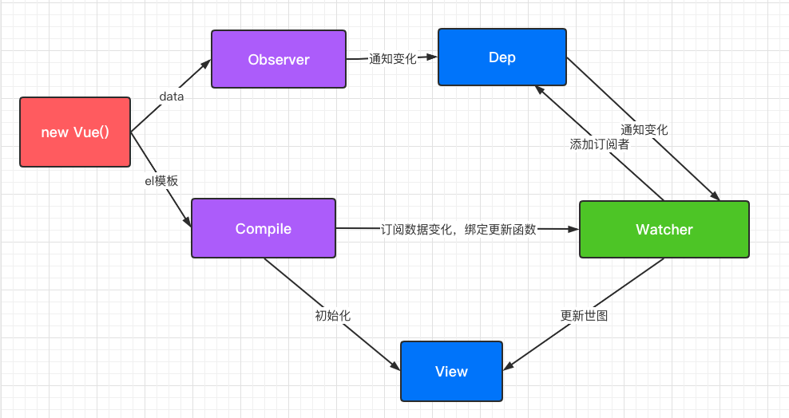
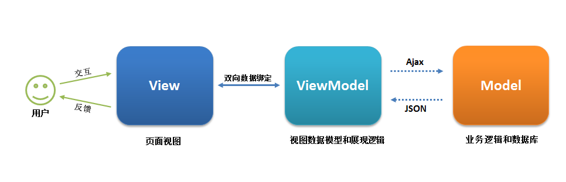

# Vue原理总结

## 1. 零散知识点整理

### 1.1 生命周期


补充：

* created之后的el option的意思是如果有设定了el属性，即有没有决定要挂载到哪个元素上，决定了才继续进行，没有决定的话直到使用了vm.$mounted(el)才继续进行
* 有无template option的意思是有没有定义template属性，定义了的话就用这个属性对应的模版字符串给render函数渲染，否则就是用el这个元素的html模版字符串来进行渲染，可以参考原生的el.outerHTML()方法

## 1.2 双向绑定的原理

- 发布者-订阅者模式：绑定监听 -> 更新数据

- 脏值检查：定时轮询检测数据变动

- 数据劫持：

   

  vue.js 采用数据劫持 + 发布者-订阅者模式，通过

  ```
  Object.defineProperty()
  ```

  来劫持各个属性的

  ```
  setter
  ```

  ```
  getter
  ```

  ，在数据变动时发布消息给订阅者，触发相应的监听回调。

  - `Object.defineProperty`：该方法会直接在一个对象上定义一个新属性，或者修改一个对象的现有属性，并返回此对象。
  - 通过遍历数组 和递归遍历对象，从而达到利用`Object.defineProperty()`也能对对象和数组（部分方法的操作）进行监听。



**双向绑定的实现**：

- 监听器 Observer：对数据对象进行遍历，包括子属性对象的属性，利用 Object.defineProperty() 对属性都加上 setter 和 getter。这样的话，给这个对象的某个值赋值，就会触发 setter，那么就能监听到了数据变化。
- 解析器 Compile：解析 Vue 模板指令，将模板中的变量都替换成数据，然后初始化渲染页面视图，并将每个指令对应的节点绑定更新函数，添加监听数据的订阅者，一旦数据有变动，收到通知，调用更新函数进行数据更新。
- 订阅者 Watcher：Watcher 订阅者是 Observer 和 Compile 之间通信的桥梁 ，主要的任务是订阅 Observer 中的属性值变化的消息，当收到属性值变化的消息时，触发解析器 Compile 中对应的更新函数。
- 订阅器 Dep：订阅器采用 发布-订阅 设计模式，用来收集订阅者 Watcher，对监听器 Observer 和 订阅者 Watcher 进行统一管理

**代码实现：**

```js
<!DOCTYPE html>
<html lang="en">
<head>
  <meta charset="UTF-8">
  <meta name="viewport" content="width=device-width, initial-scale=1.0">
  <title>Document</title>
</head>
<body>
 <div id='app'>
   <input type="text" v-model='text'>
   {{text}}
 </div>
</body>
<script>
  //1.绑定vue中的内容到对应的数值中
  //1.1 劫持结点的所有子结点生成文档片段
function nodeToFragment(node,vm) {
  let fragment = document.createDocumentFragment()
  let child
  while(child = node.firstChild){//赋值node.firstChild给child,以child的值为=表达式的返回值
    //1.3 每一个都处理一下
    compile(child,vm)
    fragment.appendChild(child)//注意通过appendChild加入文档碎片后child就不在app中了
  }
  return fragment
}

  //1.2 编译函数去处理每一个节点，把{{}}中的值和v-model属性中对应的值用vue实例中的值替换到value上
  function compile(node,vm) {
    let reg = /\{\{(.*)\}\}/
    if(node.nodeType===1){//如果该节点是元素类型
     let attr = node.attributes
     for(let i = 0;i < attr.length;i++){
       if(attr[i].nodeName === 'v-model'){
        let name = attr[i].nodeValue
        node.addEventListener('input',function(e){
          vm[name] = e.target.value//注意此时绑定到vm的对应属性上
        })
        //  node.value = vm.data[name]
        // node.value = vm[name]//注意此时绑定到vm的对应属性上
        new Watcher(vm,node,name)//使用watcher监管node的值,有几个视图就有几个watcher
         node.removeAttribute('v-model')
       }
     }
    }
    if(node.nodeType===3){//如果该节点是文本类型
      if(reg.test(node.nodeValue)){
        let name = reg.exec(node.nodeValue)[1]
        name.trim()
        // node.nodeValue = vm.data[name]
        new Watcher(vm,node,name)
        node.nodeValue = vm[name]
      }
    }
  }

  //1.4 创建一个vue实例化函数
  function Vue(options) {
    this.data = options.data

    observe(this.data,this)

    let id = options.el
    let dom = nodeToFragment(document.getElementById(id),this)
    //处理完后还回dom到原来的节点下
    document.getElementById(id).appendChild(dom)
  }

  //2. 实现input更新引起数据的更新 view=>model
  //2.1 实现一个监听数据变化的函数
  function defineReactive(obj,key,val) {
    let dep = new Dep()//Dep用来发布更新给对应的Watchers,一个数据对应一个dep
    Object.defineProperty(obj,key,{//使用Object.defineProperty不仅对obj对象新建了一个key属性，而且还将这个属性的值绑定给val
      get:function(){//读取这个属性都返回val这个值
      if(Dep.target){
        dep.addSub(Dep.target)
      }
        return val
      },
      set:function(newVal){//设置属性的时候也是作用与val这个值
        if(newVal === val){
          return
        }
        val = newVal
        console.log('add',val)
        dep.notify()
      }
    })
  }
  //2.2 实现一个观察者，观察数据的每一个属性
  function observe(obj,vm){
    for(let key of Object.keys(obj)){//注意观察者是在vm上新建了obj上的属性，然后观察vm上的新建属性
      defineReactive(vm,key,obj[key])
    }
  }

  Watcher.prototype.update = function () {
    this.get()
    this.node.nodeValue = this.value
    this.node.value = this.value
  }

  Watcher.prototype.get = function(){
    this.value = this.vm[this.name]
  }
  //3.0 model => view 数据的更新同步到视图
  function Watcher(vm,node,name){
    this.vm = vm //传入vm生成闭包
    this.node = node
    this.name = name
    Dep.target = this
    this.update()
    Dep.target = null
  }

  function Dep(){
    this.subs = []
  }

  Dep.prototype.addSub = function(sub){
    this.subs.push(sub)
  }

  Dep.prototype.notify = function(sub){
    this.subs.forEach((sub)=>{
      sub.update()
    })
  }

    let app = new Vue({
    el:'app',
    data:{
      text:'hello world'
    }
  })
</script>
</html>
```

## 1.3MVVM响应式原理

### 1.3.1 什么是MVC

 Model-View-Controller（模型-视图-控制器） 模式


* 这种模式这三层全部在后端，controller负责进行页面的逻辑，view层负责交互和展示，model负责服务端的数据维护和存储
* 这种情况下后端就要负责model的管理，页面跳转逻辑或者是数据请求逻辑或者数据的处理，任务量很重，前端只是切图

* 并且是服务端渲染视图，导致性能不好优化，很多操作都需要请求整个页面全部重新渲染和请求

### 1.3.2 什么是MVVM

- Model–View–ViewModel （MVVM） 是一个软件架构设计模式，MVVM 源自于经典的 Model–View–Controller（MVC）模式。
- MVVM 的出现促进了前端开发与后端业务逻辑的分离，极大地提高了前端开发效率。
- MVVM 的核心是 ViewModel 层，它就像是一个中转站（value converter），负责转换 Model 中的数据对象来让数据变得更容易管理和使用，该层向上与视图层进行双向数据绑定，向下与 Model 层通过接口请求进行数据交互，起呈上启下作用。



- View 层：View 是视图层，也就是用户界面。前端主要由 HTML 和 CSS 来构建 。
- Model 层：Model 是指数据模型，泛指后端进行的各种业务逻辑处理和数据操控，对于前端来说就是后端提供的 api 接口。
- ViewModel 层：ViewModel 是由前端开发人员组织生成和维护的视图数据层。
  - 在这一层，前端开发者对从后端获取的 Model 数据进行转换处理，做二次封装，以生成符合 View 层使用预期的视图数据模型。
  - 需要注意的是 ViewModel 所封装出来的数据模型包括视图的状态和行为两部分，而 Model 层的数据模型是只包含状态的，比如页面的这一块展示什么，而页面加载进来时发生什么，点击这一块发生什么，这一块滚动时发生什么这些都属于视图行为（交互），视图状态和行为都封装在了 ViewModel 里。
  - 这样的封装使得 ViewModel 可以完整地去描述 View 层。
- MVVM 框架实现了双向绑定，这样 ViewModel 的内容会实时展现在 View 层，前端开发者再也不必低效又麻烦地通过操纵 DOM 去更新-视图。
- 我们开发者只需要处理和维护 ViewModel，更新数据视图就会自动得到相应更新。
- 这样 View 层展现的不是 Model 层的数据，而是 ViewModel 的数据。
- 由 ViewModel 负责与 Model 层交互，这就完全解耦了 View 层和 Model 层，这个解耦是至关重要的，它是前后端分离方案实施的重要一环。

```html
<!-- View层 -->
<div id="app">
    <p>{{message}}</p>
    <button v-on:click="showMessage()">Click me</button>
</div>
```
```js
// ViewModel层
var app = new Vue({
    el: '#app',
    data: {  // 用于描述视图状态   
        message: 'Hello Vue!', 
    },
    methods: {  // 用于描述视图行为  
        showMessage(){
            let vm = this;
            alert(vm.message);
        }
    },
    created(){
        let vm = this;
        // Ajax 获取 Model 层的数据
        ajax({
            url: '/your/server/data/api',
            success(res){
                vm.message = res;
            }
        });
    }
})
// Model层
{
    "url": "/your/server/data/api",
    "res": {
        "success": true,
        "name": "IoveC",
        "domain": "www.cnblogs.com"
    }
}
```

## 1.4 Virtual Dom 虚拟Dom

https://github.com/livoras/blog/issues/13

### 1.4.1 什么是virtual dom?

virtual dom实际上是对真实的DOM的映射，是使用JS对象来重构一个DOM从而表达DOM的节点关系和信息

### 1.4.2 使用virtual dom的好处和坏处

* 好处
  * 实际上是规范了对DOM的操作。由于对DOM的操作过程实际上都转换为了对虚拟DOM的操作，最后再统一patch渲染。这相当于操作JS，使得中间的操作步骤会变得很快。比如对一个ul标签添加十个li,如果直接操作DOM会引发十次回流重绘，但是操作虚拟DOM的话值相当于向对象里插入了十个值，这个过程是很快的，最后再统一在DOM上渲染只会引发一次回流重绘
  * 虚拟dom的diff和patch都是自动完成的，无需开发人员手动再去实现
  * 使得开发人员不用再去特别关注操作dom的性能损耗，使得代码逻辑更加清晰
* 缺点
  * 性能优化的上限没有原生高。创建virtual dom也是有开销的，对于性能有极致要求的场合并不适合有virtual dom

### 1.4.3 Virtual dom的具体实现

实现步骤：

1. 用 JavaScript 对象结构表示 DOM 树的结构；然后用这个树构建一个真正的 DOM 树，插到文档当中
2. 当状态变更的时候，重新构造一棵新的对象树。然后用diff算法比较新的树和旧的树，记录两棵树差异,
3. 把2所记录的差异应用到步骤1所构建的真正的DOM树上，视图就更新了

```js
// 1. 构建虚拟DOM
var tree = el('div', {'id': 'container'}, [
    el('h1', {style: 'color: blue'}, ['simple virtal dom']),
    el('p', ['Hello, virtual-dom']),
    el('ul', [el('li')])
])

// 2. 通过虚拟DOM构建真正的DOM
var root = tree.render()
document.body.appendChild(root)

// 3. 生成新的虚拟DOM
var newTree = el('div', {'id': 'container'}, [
    el('h1', {style: 'color: red'}, ['simple virtal dom']),
    el('p', ['Hello, virtual-dom']),
    el('ul', [el('li'), el('li')])
])

// 4. 比较两棵虚拟DOM树的不同
var patches = diff(tree, newTree)

// 5. 在真正的DOM元素上应用变更
patch(root, patches)
```

[virtual dom的具体实现](https://github.com/livoras/blog/issues/13)

## 1.5 父子组件传值的方式

### 1.5.1 props父传子
```html
<div id="app">
    <cpm :cmovies='movies' :cmessage='message'></cmp>
</div>
<template id='cmp'>
    <div>
        <h2>{{cmessage}}</h2>
        <ul>
            <li v-for='movie in cmovies'>{{movie}}</li>
        </ul>
    </div>
</template>
<script src="../js/vue.js"></script>
<script>
   const cpm = {
       template:"#cmp",
       //注意props意为支撑，支柱，作为与父元素沟通的桥梁，并且会将父元素的值动态绑定到子元素上
       props:{
           //这里的数据是可以进行定义的
           cmessage:{
               type:String,
               default:'123'
           },
           //如果是对象的话赋初值要用函数
           cmovies:{
               type:Array,
               default(){
                   return{}
               }
           }
       },
       data(){
           return {};
       }
   }

  const app = new Vue({
    el: '#app',
    data: {
      message: '你好啊',
      movies: ['海王', '海贼王', '海尔兄弟']
    },
    components:{
        cpm,
    }
  })

</script>
```

### 1.5.2 $emit子传父
```html
<div id='app'>
    <!-- 通过这种方式默认传入的参数就是子组件中的数据 -->
    <!-- 这个地方的cmp组件实际上是在父级作用域中，所以获取到的数据都是app中的，要取得子组件的话要传递-->
    <!-- 所以说父传子是通过属性的值的传递，而子传父是通过自定义事件 -->
    <cmp @item-click='cpnClick'></cmp>
</div>

<template id='cmp'>
    <!-- 注意模版要用div包起来 -->
    <div>
        <button v-for='item in categories' @click='itemClick(item)'>{{item.name}}</button>
    </div>
</template>

<body>
    <script src='../js/vue.js'></script>
    <script>
        const cmp = {
            template: '#cmp',
            data() {
                return {
                    categories: [
                        { id: 'aaa', name: '热门推荐' },
                        { id: 'bbb', name: '手机数码' },
                        { id: 'ccc', name: '家用家电' },
                        { id: 'ddd', name: '电脑办公' },
                    ]
                }
            },
            methods: {
                itemClick(item) {
                    //把这个数据发送给item-click的自定义事件
                    this.$emit('item-click', item);
                }
            }
        }

        const app = new Vue({
            el: '#app',
            components: {
                cmp
            },
            methods: {
                cpnClick(item) {
                    console.log('父组件', item);
                }
            }
        })
    </script>
```

### 1.5.3 ref或者$children父访问子
```html
<div id='app'>
    <cmp ref='aaa'></cmp>
    <button @click='onClick()'>button</button>
</div>
<template id='cmp'>
    <div>
        <h2>我是子组件</h2>
    </div>
</template>

<body>
    <script src='../js/vue.js'></script>
    <script>

        const cmp = {
            template: '#cmp',
            data() {
                return {
                    name: 123
                }
            },
        }

        const app = new Vue({
            el: '#app',
            components: {
                cmp
            },
            methods: {
                onClick() {
                    // this.$children返回一个自组件的数组
                    // 但是这种方法并不好，如果子组件位置发生修改代码就也要随之改动
                    // console.log(this.$children[0].name);

                    //还可以用ref来实现,注意要在子组件上添加对应的名字
                    //注意是refs是复数
                    console.log(this.$refs.aaa.name);
                }

            }
        })
    </script>
</body>
```

### 1.5.4 $parent或者$root
```html
<template id="ccpn">
  <div>
    <h2>我是子组件</h2>
    <button @click="btnClick">按钮</button>
  </div>
</template>

<script src="../js/vue.js"></script>
<script>
  const app = new Vue({
    el: '#app',
    data: {
      message: '你好啊'
    },
    components: {
      cpn: {
        template: '#cpn',
        data() {
          return {
            name: '我是cpn组件的name'
          }
        },
        components: {
          ccpn: {
            template: '#ccpn',
            methods: {
              btnClick() {
                // 1.访问父组件$parent
                // console.log(this.$parent);
                // console.log(this.$parent.name);

                // 2.访问根组件$root
                console.log(this.$root);
                console.log(this.$root.message);
              }
            }
          }
        }
      }
    }
  })
</script>
```

### 1.5.5 $bus

$emit / $on ：这种方法通过一个空的 Vue 实例作为中央事件总线（事件中心），用它来触发事件和监听事件，从而实现任何组件间的通信，包括父子、隔代、兄弟组件。

- 比如：
  - `this.$bus.$on(eventName, e => {});`
  - `this.$bus.$emit(eventName, args)`

https://zhuanlan.zhihu.com/p/72777951

### 1.5.6 provide/inject

https://cn.vuejs.org/v2/guide/components-edge-cases.html

### 1.5.7 $attrs/$listeners

https://segmentfault.com/a/1190000022708579

