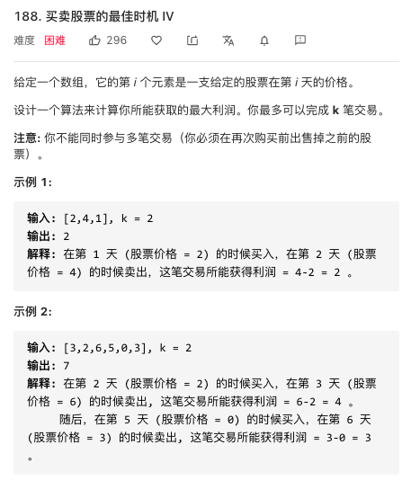

#### 股票问题
base case：
dp[-1][k][0] = dp[i][0][0] = 0
dp[-1][k][1] = dp[i][0][1] = -infinity

状态转移方程：
dp[i][k][0] = max(dp[i-1][k][0], dp[i-1][k][1] + prices[i])
dp[i][k][1] = max(dp[i-1][k][1], dp[i-1][k-1][0] - prices[i])

##### k=1(也可以用贪心来解决)
dp[i][1][0] = max(dp[i-1][1][0], dp[i-1][1][1] + prices[i])
dp[i][1][1] = max(dp[i-1][1][1], dp[i-1][0][0] - prices[i]) 
            = max(dp[i-1][1][1], -prices[i])
解释：k = 0 的 base case，所以 dp[i-1][0][0] = 0。

现在发现 k 都是 1，不会改变，即 k 对状态转移已经没有影响了。
可以进行进一步化简去掉所有 k：
dp[i][0] = max(dp[i-1][0], dp[i-1][1] + prices[i])
dp[i][1] = max(dp[i-1][1], -prices[i])


```
/**
 * @param {number[]} prices
 * @return {number}
 */
var maxProfit = function (prices) {
    let dp_0 = 0;
    let dp_1 = Number.MIN_SAFE_INTEGER;//因为第0天还没有开始交易又持有的情况不可能发生
    prices.forEach(function (price) {
        dp_0 = Math.max(dp_0, dp_1 + price);
        dp_1 = Math.max(dp_1, -price);
    })
    return dp_0;
};
```
##### k=无穷(也可以用贪心来解决)

dp[i][0] = max(dp[i-1][0], dp[i-1][1] + prices[i])
dp[i][1] = max(dp[i-1][1], dp[i-1][0]-prices[i])

```
/**
 * @param {number[]} prices
 * @return {number}
 */
var maxProfit = function(prices) {
    let dp_0 = 0;
    let dp_1 = Number.MIN_SAFE_INTEGER;
    prices.forEach((price)=>{
        let temp = dp_0;
        dp_0 = Math.max(dp_0,dp_1 + price);
        dp_1 = Math.max(dp_1,temp - price);
    })
    return dp_0;
};
```
##### k = +infinity with cooldown
dp[i][0] = max(dp[i-1][0], dp[i-1][1] + prices[i])
dp[i][1] = max(dp[i-1][1], dp[i-2][0]-prices[i])

```
/**
 * @param {number[]} prices
 * @return {number}
 */
var maxProfit = function(prices) {
    let dp_0 = 0;
    let dp_1 = Number.MIN_SAFE_INTEGER;
    let dp_pre_0 = 0;
    prices.forEach((price)=>{
        let temp = dp_0;
        dp_0 = Math.max(dp_0,dp_1+price);
        dp_1 = Math.max(dp_1,dp_pre_0-price);
        dp_pre_0 = temp;
    })
    return dp_0;
};
```
##### k = +infinity with fee

dp[i][0] = max(dp[i-1][0], dp[i-1][1] + prices[i] - fee)
dp[i][1] = max(dp[i-1][1], dp[i-1][0]-prices[i])
```
/**
 * @param {number[]} prices
 * @param {number} fee
 * @return {number}
 */
var maxProfit = function(prices, fee) {
    let dp_0 = 0;
    let dp_1 = Number.MIN_SAFE_INTEGER;
    prices.forEach(function(price){
        let temp = dp_0;
        dp_0 = Math.max(dp_0,dp_1 + price - fee);
        dp_1 = Math.max(dp_1,temp - price);
    })
    return dp_0;
};
```
##### k=2

dp[i][2][0] = max(dp[i-1][2][0], dp[i-1][2][1] + prices[i])
dp[i][2][1] = max(dp[i-1][2][1], dp[i-1][1][0] - prices[i])
dp[i][1][0] = max(dp[i-1][1][0], dp[i-1][1][1] + prices[i])
dp[i][1][1] = max(dp[i-1][1][1], - prices[i])
根据公示只需要4个变量就可以，并且先算k=2，再算k=1会有更好的效果，不用一个临时变量来进行存储

```
/**
 * @param {number[]} prices
 * @return {number}
 */
var maxProfit = function (prices) {
    let dp_2_0 = 0;
    let dp_2_1 = Number.MIN_SAFE_INTEGER;
    let dp_1_0 = 0;
    let dp_1_1 = Number.MIN_SAFE_INTEGER;
    prices.forEach(function (price) {
        dp_2_0 = Math.max(dp_2_0, dp_2_1 + price);
        dp_2_1 = Math.max(dp_2_1, dp_1_0 - price);
        dp_1_0 = Math.max(dp_1_0, dp_1_1 + price);
        dp_1_1 = Math.max(dp_1_1, -price);
    })
    return dp_2_0;
};
```
##### k=任意值


```
/**
 * @param {number} k
 * @param {number[]} prices
 * @return {number}
 */
var maxProfit = function (k, prices) {
    let temp = prices.length / 2;
    if (k >= temp) {//如果k值大于prices的长度除2，问题退化为k为无限

        let dp_0 = 0;
        let dp_1 = Number.MIN_SAFE_INTEGER;

        prices.forEach(function (price) {
            let temp = dp_0;
            dp_0 = Math.max(dp_0, dp_1 + price);
            dp_1 = Math.max(dp_1, temp - price);
        })
        return dp_0;

    } else {

        let len = prices.length;
        let dp = createArray(len + 1, k + 1);
        //初始化dp[0][k][1] = -infinity,dp[i][0][1] = -infinity
        for (let i = 0; i <= k; i++) {
            dp[0][i][1] = Number.MIN_SAFE_INTEGER;
        }
        for (let i = 0; i <= len; i++) {
            dp[i][0][1] = Number.MIN_SAFE_INTEGER;
        }
        //再计算最优解
        for (let i = 1; i <= len; i++) {
            for (let j = k; j >= 1; j--) {//从大到小从小到大都可以
                dp[i][j][1] = Math.max(dp[i - 1][j][1], dp[i - 1][j - 1][0] - prices[i - 1]);
                dp[i][j][0] = Math.max(dp[i - 1][j][0], dp[i - 1][j][1] + prices[i - 1]);
            }
        }
        //返回结果
        return dp[len][k][0];

    }

    function createArray(m, n) {
        return (new Array(m).fill(0)).map(() => {
            return (new Array(n).fill(0)).map(() => {
                return (new Array(2).fill(0));
            })
        })
    }
};
```
#### 字符串编辑

##### 两个字符串的删除操作
```
/**
 * @param {string} word1
 * @param {string} word2
 * @return {number}
 */
var minDistance = function(word1, word2) {
    let len1 = word1.length;
    let len2 = word2.length;
    let dp = createArray(len1+1,len2+1);

	//求解最大公共子串
    for(let i = 1;i <= len1;i++){
        for(let j = 1;j <= len2;j++){
            if(word1[i-1] === word2[j-1]){
                dp[i][j] = Math.max(dp[i-1][j-1] + 1,dp[i-1][j]);
            }else{
                dp[i][j] = Math.max(dp[i-1][j],dp[i][j-1]);
            }
        }
    }

    return len1 + len2 - 2 * dp[len1][len2];//最小删除数是总长度-2*最大公共子串

    function createArray(m,n){
        return (new Array(m).fill(0)).map(function(){
            return new Array(n).fill(0);
        })
    }
};
```

##### 编辑距离

```
/**
 * @param {string} word1
 * @param {string} word2
 * @return {number}
 */
var minDistance = function (word1, word2) {
    let len1 = word1.length;
    let len2 = word2.length;
    let dp = createArray(len1 + 1, len2 + 1);
    //初始化dp[0][i] = i, dp[i][0] = i
    for (let i = 0; i <= len1; i++) {
        dp[i][0] = i;
    }
    for (let i = 0; i <= len2; i++) {
        dp[0][i] = i;
    }
    for (let i = 1; i <= len1; i++) {
        for (let j = 1; j <= len2; j++) {
            if(word1[i - 1] === word2[j - 1]){
                dp[i][j] = Math.min(dp[i-1][j-1],dp[i-1][j] + 1,dp[i][j-1]+1);
            }else{
                dp[i][j] = Math.min(dp[i-1][j-1]+1,dp[i-1][j] + 1,dp[i][j-1]+1);
            }
        }
    }
    return dp[len1][len2];

    function createArray(m, n) {
        return (new Array(m).fill(0)).map(function () {
            return new Array(n).fill(0);
        })
    }
};
```
##### 650. 只有两个键的键盘


```
/**
 * @param {number} n
 * @return {number}
 */
var minSteps = function(n) {
    //递归边界
    if(n === 1) return 0;
    //先找到n的最大因子
    let mid = Math.ceil(Math.sqrt(n));
    let factor1 = 1;
    let factor2 = n;
    for(let i = n - 1;i >= mid;i--){
        if(n % i === 0){
            factor2 = i;
            factor1 = n / i;
            break;
        }
    }
    //若该因子为n即该数为素数，则直接返回n
    if(factor2 === n){
        return n;
    }else{//如果不为素数，则递归
        return factor1 + minSteps(factor2);
    }
};
```