## 面试总结
### 1.HTML
#### 1.1HTML语义化


虽然显示一样，但是右边更好因为有如上优势
#### 1.2块级内联元素

### 2.CSS
#### 盒模型宽度计算

line-height:1 就是line-height:100% line-height指的是行高


若转换为border-box盒子模型offsetWidth就是100px因为奇艺盒子的内容宽度包括了padding和border

#### margin纵向重叠问题


#### margin负值问题

#### BFC理解和应用
 


#### 实现圣杯和双飞翼


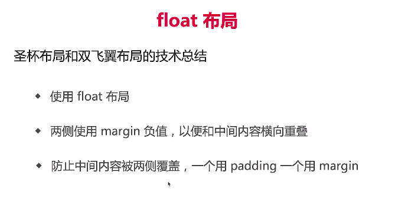

#### 手写clearfix

’‘ 或者'.' + visibility:hidden
#### flex布局


#### CSS定位
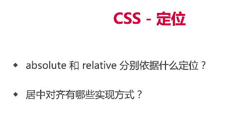


#### CSS图文样式


不加百分号是比例

#### CSS响应式


对根元素的font-size大小来对应
宽度等也可以用rem


```css
media only screen and (max-width: 374px) {
    /* iphone5 或者更小的尺寸，以 iphone5 的宽度（320px）比例设置 font-size */
    html {
        font-size: 86px;
    }
}
@(面试总结)media only screen and (min-width: 375px) and (max-width: 413px) {
    /* iphone6/7/8 和 iphone x */
    html {
        font-size: 100px;
    }
}
@media only screen and (min-width: 414px) {
    /* iphone6p 或者更大的尺寸，以 iphone6p 的宽度（414px）比例设置 font-size */
    html {
        font-size: 110px;
    }
}

body {
    font-size: 0.16rem;
}
#div1 {
    width: 1rem;
    background-color: #ccc;
}
```


不能实现精确的比例缩放，即每一个像素都有对应的比例


第一个手机屏幕高度
第二个网络视口高度
但是在浏览器模拟器中这两个是一样的，因为模拟器中没有上面网址那部分


#### 总结

### JS
#### 变量类型和计算


const a 必须赋值不然报错

#### 深拷贝
#### 变量计算-类型转换


字符串+任何 都是变成字符串相加


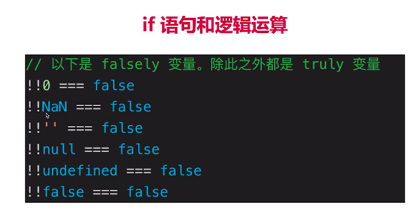


#### DOM事件和event loop
DOM事件的实现也是基于事件循环
#### for..of


forEach不会等待

for..of会等待
#### event loop和DOM渲染
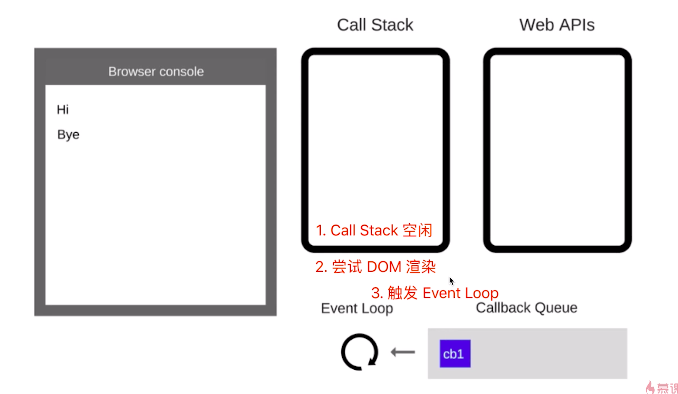
在每一次call stack中的任务执行完了过后会先尝试DOM渲染，再触发event loop


#### 微任务和宏任务的区别


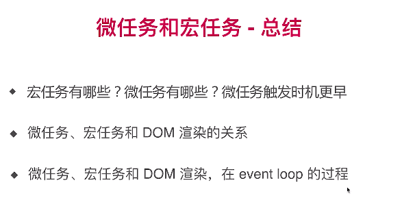
### JS web API


### DOM操作


#### DOM本质

XML自定义标签的树模式

DOM就是不能自定义的XML
DOM本质就是一棵树
#### DOM结点操作


document.getElementsByID()
document.getElementsByTagName()
document.getElementsByClassname()
document.querySelectorAll('CSS选择器语法')

property是一种获取修改DOM的属性的形式，只能对已存在的值进行获取和修改

真正的对标签进行修改，真的加了一个属性到DOM上

尽量用property,相对效率更高
#### DOM结构操作

 
 
已存在的结点使用appendChild会移动该结点


p标签会存在#text的子元素，可以通过filter过滤掉这些子元素

#### DOM性能


### BOM操作


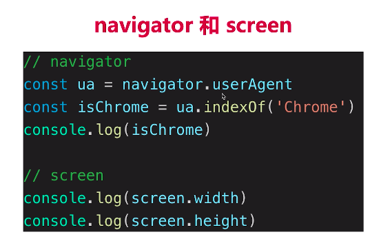

### 事件


preventDefault()阻止默认行为

stopPropogation阻止冒泡

#### 事件代理

子元素多，每一个元素都绑定就麻烦，就直接绑定在父结点上

#### 通用事件函数

```ts
// 通用的事件绑定函数
// function bindEvent(elem, type, fn) {
//     elem.addEventListener(type, fn)
// }
function bindEvent(elem, type, selector, fn) {
    if (fn == null) {
        fn = selector
        selector = null
    }
    elem.addEventListener(type, event => {
        const target = event.target
        if (selector) {
            // 代理绑定
            if (target.matches(selector)) {
                fn.call(target, event)
            }
        } else {
            // 普通绑定
            fn.call(target, event)
        }
    })
}

// 普通绑定
const btn1 = document.getElementById('btn1')
bindEvent(btn1, 'click', function (event) {
    // console.log(event.target) // 获取触发的元素
    event.preventDefault() // 阻止默认行为
    alert(this.innerHTML)
})

// 代理绑定
const div3 = document.getElementById('div3')
bindEvent(div3, 'click', 'a', function (event) {
    event.preventDefault()
    alert(this.innerHTML)
})
```
#### 描述事件冒泡的流程

#### 无限下拉图片事件代理

### AJAX


#### XMLHttpRequest


readystatus:
0 刚创建
1 open了
2 send
3 请求头接收
4 请求主体接收
### 跨域

#### 同源策略

只是浏览器有同源策略
但是server端没有同源

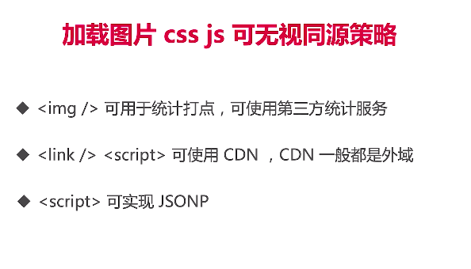

#### JSONP


#### CORS

纯服务端的操作
#### 手写一个简易的Ajax
```
function ajax(url) {
    const p = new Promise((resolve, reject) => {
        const xhr = new XMLHttpRequest()
        xhr.open('GET', url, true)
        xhr.onreadystatechange = function () {
            if (xhr.readyState === 4) {
                if (xhr.status === 200) {
                    resolve(
                        JSON.parse(xhr.responseText)
                    )
                } else if (xhr.status === 404 || xhr.status === 500) {
                    reject(new Error('404 not found'))
                }
            }
        }
        xhr.send(null)
    })
    return p
}

const url = '/data/test.json'
ajax(url)
.then(res => console.log(res))
.catch(err => console.error(err))
```

### 存储

#### cookie


#### localStorage和sessionStorage


#### 区别

### http


#### http状态码

 

301:以后浏览器都会记住直接访问新的域名
302:这是这一次临时改变，之后浏览器还是会访问这一个地址


#### http methods


操作类型 + 资源标示

#### http headers
##### request headers


同域请求都会带上cookie

##### response headers

##### 自定义header

##### 缓存相关headers

#### http 缓存


CPU很快，但是网络请求很慢
html和业务数据不容易被缓存，因为经常需要更新
##### 强制缓存

服务端觉得适合缓存才加cache-control

其实请求头也可以有cache-control


注意强制缓存的状态码是200


no-cache不用强制缓存
no-store既不强制缓存也不让服务端做缓存，即完全不缓存

private:用户缓存
public:中间路由和代理缓存


##### 协商缓存


Last-modified和if-modified-since值一样

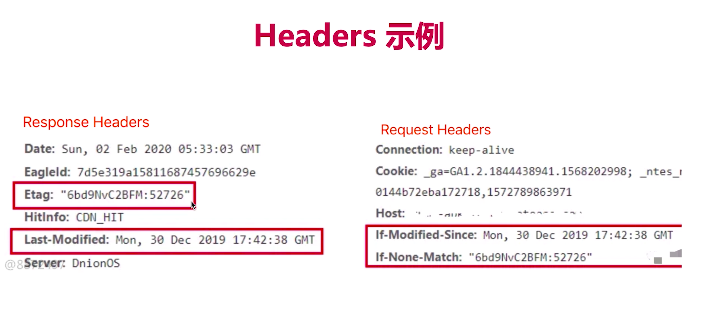


比如1秒生成一次但是内容不变使用last-modified就会导致缓存失效，但使用etag就不会有这种问题

##### 三种刷新操作


shift + command + 2 mac 强制刷新


### 开发环境

#### Git


#### chrome调试工具

#### H5抓包


#### webpack和babel

### 运行环境


#### 网页加载过程


为什么要把js放在body最后是为了不让js阻塞渲染过程使用户尽快看到这个页面，先看到再改

图片不会阻塞渲染


#### 性能优化


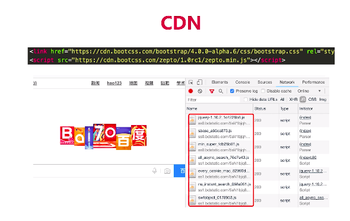
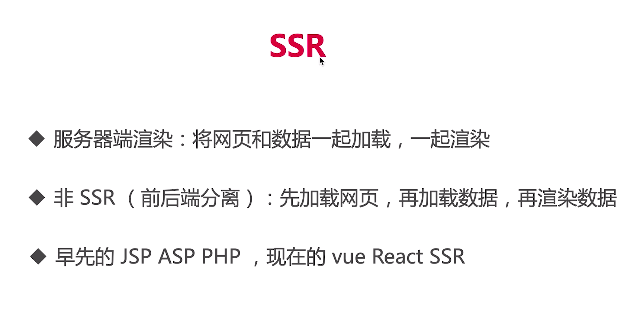
 serverside redering
 
 先放小图，再进入屏幕后换大图


#### 安全


#### XSS攻击

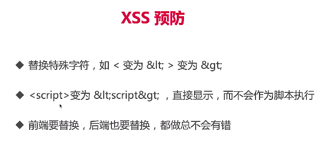
#### XSRF攻击


![Alt text](./1592540657790.png