# Social Network Mining

@(香港浸会大学)

## Network Measures
### 1.NodeInfluence/Centrality
结点影响力
#### 1.1用邻居决定
##### 1.1.1Degree Centrality
* 用出度入度来定义Centrality
* ***三种计算Normalized Degree Centrality的方式P14***
##### 1.1.2 Eigenvector Centrality
被更重要的朋友指向则更重要
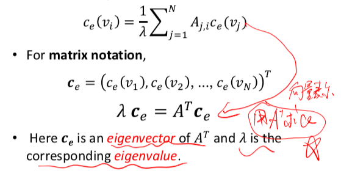
可以用Eigendecomposition求解
##### 1.1.3 PageRank
一个人的出度越多，那么他的指向也越不重要
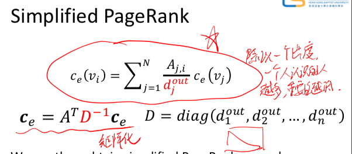
***Power Iteration Method计算，用于解决大矩阵eigen分解不了的问题P37***
***Damping Factor解决出度为0的问题***
***Redistributing to all nodes解决出度为0的问题P45***
#### 1.2用怎么到达其他结点决定
##### 1.2.1Betweenness Centrality
***Normalizing的计算P50 51***
##### 1.2.1Closeness Centrality
***计算P53 P54***
#### 1.3组的centrality
就是把几个node看成一个node和上面计算方法相同
***Group degree/betweenness/closeness centrality计算P59***
### 2.Node Interaction
结点之间关系
#### 2.1 Transitivity
衡量这个图的传递性
##### 2.1.1 Clustering Coefficient
衡量无向图中的传递性
***P63计算***
##### 2.1.2 Local Clustering Coefficient
***计算P64P65***
#### 2.2 Balance and status
##### 2.2.1 Social Balance Theory
满足负负得正的环的图P68
##### 2.2.2 Social Status Theory
A>B A>C => A>C
满足该式为stable否则不stable
P70
#### 2.3 Similarity
结点之间相似度，用共同朋友定义
##### Structural Equivalence
* Vertex similarity
* Jaccard Similarity
* Cosine Similarity
***每一种的计算P73 74***
## Community Analysis
### 1.什么是Community Analysis
Community Detection vs. Clustering P11 12
### 2. Member-based Community Detection
#### 2.1Node Degree分Community
##### 2.1.1 Clique
Clique:任意两点可以直接到达的图
Maximal Clique:不能再expand的Clique
Maximum Clique:最大的Maximal Clique
##### 2.1.2 Clique of size k
Clique of size k：clique中每个结点的度都大于等于k-1，即size为k的clique
***找Clique of size k P23***
##### 2.1.3 Relaxing Cliques
* k-plex: 所有结点的度大于等于 |V| - k(只看这个子图中的部分) |V|字图中的结点个数
***找maximal k-plex P25 26***

* k-core:子图中所有结点度至少为k
* k-shell： 在k-core中但不在k+1-core中
***计算看作业***
##### 2.1.3 CPM
***用CPM找communitiesP31***
#### 2.1Node Reachability分Community
* k-clique: 基于原图任意两点最短距离不超过k的maximal的子图为一个community
* k-clan:先是k-clique,再去掉k-clique中利用了外结点的
* k-Club: 基于子图任意两点最短距离不超过k的maximal的子图为一个community
***找这三个P33***
#### 2.3 Node Similarity分Community
Structural Equivalence计算相似度再用clustering的方法分
### 3.Group-basedCommunityDetection
#### 3.1 Balanced Communities
Minimum cut (min-cut) problem导致不平衡的社区
用***Ratio Cut & Normalized Cut 的计算 P40***
##### 3.1.1 Spectral Clustering
$ X^{T}AX$的diagonal是每一个community中的每一个点的边数和
$ X^{T}DX$的diagonal是每一个community中的每一个点的边数和不算被cut的边
$ X^{T}(D-A)X$的diagonal是cut掉的边数
#### 3.2 Robust Communities
* k-vertex connected(k-connected) graph:至少移除k个点让这个图不连通
* k-edge connected: 至少移除k条边让这个图不连通
#### 3.3 Modular Communities
两个结点已知度，不知具体的边数，计算随机边数：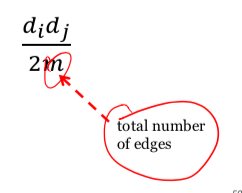
对一个partition中的一部分的Normalized Modularity:
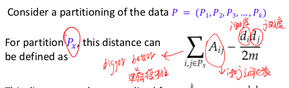(越大越有模块性)
对一个partition的 Modularity：
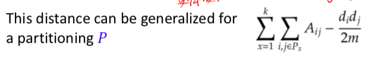
对一个partition的**Normalized** Modularity:
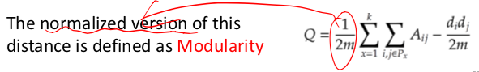
***会计算Normalized Modularity***
**最后modularity最大的partition作为最后的community的划分方式**
# Web Usage Mining
用clickstream分析users
## 1.Clickstream Data Pre-Processing
P13要clean的records
### 1.1User Identification and User Session
session对应一个用户的一次访问
通过session辨认用户身份
***相同IP地址判定为同一用户P15 16***
### 1.2 Sessionization and Transaction Identification
#### 1.2.1Sessionization
同一IP地址继续划分session的两种方法
* time-oriented heuristics
* h-ref heuristics
***P20 21***
#### 1.2.2 User Transaction Identification
user的session可以根据不同的活动被分为不同的transaction,transaction可以被分为两类：
* Auxiliary-content transactions：for navigation
* Content-only transactions:为了某一目的浏览页面
#### 1.2.3 Transaction Matrix
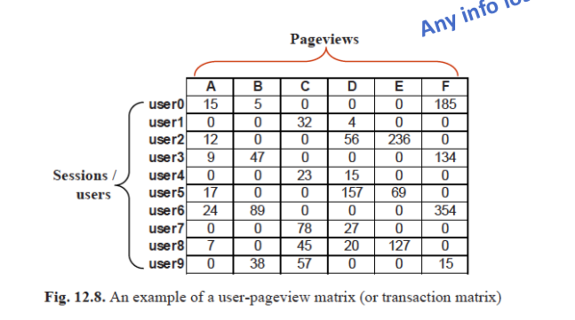
可以对这个矩阵进行协同过滤等方法分析
## 2. Clickstream Data Analysis
### 2.1Sequential Pattern Analysis
***根据用户transaction构建Markov Chain P36***
### 2.2 Web Usage Regularity Characterization
#### 2.2.1 Scale-free Network
度为 k的结点个数满足power law：
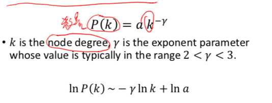
large-scalse的网络都满足power law
#### 2.2.2 Characterization of Web Usage
另外两个指标也在大型网络中满足power law:
* Forging depth (how long they search)
* Link-click frequency (how frequent a link is clicked)
***用这两个指标来判断用户是recurrent还是rationalP44 45*** 
r值越大，相同度的结点越少，越rational,反之越recurrent

# Opinion Mining and Sentiment Analysis
## 1.Key Tasks in Opinion Mining
### 1.1 Opinion Representation
opinion is a quintuple
* entity 实体
* aspect 实体的某一个方面 
* orientation 正面还是负面
* opinion holder
* time when the opinion is expressed
***提取opinion P12-19***
## 2.POS Tagging
语法标记
### 2.1Rule-based POS Tagging
***用已有POS标记的词库和parch rule的组合去标记POS P26-27***
## 3.Entity/Aspect Extraction
设计Extraction Rules定位entity和aspect
两种方式：
* 直接找对应的单词
* 找前后的形容词等
### 3.1 Obtain Extraction Rules
#### 3.1.1 Unsupervised Aspect Extraction
用常见的aspect推出不常见的
***提取aspect的unsupervised方法P36***
#### 3.1.1 Supervised Aspect Extraction
人工标记training data生成Hidden Markov Model，对应输入的句子去找一条joint probability最大的path,这条path中的A就是这个句子中的aspect
***要会计算P44***
## 4.Aspect Sentiment Classification
分类主客观评价和主观评价中积极负面中性评价
* Supervised Method
有标记则直接用标记
* Unsupervised Method
找extraction patterns 和 subjective words
### 4.1提取extraction patterns
***P54***
### 4.2创建新的subjective words/Opinion Lexicon
方法1:
***lexicon-based approach P55***
方法2:
***计算PMI比较词语的相似度从而从已知偏向的词出发推断一个词的倾向性(偏positive or negative)57-P59***
### 4.3 注意
* 客观的句子也可以表达主观的感受，如The earphone broke in two days
* 情绪emotion和opinions看法观点并不完全划等号

# 补丁
## 1. Eigendecomposition
要会计算对称矩阵的特征值分解
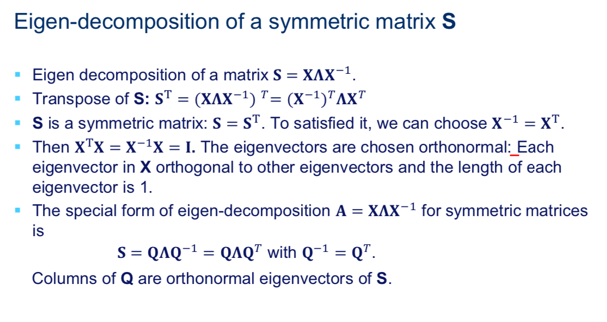
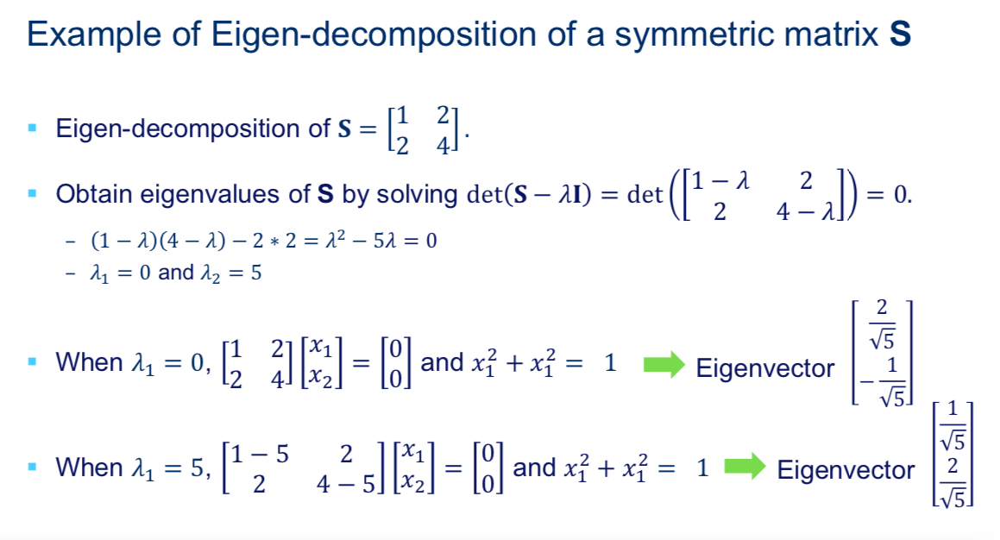
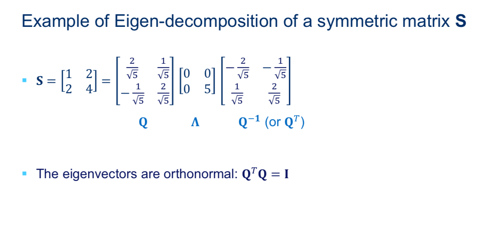

## 2.对PCA的大致理解
### 2.1理解计算PCA的步骤
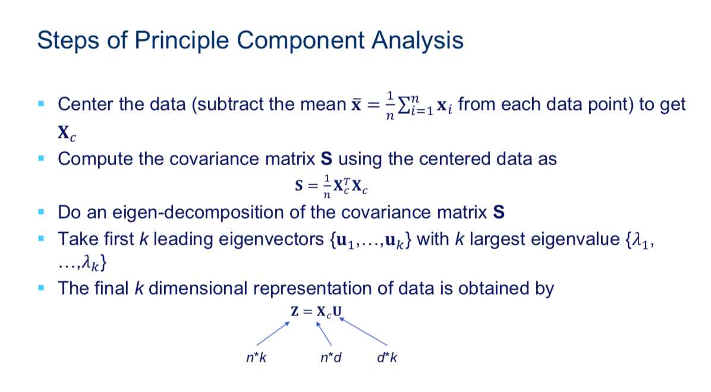

* center the data即每个点的每一维减去该维的所有点的平均值
* 计算该矩阵的协方差矩阵
* 由于该协方差矩阵为对称矩阵矩阵，可以直接eigendecomposition
* 保留k个最大的eigenvector对应的eigenvalue组成U
* 最后XU相乘得到降为k维后的矩阵
### 2.2 PCA的意义
Transforming (also called projecting) the original coordinate system (or space) to another one so that the different dimensions in the new coordinate system are linearly uncorrelated.
投影原坐标系到新的线形不想关的坐标系并让点的方差最大

## 3.协方差矩阵
### 3.1协方差向量
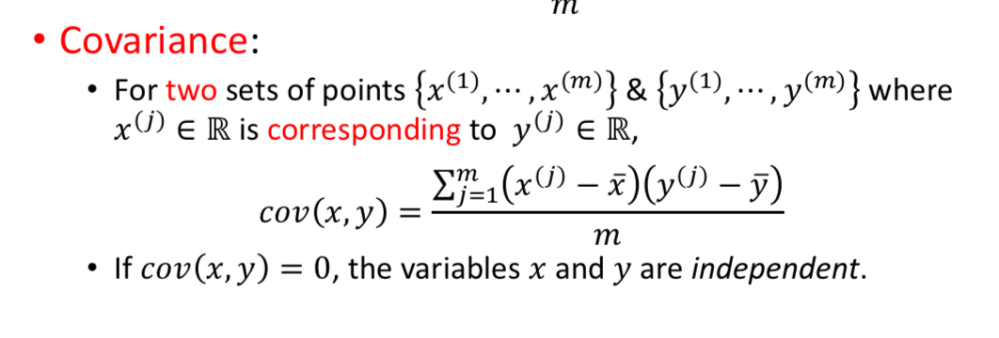
* cov(x,y)=0这两个变量独立
### 3.2协方差矩阵
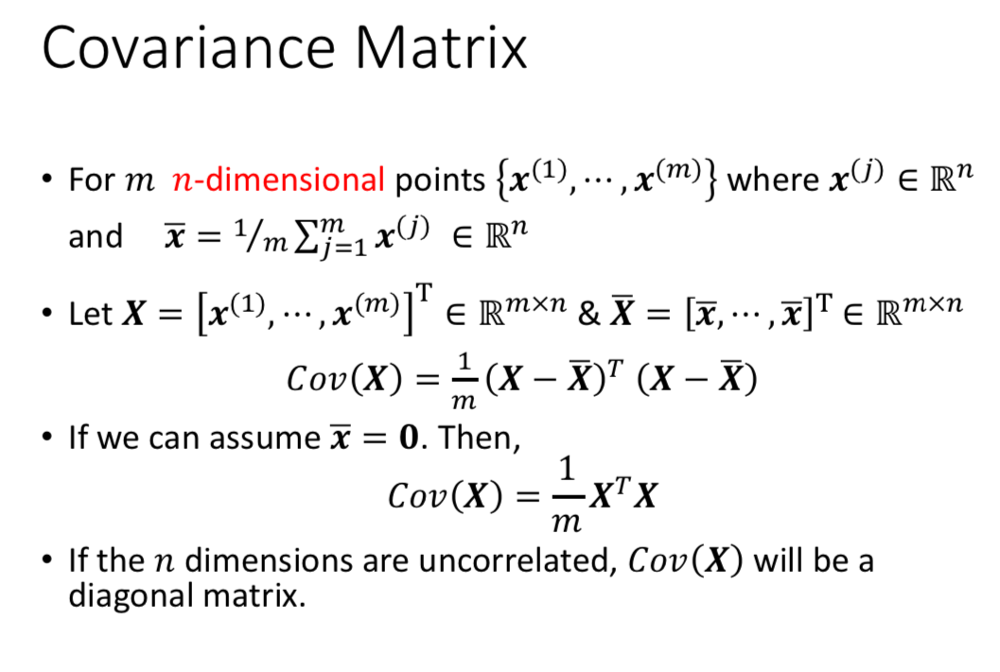
* 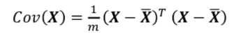   一个矩阵和其协方差矩阵的关系
* 若n维线形不相关，Cov(X)会是一个diagonal matrix
### 3.3和PCA的联系
* 实际上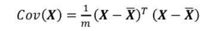   就是PCA中对所有点居中的过程
* 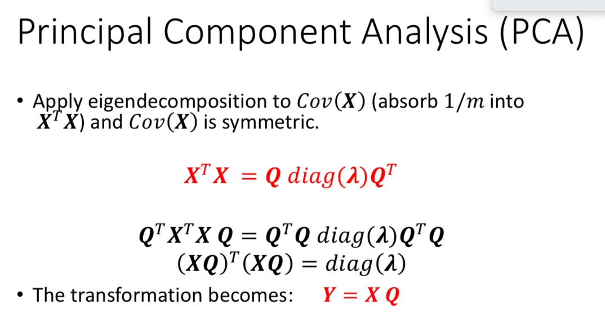
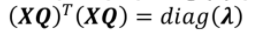    也就是一个n维独立的矩阵，所以first k principle component vectors仍然独立

## 4.SVD及Latent Semantic Analysis
### 4.1 SVD
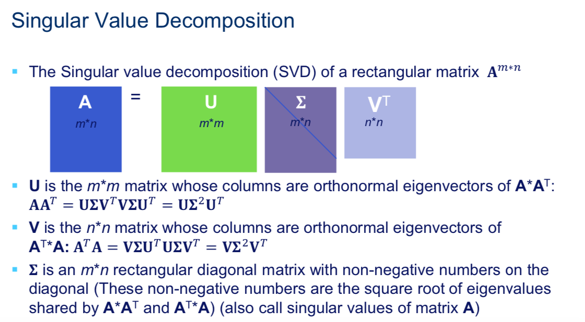
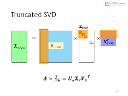    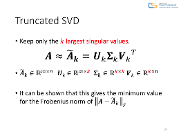
注意U=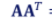
### 4.2 Latent Semantic Analysis
使用了SVD对TF-IDF矩阵做处理，解决如下问题：
• Small storage (dimension reduction)
• Remove noise in document-term matrix
• Recover missing data via the help of co-occurrence patterns (addressed the sparsity problem)
最终使得相近的点更相近，远的点更远，解决一义多词的问题
不考虑词之间的顺序除非矩阵使用了n-gram模型
**例子：**
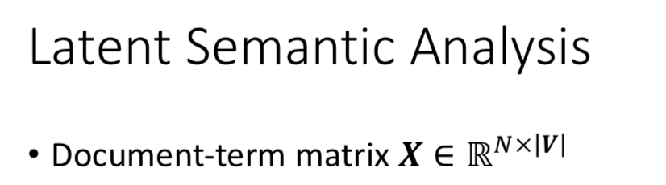
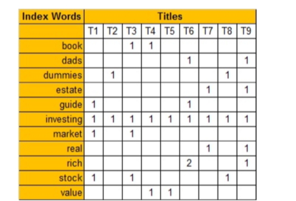
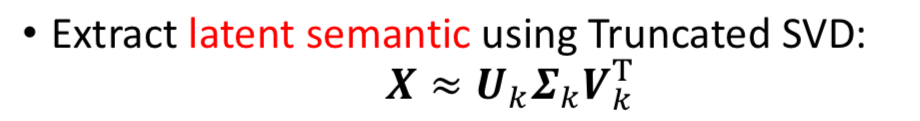
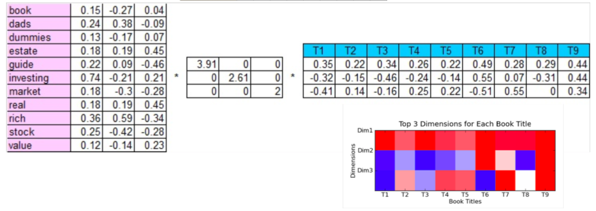
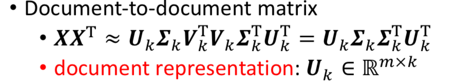
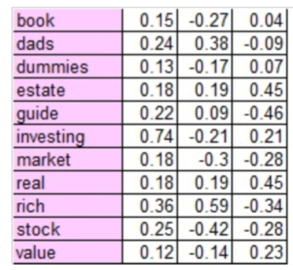
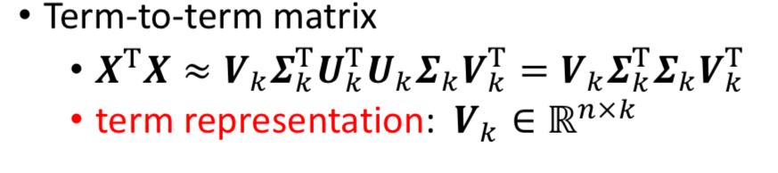
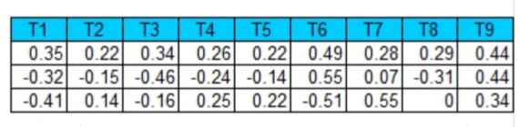
## 5.word2vec

* 与LSA潜在语义分析不同的是LSA考虑的是整个document的co-occurence pattern但是word2vec考虑的是local neighborhood的co-occurence pattern.
* 考虑了上下文context的影响进行word embedding,从而可以预测一个词的上下文
* 如果是用一个词语作为输入，来预测它周围的上下文，那这个模型叫做『Skip-gram 模型』
而如果是拿一个词语的上下文作为输入，来预测这个词语本身，则是 『CBOW 模型』
* 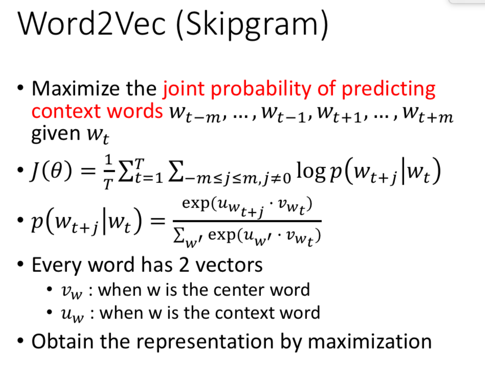
通过最大化上下文的joint probability来word embedding
## 6.n-gram和bigram
* The general case is 𝑛-gram model, where the 𝑛 th term is conditioned on the previous 𝑛 − 1 terms
* bigram就是两两组合，需要通过Chi-Square Test来进行有效筛选
* bigram最多有V的平方个
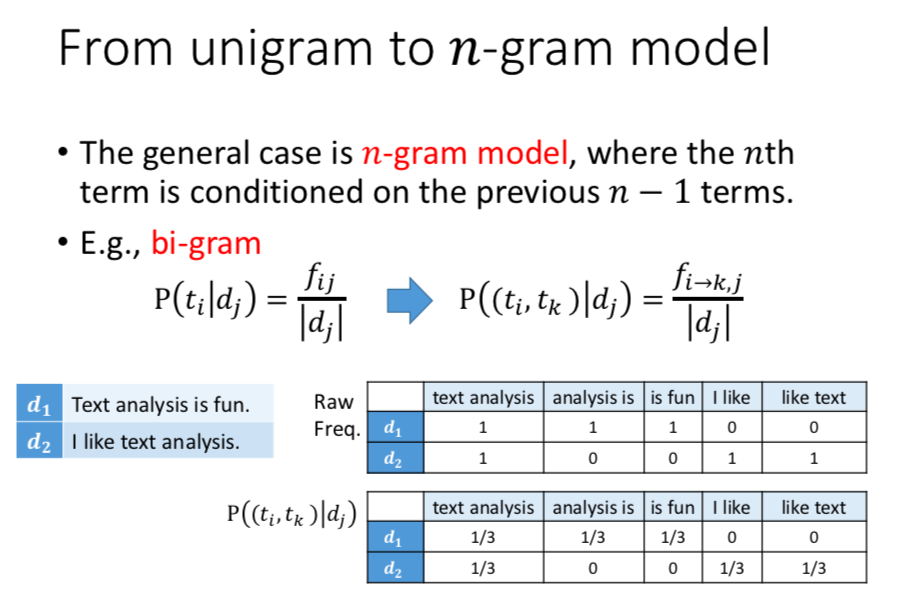
* 这种方式考虑了上下文，更精确，并且可以给一个词预测它的上下文
## 7.Skip-gram Model
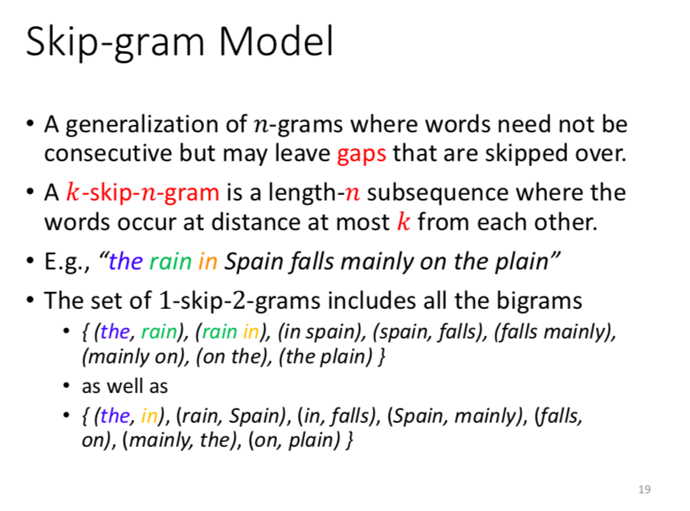
会找skip-gram即可，也是考虑了上下文，并且可以给一个词预测它的上下文
## 8.topic model
### 8.1假设
* Considering documents to be independent of each other is a strong assumption.
* Documents under similar topics should have a similar set of words (instead of independent).
* 给定topic,query和doc独立
### 思想
• Each topic is a distribution over words.
• Each document is a mixture of corpus-wide topics. 
• Each word is drawn from one of those topics.
### 8.2根据topic model计算概率和ranking
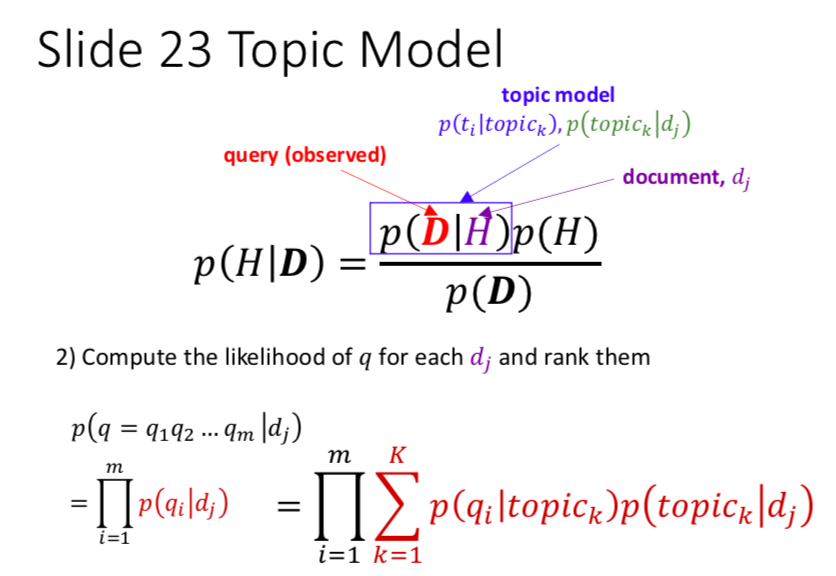
### 8.3topic model的调整
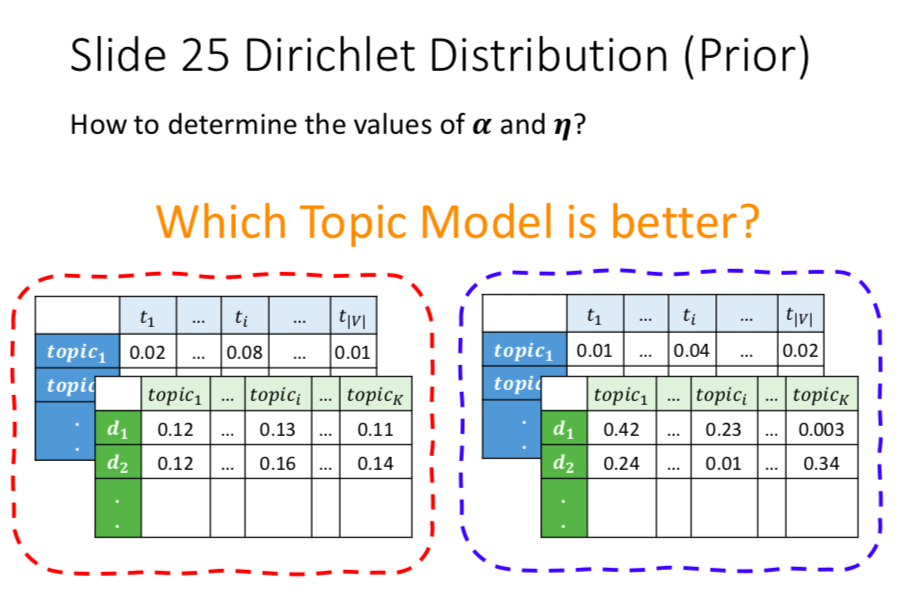
右边更好因为右边的区别更大，更易区分topic和解释
通过调整𝜶 and 𝜼使得分部更极端获得
𝜶 and 𝜼越接近0越极端，越接近1分部越均匀
所以𝜶 and 𝜼越接近0越好
### 8.4优势
topic model assumes that the online news share a common set of topics, and each topic is associated with the set of words from different documents but discovered to be under the same topic. This leads to better retrieval results.
因为topic model假设了相近词属于一个topic,一个文件又是不同topic的分部，所以实际上解决了一义多词的问题，即一个意思属于一个topic但却可以由很多不同的词表示
相较与unigram或者ngram都只能根据词语本身的样子去计算相似度，要求use of overlapped words，所以不能解决一义多词问题。